# Chevron Catalog

## **GENERAL**

### **General Concepts**

`chevron` is a collection of functions to creates tables, listings, and
graphs following Roche standards for clinical trials reporting. After
loading the R packages and the trial data, the output is to be created
by the main function `run(...)` . Two arguments `object=` and `adam_db=`
are always expected in the function. `object=` specifies which Roche
Standard Template ID to use. `adam_db=` specifies the input dataset.
Other mandatory and optional arguments within the `run` function vary
depending on which template ID is called. To access which arguments are
required and what functions are used in each template, simply try
`?template`
(e.g. [`?aet01`](https://insightsengineering.github.io/chevron/reference/aet01.md))
to see more detailed descriptions and instructions.

#### **1. Input dataset and dataset names**

The input dataset expected by the argument `adam_db=` in the `run(...)`
function is a collection of `ADaM` datasets as a list object. Each
`ADaM` dataset is expected to be an object of data frame. If the `ADaM`
datasets are read in individually, user will need to combine them into a
list object and provide the name of the list to `adam_db=`. Also, each
element in the list are expected to have corresponding `ADaM` dataset
names. Conventional `ADaM` dataset names, including `adsl`,`adex`,
`adae`, `adlb`,`advs`,`adeg`,`adcm`,`admh`,`adrs`, and `adtte`, can be
picked up by `chevron` with one exception.

``` r
std_data <- list(adsl = adsl, adae = adae)
run(object = aet01_nollt, adam_db = std_data)
```

#### **2. Expected variables in input analysis dataset**

By default, `chevron` does not pull any subject-level information from
either `adsl` or `adsub` and merge into the analysis dataset in the
underlying preprocessing steps. The analysis dataset fed into `adam_db=`
is expected to have all variables required for analysis available.

#### **3. Character vs Factor**

In the output generation, we often need to specify a particular sorting
order of a variable at the time of display. In `chevron`, a character
variable needs to be factorized with pre-specified levels to display in
order. When encountering cases, for instance, `"ARM A"` has an Asian
group only while `"ARM B"` has both Asian and White groups, it is not
able to produce outputs like the demographic table unless `"RACE"` is
factorized to provide access to the same level attribute of the variable
`"RACE"` after the arm split. It is noted that the feature comes from
`rtables` instead of `chevron`.

``` r
proc_data <- syn_data
proc_data$adsl <- proc_data$adsl %>%
  mutate(RACE = case_when(
    ARMCD == "ARM A" ~ "ASIAN",
    ARMCD == "ARM B" & !.data$RACE %in% c("WHITE", "ASIAN") ~ "ASIAN",
    TRUE ~ RACE
  ))
```

Having `"RACE"` as a character variable rather than a factor leads to
error message showing up as “Error: Error applying analysis function
(var - RACE): Number of rows generated by analysis function do not match
across all columns,” and it is recommended to convert analysis variable
`"RACE"` to a factor.

``` r
run(dmt01, proc_data)
```

To resolve this issue, simply try factorizing the variable `"RACE"`:

``` r
proc_data$adsl$RACE <- as.factor(proc_data$adsl$RACE)
run(dmt01, proc_data)
#>                                        A: Drug X    B: Placebo   C: Combination   All Patients
#>                                          (N=15)       (N=15)         (N=15)          (N=45)   
#>   ————————————————————————————————————————————————————————————————————————————————————————————
#>   Age (yr)                                                                                    
#>     n                                      15           15             15              45     
#>     Mean (SD)                          31.3 (5.3)   35.1 (9.0)     36.6 (6.4)      34.3 (7.3) 
#>     Median                                31.0         35.0           35.0            34.0    
#>     Min - Max                           24 - 40      24 - 57        24 - 49         24 - 57   
#>   Age Group                                                                                   
#>     n                                      15           15             15              45     
#>     <65                                15 (100%)    15 (100%)      15 (100%)       45 (100%)  
#>   Sex                                                                                         
#>     n                                      15           15             15              45     
#>     Male                               3 (20.0%)    7 (46.7%)      5 (33.3%)       15 (33.3%) 
#>     Female                             12 (80.0%)   8 (53.3%)      10 (66.7%)      30 (66.7%) 
#>   Ethnicity                                                                                   
#>     n                                      15           15             15              45     
#>     HISPANIC OR LATINO                 2 (13.3%)        0              0            2 (4.4%)  
#>     NOT HISPANIC OR LATINO             13 (86.7%)   15 (100%)      13 (86.7%)      41 (91.1%) 
#>     NOT REPORTED                           0            0          2 (13.3%)        2 (4.4%)  
#>   RACE                                                                                        
#>     n                                      15           15             15              45     
#>     AMERICAN INDIAN OR ALASKA NATIVE       0            0           1 (6.7%)        1 (2.2%)  
#>     ASIAN                              15 (100%)    13 (86.7%)     8 (53.3%)       36 (80.0%) 
#>     BLACK OR AFRICAN AMERICAN              0            0          4 (26.7%)        4 (8.9%)  
#>     WHITE                                  0        2 (13.3%)      2 (13.3%)        4 (8.9%)
```

#### **4. Testing the codes for plot generation**

The `run` function when calling a Graphics Template ID returns a `gTree`
object which will be used in the downstream workflow for output
generation. There are two alternative approaches to rendering the plot:
(1) having `draw = TRUE` in the `run` function to enable the generated
plot to be automatically created and viewed via the `Plots` tab, and (2)
calling the function `grid.draw` from the package `grid` which can be
utilized to render the plot for viewing and testing purpose. See example
below:

``` r
proc_data <- log_filter(syn_data, PARAMCD == "OS", "adtte")

# method 1
run(kmg01, proc_data, dataset = "adtte", draw = TRUE)

# method 2
res <- run(kmg01, proc_data, dataset = "adtte")
grid::grid.newpage()
grid::grid.draw(res)
```

### **General Control Arguments**

#### **1. `lbl_overall`: Column of Total**

The generic argument `lbl_overall` controls whether the column of total
will be produced or not. `lbl_overall = NULL` suppresses the total,
`lbl_overall = "All Patients"` produces the total.

#### **2. Column counts: N=xxx**

Column counts are displayed by default. There is no generic argument
controlling whether the count of unique number of subjects (N=xxx) will
be displayed in the column header or not. Users are allowed to customize
the display of N=xxx by forcing `display_columncounts = FALSE` to wipe
column counts away during the postprocessing (with precautions and it is
not recommended).

``` r
tbl <- run(dmt01, syn_data) # table with column counts
tbl@col_info@display_columncounts <- FALSE
tbl # no column counts now
#>                                        A: Drug X    B: Placebo   C: Combination   All Patients
#>                                          (N=15)       (N=15)         (N=15)          (N=45)   
#>   ————————————————————————————————————————————————————————————————————————————————————————————
#>   Age (yr)                                                                                    
#>     n                                      15           15             15              45     
#>     Mean (SD)                          31.3 (5.3)   35.1 (9.0)     36.6 (6.4)      34.3 (7.3) 
#>     Median                                31.0         35.0           35.0            34.0    
#>     Min - Max                           24 - 40      24 - 57        24 - 49         24 - 57   
#>   Age Group                                                                                   
#>     n                                      15           15             15              45     
#>     <65                                15 (100%)    15 (100%)      15 (100%)       45 (100%)  
#>   Sex                                                                                         
#>     n                                      15           15             15              45     
#>     Male                               3 (20.0%)    7 (46.7%)      5 (33.3%)       15 (33.3%) 
#>     Female                             12 (80.0%)   8 (53.3%)      10 (66.7%)      30 (66.7%) 
#>   Ethnicity                                                                                   
#>     n                                      15           15             15              45     
#>     HISPANIC OR LATINO                 2 (13.3%)        0              0            2 (4.4%)  
#>     NOT HISPANIC OR LATINO             13 (86.7%)   15 (100%)      13 (86.7%)      41 (91.1%) 
#>     NOT REPORTED                           0            0          2 (13.3%)        2 (4.4%)  
#>   RACE                                                                                        
#>     n                                      15           15             15              45     
#>     AMERICAN INDIAN OR ALASKA NATIVE       0        2 (13.3%)       1 (6.7%)        3 (6.7%)  
#>     ASIAN                              8 (53.3%)    10 (66.7%)     8 (53.3%)       26 (57.8%) 
#>     BLACK OR AFRICAN AMERICAN          4 (26.7%)     1 (6.7%)      4 (26.7%)       9 (20.0%)  
#>     WHITE                              3 (20.0%)    2 (13.3%)      2 (13.3%)       7 (15.6%)
```

## **TABLES**

### **Safety Summary (`AET01`)**

#### **1. Safety Summary**

The **`aet01`** template produces the standard safety summary.

``` r
run(aet01, syn_data, arm_var = "ARM")
#>                                                                A: Drug X    B: Placebo   C: Combination
#>                                                                  (N=15)       (N=15)         (N=15)    
#>   —————————————————————————————————————————————————————————————————————————————————————————————————————
#>   Total number of patients with at least one AE                13 (86.7%)   14 (93.3%)     15 (100%)   
#>   Total number of AEs                                              58           59             99      
#>   Total number of deaths                                       2 (13.3%)    4 (26.7%)      3 (20.0%)   
#>   Total number of patients withdrawn from study due to an AE       0            0           1 (6.7%)   
#>   Total number of patients with at least one                                                           
#>     AE with fatal outcome                                      8 (53.3%)    8 (53.3%)      10 (66.7%)  
#>     Serious AE                                                 12 (80.0%)   12 (80.0%)     11 (73.3%)  
#>     Serious AE leading to withdrawal from treatment                0            0          2 (13.3%)   
#>     Serious AE leading to dose modification/interruption       4 (26.7%)    3 (20.0%)      4 (26.7%)   
#>     Related Serious AE                                         8 (53.3%)    8 (53.3%)      10 (66.7%)  
#>     AE leading to withdrawal from treatment                    2 (13.3%)    3 (20.0%)      3 (20.0%)   
#>     AE leading to dose modification/interruption               6 (40.0%)    9 (60.0%)      11 (73.3%)  
#>     Related AE                                                 11 (73.3%)   10 (66.7%)     13 (86.7%)  
#>     Related AE leading to withdrawal from treatment                0        3 (20.0%)          0       
#>     Related AE leading to dose modification/interruption        1 (6.7%)    4 (26.7%)      9 (60.0%)   
#>     Severe AE (at greatest intensity)                          11 (73.3%)   10 (66.7%)     12 (80.0%)
```

#### **2. Safety Summary with Modified Rows**

Analyses under “Total number of patients with at least one” can be
removed, added, or modified by editing the parameter `anl_vars`. An
analysis here is an abbreviated name of the analysis of interest, and
supported by a variable in `ADAE` derived under the condition of
interest. The defined analyses currently include `"FATAL"`, `"SER"`,
`"SERWD"`, `"SERDSM"`, `"RELSER"`, `"WD"`, `"DSM"`, `"REL"`, `"RELWD"`,
`"RELDSM"`, and `"SEV"`. When modification is made, analyses must all be
listed in the argument `anl_vars`. The example below shows adding the
customized analysis `"RELCTC35"`.

``` r
proc_data <- syn_data
proc_data$adae <- proc_data$adae %>%
  filter(.data$ANL01FL == "Y") %>%
  mutate(
    FATAL = with_label(.data$AESDTH == "Y", "AE with fatal outcome"),
    SER = with_label(.data$AESER == "Y", "Serious AE"),
    SEV = with_label(.data$ASEV == "SEVERE", "Severe AE (at greatest intensity)"),
    REL = with_label(.data$AREL == "Y", "Related AE"),
    WD = with_label(.data$AEACN == "DRUG WITHDRAWN", "AE leading to withdrawal from treatment"),
    DSM = with_label(
      .data$AEACN %in% c("DRUG INTERRUPTED", "DOSE INCREASED", "DOSE REDUCED"),
      "AE leading to dose modification/interruption"
    ),
    SERWD = with_label(.data$SER & .data$WD, "Serious AE leading to withdrawal from treatment"),
    SERDSM = with_label(.data$SER & .data$DSM, "Serious AE leading to dose modification/interruption"),
    RELSER = with_label(.data$SER & .data$REL, "Related Serious AE"),
    RELWD = with_label(.data$REL & .data$WD, "Related AE leading to withdrawal from treatment"),
    RELDSM = with_label(.data$REL & .data$DSM, "Related AE leading to dose modification/interruption"),
    CTC35 = with_label(.data$ATOXGR %in% c("3", "4", "5"), "Grade 3-5 AE"),
    CTC45 = with_label(.data$ATOXGR %in% c("4", "5"), "Grade 4/5 AE"),
    RELCTC35 = with_label(.data$ATOXGR %in% c("3", "4", "5") & .data$AEREL == "Y", "Related Grade 3-5")
  )

proc_data$adsl <- proc_data$adsl %>%
  mutate(DCSREAS = reformat(.data$DCSREAS, missing_rule))

run(aet01, proc_data, anl_vars = list(safety_var = c("FATAL", "SER", "RELSER", "RELCTC35")), auto_pre = FALSE)
#>                                                                A: Drug X    B: Placebo   C: Combination
#>                                                                  (N=15)       (N=15)         (N=15)    
#>   —————————————————————————————————————————————————————————————————————————————————————————————————————
#>   Total number of patients with at least one AE                13 (86.7%)   14 (93.3%)     15 (100%)   
#>   Total number of AEs                                              58           59             99      
#>   Total number of deaths                                       2 (13.3%)    4 (26.7%)      3 (20.0%)   
#>   Total number of patients withdrawn from study due to an AE       0            0           1 (6.7%)   
#>   Total number of patients with at least one                                                           
#>     AE with fatal outcome                                      8 (53.3%)    8 (53.3%)      10 (66.7%)  
#>     Serious AE                                                 12 (80.0%)   12 (80.0%)     11 (73.3%)  
#>     Related Serious AE                                         8 (53.3%)    8 (53.3%)      10 (66.7%)  
#>     Related Grade 3-5                                          11 (73.3%)   10 (66.7%)     12 (80.0%)
```

### **Safety Summary (Adverse Events of Special Interest) (`AET01_AESI`)**

#### **1. Safety Summary (Adverse Events of Special Interest)**

The **`aet01_aesi`** template produces the standard safety summary for
adverse events of special interest.

``` r
run(aet01_aesi, syn_data)
#>                                                                                   A: Drug X    B: Placebo   C: Combination
#>                                                                                     (N=15)       (N=15)         (N=15)    
#>   ————————————————————————————————————————————————————————————————————————————————————————————————————————————————————————
#>   Total number of patients with at least one AE                                   13 (86.7%)   14 (93.3%)     15 (100%)   
#>   Total number of AEs                                                                 58           59             99      
#>   Total number of patients with at least one AE by worst grade                                                            
#>     Grade 1                                                                           0         1 (6.7%)       1 (6.7%)   
#>     Grade 2                                                                        1 (6.7%)     1 (6.7%)       1 (6.7%)   
#>     Grade 3                                                                        1 (6.7%)    2 (13.3%)       1 (6.7%)   
#>     Grade 4                                                                       3 (20.0%)    2 (13.3%)      2 (13.3%)   
#>     Grade 5 (fatal outcome)                                                       8 (53.3%)    8 (53.3%)      10 (66.7%)  
#>   Total number of patients with study drug withdrawn due to AE                    2 (13.3%)    3 (20.0%)      3 (20.0%)   
#>   Total number of patients with dose modified/interrupted due to AE               6 (40.0%)    9 (60.0%)      11 (73.3%)  
#>   Total number of patients with treatment received for AE                         10 (66.7%)   10 (66.7%)     14 (93.3%)  
#>   Total number of patients with all non-fatal AEs resolved                        9 (60.0%)    10 (66.7%)     12 (80.0%)  
#>   Total number of patients with at least one unresolved or ongoing non-fatal AE   10 (66.7%)   9 (60.0%)      14 (93.3%)  
#>   Total number of patients with at least one serious AE                           12 (80.0%)   12 (80.0%)     11 (73.3%)  
#>   Total number of patients with at least one related AE                           11 (73.3%)   10 (66.7%)     13 (86.7%)
```

#### **2. Safety Summary (Adverse Events of Special Interest) (optional lines)**

Additional analyses can be added with the argument `aesi_vars`, please
type
[`?aet01_aesi`](https://insightsengineering.github.io/chevron/reference/aet01_aesi.md)
in console to find out the list of all pre-defined optional analyses in
the HELP.

``` r
run(aet01_aesi, syn_data, aesi_vars = c("RESLWD", "RELSER"))
#>                                                                                   A: Drug X    B: Placebo   C: Combination
#>                                                                                     (N=15)       (N=15)         (N=15)    
#>   ————————————————————————————————————————————————————————————————————————————————————————————————————————————————————————
#>   Total number of patients with at least one AE                                   13 (86.7%)   14 (93.3%)     15 (100%)   
#>   Total number of AEs                                                                 58           59             99      
#>   Total number of patients with at least one AE by worst grade                                                            
#>     Grade 1                                                                           0         1 (6.7%)       1 (6.7%)   
#>     Grade 2                                                                        1 (6.7%)     1 (6.7%)       1 (6.7%)   
#>     Grade 3                                                                        1 (6.7%)    2 (13.3%)       1 (6.7%)   
#>     Grade 4                                                                       3 (20.0%)    2 (13.3%)      2 (13.3%)   
#>     Grade 5 (fatal outcome)                                                       8 (53.3%)    8 (53.3%)      10 (66.7%)  
#>   Total number of patients with study drug withdrawn due to AE                    2 (13.3%)    3 (20.0%)      3 (20.0%)   
#>   Total number of patients with dose modified/interrupted due to AE               6 (40.0%)    9 (60.0%)      11 (73.3%)  
#>   Total number of patients with treatment received for AE                         10 (66.7%)   10 (66.7%)     14 (93.3%)  
#>   Total number of patients with all non-fatal AEs resolved                        9 (60.0%)    10 (66.7%)     12 (80.0%)  
#>   Total number of patients with at least one unresolved or ongoing non-fatal AE   10 (66.7%)   9 (60.0%)      14 (93.3%)  
#>   Total number of patients with at least one serious AE                           12 (80.0%)   12 (80.0%)     11 (73.3%)  
#>   Total number of patients with at least one related AE                           11 (73.3%)   10 (66.7%)     13 (86.7%)  
#>     No. of patients with serious, related AE                                      8 (53.3%)    8 (53.3%)      10 (66.7%)
```

#### **3. Safety Summary (Adverse Events of Special Interest) (for studies with multiple drugs)**

For studies with more than one study drug, users need to define the
analyses in `adae` and add to the argument `aesi_vars` following the
example above. No pre-defined analysis is available at this moment.

### **Adverse Events (`AET02`)**

#### **1. Adverse Events**

1.  The template `aet02` produces the standard adverse event summary by
    MedDRA system organ class and preferred term.
2.  The template does not include the column of total as default. The
    ‘All Patients’ column can be added with the argument
    `lbl_overall = "All Patients"`.
3.  Missing values in `"AEBODSYS"`, and `"AEDECOD"` are labeled as
    `No Coding Available`.

``` r
run(aet02, syn_data)
#>   MedDRA System Organ Class                                    A: Drug X    B: Placebo   C: Combination
#>     MedDRA Preferred Term                                        (N=15)       (N=15)         (N=15)    
#>   —————————————————————————————————————————————————————————————————————————————————————————————————————
#>   Total number of patients with at least one adverse event     13 (86.7%)   14 (93.3%)     15 (100%)   
#>   Overall total number of events                                   58           59             99      
#>   cl B.2                                                                                               
#>     Total number of patients with at least one adverse event   11 (73.3%)   8 (53.3%)      10 (66.7%)  
#>     Total number of events                                         18           15             20      
#>     dcd B.2.2.3.1                                              8 (53.3%)    6 (40.0%)      7 (46.7%)   
#>     dcd B.2.1.2.1                                              5 (33.3%)    6 (40.0%)      5 (33.3%)   
#>   cl D.1                                                                                               
#>     Total number of patients with at least one adverse event   9 (60.0%)    5 (33.3%)      11 (73.3%)  
#>     Total number of events                                         13           9              19      
#>     dcd D.1.1.1.1                                              4 (26.7%)    4 (26.7%)      7 (46.7%)   
#>     dcd D.1.1.4.2                                              6 (40.0%)    2 (13.3%)      7 (46.7%)   
#>   cl A.1                                                                                               
#>     Total number of patients with at least one adverse event   7 (46.7%)    6 (40.0%)      10 (66.7%)  
#>     Total number of events                                         8            11             16      
#>     dcd A.1.1.1.2                                              5 (33.3%)    6 (40.0%)      6 (40.0%)   
#>     dcd A.1.1.1.1                                              3 (20.0%)     1 (6.7%)      6 (40.0%)   
#>   cl B.1                                                                                               
#>     Total number of patients with at least one adverse event   5 (33.3%)    6 (40.0%)      8 (53.3%)   
#>     Total number of events                                         6            6              12      
#>     dcd B.1.1.1.1                                              5 (33.3%)    6 (40.0%)      8 (53.3%)   
#>   cl C.2                                                                                               
#>     Total number of patients with at least one adverse event   6 (40.0%)    4 (26.7%)      8 (53.3%)   
#>     Total number of events                                         6            4              12      
#>     dcd C.2.1.2.1                                              6 (40.0%)    4 (26.7%)      8 (53.3%)   
#>   cl D.2                                                                                               
#>     Total number of patients with at least one adverse event   2 (13.3%)    5 (33.3%)      7 (46.7%)   
#>     Total number of events                                         3            5              10      
#>     dcd D.2.1.5.3                                              2 (13.3%)    5 (33.3%)      7 (46.7%)   
#>   cl C.1                                                                                               
#>     Total number of patients with at least one adverse event   4 (26.7%)    4 (26.7%)      5 (33.3%)   
#>     Total number of events                                         4            9              10      
#>     dcd C.1.1.1.3                                              4 (26.7%)    4 (26.7%)      5 (33.3%)
```

#### **2. Adverse Events (with High-level Term)**

The syntax below displays adverse events by MedDRA system organ class,
high-level term and preferred term.

``` r
run(aet02, syn_data, row_split_var = c("AEBODSYS", "AEHLT"))
#>   MedDRA System Organ Class                                                                              
#>     High Level Term                                              A: Drug X    B: Placebo   C: Combination
#>       MedDRA Preferred Term                                        (N=15)       (N=15)         (N=15)    
#>   ———————————————————————————————————————————————————————————————————————————————————————————————————————
#>   Total number of patients with at least one adverse event       13 (86.7%)   14 (93.3%)     15 (100%)   
#>   Overall total number of events                                     58           59             99      
#>   cl B.2                                                                                                 
#>     Total number of patients with at least one adverse event     11 (73.3%)   8 (53.3%)      10 (66.7%)  
#>     Total number of events                                           18           15             20      
#>     hlt B.2.2.3                                                                                          
#>       Total number of patients with at least one adverse event   8 (53.3%)    6 (40.0%)      7 (46.7%)   
#>       Total number of events                                         9            7              13      
#>       dcd B.2.2.3.1                                              8 (53.3%)    6 (40.0%)      7 (46.7%)   
#>     hlt B.2.1.2                                                                                          
#>       Total number of patients with at least one adverse event   5 (33.3%)    6 (40.0%)      5 (33.3%)   
#>       Total number of events                                         9            8              7       
#>       dcd B.2.1.2.1                                              5 (33.3%)    6 (40.0%)      5 (33.3%)   
#>   cl D.1                                                                                                 
#>     Total number of patients with at least one adverse event     9 (60.0%)    5 (33.3%)      11 (73.3%)  
#>     Total number of events                                           13           9              19      
#>     hlt D.1.1.1                                                                                          
#>       Total number of patients with at least one adverse event   4 (26.7%)    4 (26.7%)      7 (46.7%)   
#>       Total number of events                                         5            7              11      
#>       dcd D.1.1.1.1                                              4 (26.7%)    4 (26.7%)      7 (46.7%)   
#>     hlt D.1.1.4                                                                                          
#>       Total number of patients with at least one adverse event   6 (40.0%)    2 (13.3%)      7 (46.7%)   
#>       Total number of events                                         8            2              8       
#>       dcd D.1.1.4.2                                              6 (40.0%)    2 (13.3%)      7 (46.7%)   
#>   cl A.1                                                                                                 
#>     Total number of patients with at least one adverse event     7 (46.7%)    6 (40.0%)      10 (66.7%)  
#>     Total number of events                                           8            11             16      
#>     hlt A.1.1.1                                                                                          
#>       Total number of patients with at least one adverse event   7 (46.7%)    6 (40.0%)      10 (66.7%)  
#>       Total number of events                                         8            11             16      
#>       dcd A.1.1.1.2                                              5 (33.3%)    6 (40.0%)      6 (40.0%)   
#>       dcd A.1.1.1.1                                              3 (20.0%)     1 (6.7%)      6 (40.0%)   
#>   cl B.1                                                                                                 
#>     Total number of patients with at least one adverse event     5 (33.3%)    6 (40.0%)      8 (53.3%)   
#>     Total number of events                                           6            6              12      
#>     hlt B.1.1.1                                                                                          
#>       Total number of patients with at least one adverse event   5 (33.3%)    6 (40.0%)      8 (53.3%)   
#>       Total number of events                                         6            6              12      
#>       dcd B.1.1.1.1                                              5 (33.3%)    6 (40.0%)      8 (53.3%)   
#>   cl C.2                                                                                                 
#>     Total number of patients with at least one adverse event     6 (40.0%)    4 (26.7%)      8 (53.3%)   
#>     Total number of events                                           6            4              12      
#>     hlt C.2.1.2                                                                                          
#>       Total number of patients with at least one adverse event   6 (40.0%)    4 (26.7%)      8 (53.3%)   
#>       Total number of events                                         6            4              12      
#>       dcd C.2.1.2.1                                              6 (40.0%)    4 (26.7%)      8 (53.3%)   
#>   cl D.2                                                                                                 
#>     Total number of patients with at least one adverse event     2 (13.3%)    5 (33.3%)      7 (46.7%)   
#>     Total number of events                                           3            5              10      
#>     hlt D.2.1.5                                                                                          
#>       Total number of patients with at least one adverse event   2 (13.3%)    5 (33.3%)      7 (46.7%)   
#>       Total number of events                                         3            5              10      
#>       dcd D.2.1.5.3                                              2 (13.3%)    5 (33.3%)      7 (46.7%)   
#>   cl C.1                                                                                                 
#>     Total number of patients with at least one adverse event     4 (26.7%)    4 (26.7%)      5 (33.3%)   
#>     Total number of events                                           4            9              10      
#>     hlt C.1.1.1                                                                                          
#>       Total number of patients with at least one adverse event   4 (26.7%)    4 (26.7%)      5 (33.3%)   
#>       Total number of events                                         4            9              10      
#>       dcd C.1.1.1.3                                              4 (26.7%)    4 (26.7%)      5 (33.3%)
```

#### **3. Adverse Events (Preferred Terms only)**

The syntax below displays adverse events by preferred term only.

``` r
run(aet02, syn_data, row_split_var = NULL)
#>                                                              A: Drug X    B: Placebo   C: Combination
#>   MedDRA Preferred Term                                        (N=15)       (N=15)         (N=15)    
#>   ———————————————————————————————————————————————————————————————————————————————————————————————————
#>   Total number of patients with at least one adverse event   13 (86.7%)   14 (93.3%)     15 (100%)   
#>   Overall total number of events                                 58           59             99      
#>   dcd B.2.2.3.1                                              8 (53.3%)    6 (40.0%)      7 (46.7%)   
#>   dcd B.1.1.1.1                                              5 (33.3%)    6 (40.0%)      8 (53.3%)   
#>   dcd C.2.1.2.1                                              6 (40.0%)    4 (26.7%)      8 (53.3%)   
#>   dcd A.1.1.1.2                                              5 (33.3%)    6 (40.0%)      6 (40.0%)   
#>   dcd B.2.1.2.1                                              5 (33.3%)    6 (40.0%)      5 (33.3%)   
#>   dcd D.1.1.1.1                                              4 (26.7%)    4 (26.7%)      7 (46.7%)   
#>   dcd D.1.1.4.2                                              6 (40.0%)    2 (13.3%)      7 (46.7%)   
#>   dcd D.2.1.5.3                                              2 (13.3%)    5 (33.3%)      7 (46.7%)   
#>   dcd C.1.1.1.3                                              4 (26.7%)    4 (26.7%)      5 (33.3%)   
#>   dcd A.1.1.1.1                                              3 (20.0%)     1 (6.7%)      6 (40.0%)
```

### **Adverse Events by Greatest Intensity(`AET03`)**

#### **1. Adverse Events by Greatest Intensity**

This **`aet03`** template produces the standard adverse event by
greatest intensity summary

``` r
run(aet03, syn_data)
#>   MedDRA System Organ Class   A: Drug X    B: Placebo   C: Combination
#>     MedDRA Preferred Term       (N=15)       (N=15)         (N=15)    
#>   ————————————————————————————————————————————————————————————————————
#>   - Any Intensity -           13 (86.7%)   14 (93.3%)     15 (100%)   
#>   MILD                            0         1 (6.7%)       1 (6.7%)   
#>   MODERATE                    2 (13.3%)    3 (20.0%)      2 (13.3%)   
#>   SEVERE                      11 (73.3%)   10 (66.7%)     12 (80.0%)  
#>   cl B.2                                                              
#>     - Any Intensity -         11 (73.3%)   8 (53.3%)      10 (66.7%)  
#>     MILD                      6 (40.0%)    2 (13.3%)      5 (33.3%)   
#>     MODERATE                  5 (33.3%)    6 (40.0%)      5 (33.3%)   
#>     dcd B.2.2.3.1                                                     
#>       - Any Intensity -       8 (53.3%)    6 (40.0%)      7 (46.7%)   
#>       MILD                    8 (53.3%)    6 (40.0%)      7 (46.7%)   
#>     dcd B.2.1.2.1                                                     
#>       - Any Intensity -       5 (33.3%)    6 (40.0%)      5 (33.3%)   
#>       MODERATE                5 (33.3%)    6 (40.0%)      5 (33.3%)   
#>   cl D.1                                                              
#>     - Any Intensity -         9 (60.0%)    5 (33.3%)      11 (73.3%)  
#>     MODERATE                  5 (33.3%)     1 (6.7%)      4 (26.7%)   
#>     SEVERE                    4 (26.7%)    4 (26.7%)      7 (46.7%)   
#>     dcd D.1.1.1.1                                                     
#>       - Any Intensity -       4 (26.7%)    4 (26.7%)      7 (46.7%)   
#>       SEVERE                  4 (26.7%)    4 (26.7%)      7 (46.7%)   
#>     dcd D.1.1.4.2                                                     
#>       - Any Intensity -       6 (40.0%)    2 (13.3%)      7 (46.7%)   
#>       MODERATE                6 (40.0%)    2 (13.3%)      7 (46.7%)   
#>   cl A.1                                                              
#>     - Any Intensity -         7 (46.7%)    6 (40.0%)      10 (66.7%)  
#>     MILD                      2 (13.3%)        0          4 (26.7%)   
#>     MODERATE                  5 (33.3%)    6 (40.0%)      6 (40.0%)   
#>     dcd A.1.1.1.2                                                     
#>       - Any Intensity -       5 (33.3%)    6 (40.0%)      6 (40.0%)   
#>       MODERATE                5 (33.3%)    6 (40.0%)      6 (40.0%)   
#>     dcd A.1.1.1.1                                                     
#>       - Any Intensity -       3 (20.0%)     1 (6.7%)      6 (40.0%)   
#>       MILD                    3 (20.0%)     1 (6.7%)      6 (40.0%)   
#>   cl B.1                                                              
#>     - Any Intensity -         5 (33.3%)    6 (40.0%)      8 (53.3%)   
#>     SEVERE                    5 (33.3%)    6 (40.0%)      8 (53.3%)   
#>     dcd B.1.1.1.1                                                     
#>       - Any Intensity -       5 (33.3%)    6 (40.0%)      8 (53.3%)   
#>       SEVERE                  5 (33.3%)    6 (40.0%)      8 (53.3%)   
#>   cl C.2                                                              
#>     - Any Intensity -         6 (40.0%)    4 (26.7%)      8 (53.3%)   
#>     MODERATE                  6 (40.0%)    4 (26.7%)      8 (53.3%)   
#>     dcd C.2.1.2.1                                                     
#>       - Any Intensity -       6 (40.0%)    4 (26.7%)      8 (53.3%)   
#>       MODERATE                6 (40.0%)    4 (26.7%)      8 (53.3%)   
#>   cl D.2                                                              
#>     - Any Intensity -         2 (13.3%)    5 (33.3%)      7 (46.7%)   
#>     MILD                      2 (13.3%)    5 (33.3%)      7 (46.7%)   
#>     dcd D.2.1.5.3                                                     
#>       - Any Intensity -       2 (13.3%)    5 (33.3%)      7 (46.7%)   
#>       MILD                    2 (13.3%)    5 (33.3%)      7 (46.7%)   
#>   cl C.1                                                              
#>     - Any Intensity -         4 (26.7%)    4 (26.7%)      5 (33.3%)   
#>     SEVERE                    4 (26.7%)    4 (26.7%)      5 (33.3%)   
#>     dcd C.1.1.1.3                                                     
#>       - Any Intensity -       4 (26.7%)    4 (26.7%)      5 (33.3%)   
#>       SEVERE                  4 (26.7%)    4 (26.7%)      5 (33.3%)
```

### **Adverse Events by Highest `NCI CTCAE` Grade (`AET04`)**

#### **1. Adverse Events by Highest `NCI CTCAE` Grade**

1.  The **`aet04`** template produces the standard adverse event by
    highest `NCI CTCAE` grade summary.
2.  By default, this template includes the grouped grades of ‘Grade 1-2’
    and ‘Grade 3-4’.
3.  By default this template removes the rows with 0 count.
4.  If a treatment group does not have any adverse event, the treatment
    group is automatically displayed providing that it is defined in
    `ADSL`.

``` r
run(aet04, syn_data)
#>   MedDRA System Organ Class                                                           
#>     MedDRA Preferred Term                     A: Drug X    B: Placebo   C: Combination
#>                               Grade             (N=15)       (N=15)         (N=15)    
#>   ————————————————————————————————————————————————————————————————————————————————————
#>   - Any adverse events -                                                              
#>                               - Any Grade -   13 (86.7%)   14 (93.3%)     15 (100%)   
#>                               Grade 1-2        1 (6.7%)    2 (13.3%)      2 (13.3%)   
#>                               1                   0         1 (6.7%)       1 (6.7%)   
#>                               2                1 (6.7%)     1 (6.7%)       1 (6.7%)   
#>                               Grade 3-4       4 (26.7%)    4 (26.7%)      3 (20.0%)   
#>                               3                1 (6.7%)    2 (13.3%)       1 (6.7%)   
#>                               4               3 (20.0%)    2 (13.3%)      2 (13.3%)   
#>                               Grade 5         8 (53.3%)    8 (53.3%)      10 (66.7%)  
#>   cl B.2                                                                              
#>     - Overall -                                                                       
#>                               - Any Grade -   11 (73.3%)   8 (53.3%)      10 (66.7%)  
#>                               Grade 1-2       6 (40.0%)    2 (13.3%)      5 (33.3%)   
#>                               1               6 (40.0%)    2 (13.3%)      5 (33.3%)   
#>                               Grade 3-4       5 (33.3%)    6 (40.0%)      5 (33.3%)   
#>                               3               5 (33.3%)    6 (40.0%)      5 (33.3%)   
#>     dcd B.2.2.3.1                                                                     
#>                               - Any Grade -   8 (53.3%)    6 (40.0%)      7 (46.7%)   
#>                               Grade 1-2       8 (53.3%)    6 (40.0%)      7 (46.7%)   
#>                               1               8 (53.3%)    6 (40.0%)      7 (46.7%)   
#>     dcd B.2.1.2.1                                                                     
#>                               - Any Grade -   5 (33.3%)    6 (40.0%)      5 (33.3%)   
#>                               Grade 3-4       5 (33.3%)    6 (40.0%)      5 (33.3%)   
#>                               3               5 (33.3%)    6 (40.0%)      5 (33.3%)   
#>   cl D.1                                                                              
#>     - Overall -                                                                       
#>                               - Any Grade -   9 (60.0%)    5 (33.3%)      11 (73.3%)  
#>                               Grade 3-4       5 (33.3%)     1 (6.7%)      4 (26.7%)   
#>                               3               5 (33.3%)     1 (6.7%)      4 (26.7%)   
#>                               Grade 5         4 (26.7%)    4 (26.7%)      7 (46.7%)   
#>     dcd D.1.1.1.1                                                                     
#>                               - Any Grade -   4 (26.7%)    4 (26.7%)      7 (46.7%)   
#>                               Grade 5         4 (26.7%)    4 (26.7%)      7 (46.7%)   
#>     dcd D.1.1.4.2                                                                     
#>                               - Any Grade -   6 (40.0%)    2 (13.3%)      7 (46.7%)   
#>                               Grade 3-4       6 (40.0%)    2 (13.3%)      7 (46.7%)   
#>                               3               6 (40.0%)    2 (13.3%)      7 (46.7%)   
#>   cl A.1                                                                              
#>     - Overall -                                                                       
#>                               - Any Grade -   7 (46.7%)    6 (40.0%)      10 (66.7%)  
#>                               Grade 1-2       7 (46.7%)    6 (40.0%)      10 (66.7%)  
#>                               1               2 (13.3%)        0          4 (26.7%)   
#>                               2               5 (33.3%)    6 (40.0%)      6 (40.0%)   
#>     dcd A.1.1.1.2                                                                     
#>                               - Any Grade -   5 (33.3%)    6 (40.0%)      6 (40.0%)   
#>                               Grade 1-2       5 (33.3%)    6 (40.0%)      6 (40.0%)   
#>                               2               5 (33.3%)    6 (40.0%)      6 (40.0%)   
#>     dcd A.1.1.1.1                                                                     
#>                               - Any Grade -   3 (20.0%)     1 (6.7%)      6 (40.0%)   
#>                               Grade 1-2       3 (20.0%)     1 (6.7%)      6 (40.0%)   
#>                               1               3 (20.0%)     1 (6.7%)      6 (40.0%)   
#>   cl B.1                                                                              
#>     - Overall -                                                                       
#>                               - Any Grade -   5 (33.3%)    6 (40.0%)      8 (53.3%)   
#>                               Grade 5         5 (33.3%)    6 (40.0%)      8 (53.3%)   
#>     dcd B.1.1.1.1                                                                     
#>                               - Any Grade -   5 (33.3%)    6 (40.0%)      8 (53.3%)   
#>                               Grade 5         5 (33.3%)    6 (40.0%)      8 (53.3%)   
#>   cl C.2                                                                              
#>     - Overall -                                                                       
#>                               - Any Grade -   6 (40.0%)    4 (26.7%)      8 (53.3%)   
#>                               Grade 1-2       6 (40.0%)    4 (26.7%)      8 (53.3%)   
#>                               2               6 (40.0%)    4 (26.7%)      8 (53.3%)   
#>     dcd C.2.1.2.1                                                                     
#>                               - Any Grade -   6 (40.0%)    4 (26.7%)      8 (53.3%)   
#>                               Grade 1-2       6 (40.0%)    4 (26.7%)      8 (53.3%)   
#>                               2               6 (40.0%)    4 (26.7%)      8 (53.3%)   
#>   cl D.2                                                                              
#>     - Overall -                                                                       
#>                               - Any Grade -   2 (13.3%)    5 (33.3%)      7 (46.7%)   
#>                               Grade 1-2       2 (13.3%)    5 (33.3%)      7 (46.7%)   
#>                               1               2 (13.3%)    5 (33.3%)      7 (46.7%)   
#>     dcd D.2.1.5.3                                                                     
#>                               - Any Grade -   2 (13.3%)    5 (33.3%)      7 (46.7%)   
#>                               Grade 1-2       2 (13.3%)    5 (33.3%)      7 (46.7%)   
#>                               1               2 (13.3%)    5 (33.3%)      7 (46.7%)   
#>   cl C.1                                                                              
#>     - Overall -                                                                       
#>                               - Any Grade -   4 (26.7%)    4 (26.7%)      5 (33.3%)   
#>                               Grade 3-4       4 (26.7%)    4 (26.7%)      5 (33.3%)   
#>                               4               4 (26.7%)    4 (26.7%)      5 (33.3%)   
#>     dcd C.1.1.1.3                                                                     
#>                               - Any Grade -   4 (26.7%)    4 (26.7%)      5 (33.3%)   
#>                               Grade 3-4       4 (26.7%)    4 (26.7%)      5 (33.3%)   
#>                               4               4 (26.7%)    4 (26.7%)      5 (33.3%)
```

#### **2. Adverse Events by Highest `NCI CTCAE` Grade (Fill in of Grades)**

If, for some preferred terms, not all grades occur but all grades should
be displayed, this can be achieved by specifying the argument
`prune_0 = FALSE`.

``` r
run(aet04, syn_data, prune_0 = FALSE)
#>   MedDRA System Organ Class                                                           
#>     MedDRA Preferred Term                     A: Drug X    B: Placebo   C: Combination
#>                               Grade             (N=15)       (N=15)         (N=15)    
#>   ————————————————————————————————————————————————————————————————————————————————————
#>   - Any adverse events -                                                              
#>                               - Any Grade -   13 (86.7%)   14 (93.3%)     15 (100%)   
#>                               Grade 1-2        1 (6.7%)    2 (13.3%)      2 (13.3%)   
#>                               1                   0         1 (6.7%)       1 (6.7%)   
#>                               2                1 (6.7%)     1 (6.7%)       1 (6.7%)   
#>                               Grade 3-4       4 (26.7%)    4 (26.7%)      3 (20.0%)   
#>                               3                1 (6.7%)    2 (13.3%)       1 (6.7%)   
#>                               4               3 (20.0%)    2 (13.3%)      2 (13.3%)   
#>                               Grade 5         8 (53.3%)    8 (53.3%)      10 (66.7%)  
#>   cl B.2                                                                              
#>     - Overall -                                                                       
#>                               - Any Grade -   11 (73.3%)   8 (53.3%)      10 (66.7%)  
#>                               Grade 1-2       6 (40.0%)    2 (13.3%)      5 (33.3%)   
#>                               1               6 (40.0%)    2 (13.3%)      5 (33.3%)   
#>                               2                   0            0              0       
#>                               Grade 3-4       5 (33.3%)    6 (40.0%)      5 (33.3%)   
#>                               3               5 (33.3%)    6 (40.0%)      5 (33.3%)   
#>                               4                   0            0              0       
#>                               Grade 5             0            0              0       
#>     dcd B.2.2.3.1                                                                     
#>                               - Any Grade -   8 (53.3%)    6 (40.0%)      7 (46.7%)   
#>                               Grade 1-2       8 (53.3%)    6 (40.0%)      7 (46.7%)   
#>                               1               8 (53.3%)    6 (40.0%)      7 (46.7%)   
#>                               2                   0            0              0       
#>                               Grade 3-4           0            0              0       
#>                               3                   0            0              0       
#>                               4                   0            0              0       
#>                               Grade 5             0            0              0       
#>     dcd B.2.1.2.1                                                                     
#>                               - Any Grade -   5 (33.3%)    6 (40.0%)      5 (33.3%)   
#>                               Grade 1-2           0            0              0       
#>                               1                   0            0              0       
#>                               2                   0            0              0       
#>                               Grade 3-4       5 (33.3%)    6 (40.0%)      5 (33.3%)   
#>                               3               5 (33.3%)    6 (40.0%)      5 (33.3%)   
#>                               4                   0            0              0       
#>                               Grade 5             0            0              0       
#>   cl D.1                                                                              
#>     - Overall -                                                                       
#>                               - Any Grade -   9 (60.0%)    5 (33.3%)      11 (73.3%)  
#>                               Grade 1-2           0            0              0       
#>                               1                   0            0              0       
#>                               2                   0            0              0       
#>                               Grade 3-4       5 (33.3%)     1 (6.7%)      4 (26.7%)   
#>                               3               5 (33.3%)     1 (6.7%)      4 (26.7%)   
#>                               4                   0            0              0       
#>                               Grade 5         4 (26.7%)    4 (26.7%)      7 (46.7%)   
#>     dcd D.1.1.1.1                                                                     
#>                               - Any Grade -   4 (26.7%)    4 (26.7%)      7 (46.7%)   
#>                               Grade 1-2           0            0              0       
#>                               1                   0            0              0       
#>                               2                   0            0              0       
#>                               Grade 3-4           0            0              0       
#>                               3                   0            0              0       
#>                               4                   0            0              0       
#>                               Grade 5         4 (26.7%)    4 (26.7%)      7 (46.7%)   
#>     dcd D.1.1.4.2                                                                     
#>                               - Any Grade -   6 (40.0%)    2 (13.3%)      7 (46.7%)   
#>                               Grade 1-2           0            0              0       
#>                               1                   0            0              0       
#>                               2                   0            0              0       
#>                               Grade 3-4       6 (40.0%)    2 (13.3%)      7 (46.7%)   
#>                               3               6 (40.0%)    2 (13.3%)      7 (46.7%)   
#>                               4                   0            0              0       
#>                               Grade 5             0            0              0       
#>   cl A.1                                                                              
#>     - Overall -                                                                       
#>                               - Any Grade -   7 (46.7%)    6 (40.0%)      10 (66.7%)  
#>                               Grade 1-2       7 (46.7%)    6 (40.0%)      10 (66.7%)  
#>                               1               2 (13.3%)        0          4 (26.7%)   
#>                               2               5 (33.3%)    6 (40.0%)      6 (40.0%)   
#>                               Grade 3-4           0            0              0       
#>                               3                   0            0              0       
#>                               4                   0            0              0       
#>                               Grade 5             0            0              0       
#>     dcd A.1.1.1.2                                                                     
#>                               - Any Grade -   5 (33.3%)    6 (40.0%)      6 (40.0%)   
#>                               Grade 1-2       5 (33.3%)    6 (40.0%)      6 (40.0%)   
#>                               1                   0            0              0       
#>                               2               5 (33.3%)    6 (40.0%)      6 (40.0%)   
#>                               Grade 3-4           0            0              0       
#>                               3                   0            0              0       
#>                               4                   0            0              0       
#>                               Grade 5             0            0              0       
#>     dcd A.1.1.1.1                                                                     
#>                               - Any Grade -   3 (20.0%)     1 (6.7%)      6 (40.0%)   
#>                               Grade 1-2       3 (20.0%)     1 (6.7%)      6 (40.0%)   
#>                               1               3 (20.0%)     1 (6.7%)      6 (40.0%)   
#>                               2                   0            0              0       
#>                               Grade 3-4           0            0              0       
#>                               3                   0            0              0       
#>                               4                   0            0              0       
#>                               Grade 5             0            0              0       
#>   cl B.1                                                                              
#>     - Overall -                                                                       
#>                               - Any Grade -   5 (33.3%)    6 (40.0%)      8 (53.3%)   
#>                               Grade 1-2           0            0              0       
#>                               1                   0            0              0       
#>                               2                   0            0              0       
#>                               Grade 3-4           0            0              0       
#>                               3                   0            0              0       
#>                               4                   0            0              0       
#>                               Grade 5         5 (33.3%)    6 (40.0%)      8 (53.3%)   
#>     dcd B.1.1.1.1                                                                     
#>                               - Any Grade -   5 (33.3%)    6 (40.0%)      8 (53.3%)   
#>                               Grade 1-2           0            0              0       
#>                               1                   0            0              0       
#>                               2                   0            0              0       
#>                               Grade 3-4           0            0              0       
#>                               3                   0            0              0       
#>                               4                   0            0              0       
#>                               Grade 5         5 (33.3%)    6 (40.0%)      8 (53.3%)   
#>   cl C.2                                                                              
#>     - Overall -                                                                       
#>                               - Any Grade -   6 (40.0%)    4 (26.7%)      8 (53.3%)   
#>                               Grade 1-2       6 (40.0%)    4 (26.7%)      8 (53.3%)   
#>                               1                   0            0              0       
#>                               2               6 (40.0%)    4 (26.7%)      8 (53.3%)   
#>                               Grade 3-4           0            0              0       
#>                               3                   0            0              0       
#>                               4                   0            0              0       
#>                               Grade 5             0            0              0       
#>     dcd C.2.1.2.1                                                                     
#>                               - Any Grade -   6 (40.0%)    4 (26.7%)      8 (53.3%)   
#>                               Grade 1-2       6 (40.0%)    4 (26.7%)      8 (53.3%)   
#>                               1                   0            0              0       
#>                               2               6 (40.0%)    4 (26.7%)      8 (53.3%)   
#>                               Grade 3-4           0            0              0       
#>                               3                   0            0              0       
#>                               4                   0            0              0       
#>                               Grade 5             0            0              0       
#>   cl D.2                                                                              
#>     - Overall -                                                                       
#>                               - Any Grade -   2 (13.3%)    5 (33.3%)      7 (46.7%)   
#>                               Grade 1-2       2 (13.3%)    5 (33.3%)      7 (46.7%)   
#>                               1               2 (13.3%)    5 (33.3%)      7 (46.7%)   
#>                               2                   0            0              0       
#>                               Grade 3-4           0            0              0       
#>                               3                   0            0              0       
#>                               4                   0            0              0       
#>                               Grade 5             0            0              0       
#>     dcd D.2.1.5.3                                                                     
#>                               - Any Grade -   2 (13.3%)    5 (33.3%)      7 (46.7%)   
#>                               Grade 1-2       2 (13.3%)    5 (33.3%)      7 (46.7%)   
#>                               1               2 (13.3%)    5 (33.3%)      7 (46.7%)   
#>                               2                   0            0              0       
#>                               Grade 3-4           0            0              0       
#>                               3                   0            0              0       
#>                               4                   0            0              0       
#>                               Grade 5             0            0              0       
#>   cl C.1                                                                              
#>     - Overall -                                                                       
#>                               - Any Grade -   4 (26.7%)    4 (26.7%)      5 (33.3%)   
#>                               Grade 1-2           0            0              0       
#>                               1                   0            0              0       
#>                               2                   0            0              0       
#>                               Grade 3-4       4 (26.7%)    4 (26.7%)      5 (33.3%)   
#>                               3                   0            0              0       
#>                               4               4 (26.7%)    4 (26.7%)      5 (33.3%)   
#>                               Grade 5             0            0              0       
#>     dcd C.1.1.1.3                                                                     
#>                               - Any Grade -   4 (26.7%)    4 (26.7%)      5 (33.3%)   
#>                               Grade 1-2           0            0              0       
#>                               1                   0            0              0       
#>                               2                   0            0              0       
#>                               Grade 3-4       4 (26.7%)    4 (26.7%)      5 (33.3%)   
#>                               3                   0            0              0       
#>                               4               4 (26.7%)    4 (26.7%)      5 (33.3%)   
#>                               Grade 5             0            0              0
```

#### **3. Adverse Events by Highest `NCI CTCAE` Grade with modified grouping of grade**

Collapsing grade 3-4 with grade 5, can be achieved by modifying the
definition of grade groups in the argument `grade_groups`.

``` r
grade_groups <- list(
  "Grade 1-2" = c("1", "2"),
  "Grade 3-5" = c("3", "4", "5")
)

run(aet04, syn_data, grade_groups = grade_groups, prune_0 = FALSE)
#>   MedDRA System Organ Class                                                           
#>     MedDRA Preferred Term                     A: Drug X    B: Placebo   C: Combination
#>                               Grade             (N=15)       (N=15)         (N=15)    
#>   ————————————————————————————————————————————————————————————————————————————————————
#>   - Any adverse events -                                                              
#>                               - Any Grade -   13 (86.7%)   14 (93.3%)     15 (100%)   
#>                               Grade 1-2        1 (6.7%)    2 (13.3%)      2 (13.3%)   
#>                               1                   0         1 (6.7%)       1 (6.7%)   
#>                               2                1 (6.7%)     1 (6.7%)       1 (6.7%)   
#>                               Grade 3-5       12 (80.0%)   12 (80.0%)     13 (86.7%)  
#>                               3                1 (6.7%)    2 (13.3%)       1 (6.7%)   
#>                               4               3 (20.0%)    2 (13.3%)      2 (13.3%)   
#>                               5               8 (53.3%)    8 (53.3%)      10 (66.7%)  
#>   cl B.2                                                                              
#>     - Overall -                                                                       
#>                               - Any Grade -   11 (73.3%)   8 (53.3%)      10 (66.7%)  
#>                               Grade 1-2       6 (40.0%)    2 (13.3%)      5 (33.3%)   
#>                               1               6 (40.0%)    2 (13.3%)      5 (33.3%)   
#>                               2                   0            0              0       
#>                               Grade 3-5       5 (33.3%)    6 (40.0%)      5 (33.3%)   
#>                               3               5 (33.3%)    6 (40.0%)      5 (33.3%)   
#>                               4                   0            0              0       
#>                               5                   0            0              0       
#>     dcd B.2.2.3.1                                                                     
#>                               - Any Grade -   8 (53.3%)    6 (40.0%)      7 (46.7%)   
#>                               Grade 1-2       8 (53.3%)    6 (40.0%)      7 (46.7%)   
#>                               1               8 (53.3%)    6 (40.0%)      7 (46.7%)   
#>                               2                   0            0              0       
#>                               Grade 3-5           0            0              0       
#>                               3                   0            0              0       
#>                               4                   0            0              0       
#>                               5                   0            0              0       
#>     dcd B.2.1.2.1                                                                     
#>                               - Any Grade -   5 (33.3%)    6 (40.0%)      5 (33.3%)   
#>                               Grade 1-2           0            0              0       
#>                               1                   0            0              0       
#>                               2                   0            0              0       
#>                               Grade 3-5       5 (33.3%)    6 (40.0%)      5 (33.3%)   
#>                               3               5 (33.3%)    6 (40.0%)      5 (33.3%)   
#>                               4                   0            0              0       
#>                               5                   0            0              0       
#>   cl D.1                                                                              
#>     - Overall -                                                                       
#>                               - Any Grade -   9 (60.0%)    5 (33.3%)      11 (73.3%)  
#>                               Grade 1-2           0            0              0       
#>                               1                   0            0              0       
#>                               2                   0            0              0       
#>                               Grade 3-5       9 (60.0%)    5 (33.3%)      11 (73.3%)  
#>                               3               5 (33.3%)     1 (6.7%)      4 (26.7%)   
#>                               4                   0            0              0       
#>                               5               4 (26.7%)    4 (26.7%)      7 (46.7%)   
#>     dcd D.1.1.1.1                                                                     
#>                               - Any Grade -   4 (26.7%)    4 (26.7%)      7 (46.7%)   
#>                               Grade 1-2           0            0              0       
#>                               1                   0            0              0       
#>                               2                   0            0              0       
#>                               Grade 3-5       4 (26.7%)    4 (26.7%)      7 (46.7%)   
#>                               3                   0            0              0       
#>                               4                   0            0              0       
#>                               5               4 (26.7%)    4 (26.7%)      7 (46.7%)   
#>     dcd D.1.1.4.2                                                                     
#>                               - Any Grade -   6 (40.0%)    2 (13.3%)      7 (46.7%)   
#>                               Grade 1-2           0            0              0       
#>                               1                   0            0              0       
#>                               2                   0            0              0       
#>                               Grade 3-5       6 (40.0%)    2 (13.3%)      7 (46.7%)   
#>                               3               6 (40.0%)    2 (13.3%)      7 (46.7%)   
#>                               4                   0            0              0       
#>                               5                   0            0              0       
#>   cl A.1                                                                              
#>     - Overall -                                                                       
#>                               - Any Grade -   7 (46.7%)    6 (40.0%)      10 (66.7%)  
#>                               Grade 1-2       7 (46.7%)    6 (40.0%)      10 (66.7%)  
#>                               1               2 (13.3%)        0          4 (26.7%)   
#>                               2               5 (33.3%)    6 (40.0%)      6 (40.0%)   
#>                               Grade 3-5           0            0              0       
#>                               3                   0            0              0       
#>                               4                   0            0              0       
#>                               5                   0            0              0       
#>     dcd A.1.1.1.2                                                                     
#>                               - Any Grade -   5 (33.3%)    6 (40.0%)      6 (40.0%)   
#>                               Grade 1-2       5 (33.3%)    6 (40.0%)      6 (40.0%)   
#>                               1                   0            0              0       
#>                               2               5 (33.3%)    6 (40.0%)      6 (40.0%)   
#>                               Grade 3-5           0            0              0       
#>                               3                   0            0              0       
#>                               4                   0            0              0       
#>                               5                   0            0              0       
#>     dcd A.1.1.1.1                                                                     
#>                               - Any Grade -   3 (20.0%)     1 (6.7%)      6 (40.0%)   
#>                               Grade 1-2       3 (20.0%)     1 (6.7%)      6 (40.0%)   
#>                               1               3 (20.0%)     1 (6.7%)      6 (40.0%)   
#>                               2                   0            0              0       
#>                               Grade 3-5           0            0              0       
#>                               3                   0            0              0       
#>                               4                   0            0              0       
#>                               5                   0            0              0       
#>   cl B.1                                                                              
#>     - Overall -                                                                       
#>                               - Any Grade -   5 (33.3%)    6 (40.0%)      8 (53.3%)   
#>                               Grade 1-2           0            0              0       
#>                               1                   0            0              0       
#>                               2                   0            0              0       
#>                               Grade 3-5       5 (33.3%)    6 (40.0%)      8 (53.3%)   
#>                               3                   0            0              0       
#>                               4                   0            0              0       
#>                               5               5 (33.3%)    6 (40.0%)      8 (53.3%)   
#>     dcd B.1.1.1.1                                                                     
#>                               - Any Grade -   5 (33.3%)    6 (40.0%)      8 (53.3%)   
#>                               Grade 1-2           0            0              0       
#>                               1                   0            0              0       
#>                               2                   0            0              0       
#>                               Grade 3-5       5 (33.3%)    6 (40.0%)      8 (53.3%)   
#>                               3                   0            0              0       
#>                               4                   0            0              0       
#>                               5               5 (33.3%)    6 (40.0%)      8 (53.3%)   
#>   cl C.2                                                                              
#>     - Overall -                                                                       
#>                               - Any Grade -   6 (40.0%)    4 (26.7%)      8 (53.3%)   
#>                               Grade 1-2       6 (40.0%)    4 (26.7%)      8 (53.3%)   
#>                               1                   0            0              0       
#>                               2               6 (40.0%)    4 (26.7%)      8 (53.3%)   
#>                               Grade 3-5           0            0              0       
#>                               3                   0            0              0       
#>                               4                   0            0              0       
#>                               5                   0            0              0       
#>     dcd C.2.1.2.1                                                                     
#>                               - Any Grade -   6 (40.0%)    4 (26.7%)      8 (53.3%)   
#>                               Grade 1-2       6 (40.0%)    4 (26.7%)      8 (53.3%)   
#>                               1                   0            0              0       
#>                               2               6 (40.0%)    4 (26.7%)      8 (53.3%)   
#>                               Grade 3-5           0            0              0       
#>                               3                   0            0              0       
#>                               4                   0            0              0       
#>                               5                   0            0              0       
#>   cl D.2                                                                              
#>     - Overall -                                                                       
#>                               - Any Grade -   2 (13.3%)    5 (33.3%)      7 (46.7%)   
#>                               Grade 1-2       2 (13.3%)    5 (33.3%)      7 (46.7%)   
#>                               1               2 (13.3%)    5 (33.3%)      7 (46.7%)   
#>                               2                   0            0              0       
#>                               Grade 3-5           0            0              0       
#>                               3                   0            0              0       
#>                               4                   0            0              0       
#>                               5                   0            0              0       
#>     dcd D.2.1.5.3                                                                     
#>                               - Any Grade -   2 (13.3%)    5 (33.3%)      7 (46.7%)   
#>                               Grade 1-2       2 (13.3%)    5 (33.3%)      7 (46.7%)   
#>                               1               2 (13.3%)    5 (33.3%)      7 (46.7%)   
#>                               2                   0            0              0       
#>                               Grade 3-5           0            0              0       
#>                               3                   0            0              0       
#>                               4                   0            0              0       
#>                               5                   0            0              0       
#>   cl C.1                                                                              
#>     - Overall -                                                                       
#>                               - Any Grade -   4 (26.7%)    4 (26.7%)      5 (33.3%)   
#>                               Grade 1-2           0            0              0       
#>                               1                   0            0              0       
#>                               2                   0            0              0       
#>                               Grade 3-5       4 (26.7%)    4 (26.7%)      5 (33.3%)   
#>                               3                   0            0              0       
#>                               4               4 (26.7%)    4 (26.7%)      5 (33.3%)   
#>                               5                   0            0              0       
#>     dcd C.1.1.1.3                                                                     
#>                               - Any Grade -   4 (26.7%)    4 (26.7%)      5 (33.3%)   
#>                               Grade 1-2           0            0              0       
#>                               1                   0            0              0       
#>                               2                   0            0              0       
#>                               Grade 3-5       4 (26.7%)    4 (26.7%)      5 (33.3%)   
#>                               3                   0            0              0       
#>                               4               4 (26.7%)    4 (26.7%)      5 (33.3%)   
#>                               5                   0            0              0
```

### **Adverse Event Rate Adjusted for Patient-Years at Risk - First Occurrence (`AET05`)**

#### **1. Adverse Event Rate Adjusted for Patient-Years at Risk - First Occurrence**

1.  The **`aet05`** template produces the standard adverse event rate
    adjusted for patient-years at risk summary considering first
    occurrence only.
2.  By default, all `adsaftte` parameter codes containing the string
    `"TTE"` are included in the output. Users are expected to filter the
    parameter(s) of interest from input safety time-to-event dataset in
    pre-processing if needed.
3.  In the input safety time-to-event dataset, in the censoring variable
    `CNSR`, `0` indicates the occurrence of an event of interest and `1`
    denotes censoring.

``` r
proc_data <- log_filter(syn_data, PARAMCD == "AETTE1", "adsaftte")

run(aet05, proc_data)
#>                                                     A: Drug X       B: Placebo      C: Combination
#>                                                      (N=15)           (N=15)            (N=15)    
#>   ————————————————————————————————————————————————————————————————————————————————————————————————
#>   Time to first occurrence of any adverse event                                                   
#>     Total patient-years at risk                       31.0              9.0              22.0     
#>     Number of adverse events observed                   5               13                8       
#>     AE rate per 100 patient-years                     16.13           143.75            36.30     
#>     95% CI                                        (1.99, 30.27)   (65.61, 221.89)   (11.15, 61.45)
```

#### **2. Adverse Event Rate Adjusted for Patient-Years at Risk - First Occurrence (setting type of confidence interval)**

1.  The type of the confidence interval for rate can be specified by the
    argument `conf_type`. Options include `normal` (default),
    `normal_log` and `exact`.
2.  The confidence interval can be adjusted by the argument
    `conf_level`.

``` r
run(aet05, syn_data, conf_level = 0.90, conf_type = "exact")
#>                                                              A: Drug X         B: Placebo      C: Combination 
#>                                                               (N=15)             (N=15)            (N=15)     
#>   ————————————————————————————————————————————————————————————————————————————————————————————————————————————
#>   Time to first occurrence of a grade 3-5 adverse event                                                       
#>     Total patient-years at risk                                10.3               6.3                8.3      
#>     Number of adverse events observed                           12                 14                13       
#>     AE rate per 100 patient-years                             116.36             223.74            156.98     
#>     90% CI                                                (67.14, 188.53)   (135.27, 349.78)   (92.86, 249.59)
#>   Time to first occurrence of any adverse event                                                               
#>     Total patient-years at risk                                31.0               9.0               22.0      
#>     Number of adverse events observed                            5                 13                 8       
#>     AE rate per 100 patient-years                              16.13             143.75             36.30     
#>     90% CI                                                 (6.36, 33.91)    (85.03, 228.55)    (18.06, 65.50) 
#>   Time to first occurrence of any serious adverse event                                                       
#>     Total patient-years at risk                                32.9               7.6                9.4      
#>     Number of adverse events observed                            4                 14                13       
#>     AE rate per 100 patient-years                              12.15             183.83            137.79     
#>     90% CI                                                 (4.15, 27.80)    (111.14, 287.38)   (81.50, 219.06)
```

### **Adverse Event Rate Adjusted for Patient-Years at Risk - All Occurrences (`AET05_ALL`)**

#### **1. Adverse Event Rate Adjusted for Patient-Years at Risk - All Occurrences**

1.  The **`aet05_all`** template produces the standard adverse event
    rate adjusted for patient-years at risk summary considering all
    occurrences.
2.  By default, all `adsaftte` parameter codes containing the string
    `"TOT"` and the parameter code `"AEREPTTE"` are required. `"TOT"`
    parameters store the number of occurrences of adverse event of
    interests. Parameter code `"AEREPTTE"` stores the time to end of
    adverse event reporting period in years that contribute to the
    summary of “total patient-years at risk” in the output. Users are
    expected to filter parameters of interest from input analysis
    dataset in pre-processing, if needed.
3.  In the input safety time-to-event dataset, in the censoring variable
    `CNSR`, `0` indicates the occurrence of an event of interest and `1`
    denotes censoring.

``` r
proc_data <- log_filter(syn_data, PARAMCD == "AETOT1" | PARAMCD == "AEREPTTE", "adsaftte")

run(aet05_all, proc_data)
#>                                                  A: Drug X        B: Placebo      C: Combination 
#>                                                    (N=15)           (N=15)            (N=15)     
#>   ———————————————————————————————————————————————————————————————————————————————————————————————
#>   Number of occurrences of any adverse event                                                     
#>     Total patient-years at risk                     44.4             44.2              44.4      
#>     Number of adverse events observed                29               49                56       
#>     AE rate per 100 patient-years                  65.32            110.76            126.15     
#>     95% CI                                     (41.54, 89.09)   (79.75, 141.77)   (93.11, 159.19)
```

#### **2. Adverse Event Rate Adjusted for Patient-Years at Risk - All Occurrences (setting type of confidence interval)**

1.  The type of the confidence interval for rate can be specified by the
    argument `conf_type`. Options include `normal` (default),
    `normal_log`, `exact`, and `byar`.
2.  The confidence interval can be adjusted by the argument
    `conf_level`.

``` r
run(aet05_all, syn_data, conf_level = 0.90, conf_type = "exact")
#>                                                           A: Drug X         B: Placebo       C: Combination 
#>                                                             (N=15)            (N=15)             (N=15)     
#>   ——————————————————————————————————————————————————————————————————————————————————————————————————————————
#>   Number of occurrences of a grade 3-5 adverse event                                                        
#>     Total patient-years at risk                              44.4              44.2               44.4      
#>     Number of adverse events observed                         65                54                 95       
#>     AE rate per 100 patient-years                           146.40            122.06             214.00     
#>     90% CI                                             (117.86, 179.97)   (96.08, 153.12)   (179.22, 253.80)
#>   Number of occurrences of any adverse event                                                                
#>     Total patient-years at risk                              44.4              44.2               44.4      
#>     Number of adverse events observed                         29                49                 56       
#>     AE rate per 100 patient-years                           65.32             110.76             126.15     
#>     90% CI                                              (46.73, 89.06)    (86.08, 140.53)   (99.76, 157.60) 
#>   Number of occurrences of any serious adverse event                                                        
#>     Total patient-years at risk                              44.4              44.2               44.4      
#>     Number of adverse events observed                         9                 36                 60       
#>     AE rate per 100 patient-years                           20.27              81.37             135.16     
#>     90% CI                                              (10.57, 35.37)    (60.42, 107.46)   (107.80, 167.58)
```

### **Most Common (\>=5%) Adverse Events (`AET10`)**

#### **1. Most Common (\>=5%) Adverse Events**

1.  The **`aet10`** template produces the standard most common adverse
    events occurring with relative frequency \>=5% output.

``` r
run(aet10, syn_data)
#>                           A: Drug X   B: Placebo   C: Combination
#>   MedDRA Preferred Term    (N=15)       (N=15)         (N=15)    
#>   ———————————————————————————————————————————————————————————————
#>   dcd B.2.2.3.1           8 (53.3%)   6 (40.0%)      7 (46.7%)   
#>   dcd B.1.1.1.1           5 (33.3%)   6 (40.0%)      8 (53.3%)   
#>   dcd C.2.1.2.1           6 (40.0%)   4 (26.7%)      8 (53.3%)   
#>   dcd A.1.1.1.2           5 (33.3%)   6 (40.0%)      6 (40.0%)   
#>   dcd B.2.1.2.1           5 (33.3%)   6 (40.0%)      5 (33.3%)   
#>   dcd D.1.1.1.1           4 (26.7%)   4 (26.7%)      7 (46.7%)   
#>   dcd D.1.1.4.2           6 (40.0%)   2 (13.3%)      7 (46.7%)   
#>   dcd D.2.1.5.3           2 (13.3%)   5 (33.3%)      7 (46.7%)   
#>   dcd C.1.1.1.3           4 (26.7%)   4 (26.7%)      5 (33.3%)   
#>   dcd A.1.1.1.1           3 (20.0%)    1 (6.7%)      6 (40.0%)
```

#### **2. Most Common (\>=8%) Adverse Events (setting threshold)**

To modify the threshold for displaying preferred terms, this can be
achieved by providing the threshold to the argument `atleast`.

``` r
run(aet10, syn_data, atleast = 0.08)
#>                           A: Drug X   B: Placebo   C: Combination
#>   MedDRA Preferred Term    (N=15)       (N=15)         (N=15)    
#>   ———————————————————————————————————————————————————————————————
#>   dcd B.2.2.3.1           8 (53.3%)   6 (40.0%)      7 (46.7%)   
#>   dcd B.1.1.1.1           5 (33.3%)   6 (40.0%)      8 (53.3%)   
#>   dcd C.2.1.2.1           6 (40.0%)   4 (26.7%)      8 (53.3%)   
#>   dcd A.1.1.1.2           5 (33.3%)   6 (40.0%)      6 (40.0%)   
#>   dcd B.2.1.2.1           5 (33.3%)   6 (40.0%)      5 (33.3%)   
#>   dcd D.1.1.1.1           4 (26.7%)   4 (26.7%)      7 (46.7%)   
#>   dcd D.1.1.4.2           6 (40.0%)   2 (13.3%)      7 (46.7%)   
#>   dcd D.2.1.5.3           2 (13.3%)   5 (33.3%)      7 (46.7%)   
#>   dcd C.1.1.1.3           4 (26.7%)   4 (26.7%)      5 (33.3%)   
#>   dcd A.1.1.1.1           3 (20.0%)    1 (6.7%)      6 (40.0%)
```

### **Absolute Value and Change from Baseline by Visit (`CFBT01`)**

#### **1. Absolute Value and Change from Baseline by Visit**

1.  By default, the `cfbt01` template displays analysis value (`AVAL`)
    and absolute change from baseline (`CHG`) for each visit.
2.  The template does not include the column of total by default.
3.  Each parameter is presented on a separate page.
4.  The absolute change from baseline at baseline value is not
    displayed.

``` r
proc_data <- log_filter(
  syn_data,
  PARAMCD %in% c("DIABP", "SYSBP"), "advs"
)
run(cfbt01, proc_data, dataset = "advs")
#>                                          A: Drug X                            B: Placebo                          C: Combination           
#>                                                   Change from                          Change from                           Change from   
#>                               Value at Visit       Baseline        Value at Visit        Baseline        Value at Visit        Baseline    
#>   Analysis Visit                  (N=15)            (N=15)             (N=15)             (N=15)             (N=15)             (N=15)     
#>   —————————————————————————————————————————————————————————————————————————————————————————————————————————————————————————————————————————
#>   Diastolic Blood Pressure                                                                                                                 
#>     SCREENING                                                                                                                              
#>       n                             15                 0                 15                 0                  15                 0        
#>       Mean (SD)              94.385 (17.067)        NE (NE)       106.381 (20.586)       NE (NE)        106.468 (12.628)       NE (NE)     
#>       Median                      94.933              NE              111.133               NE              108.359               NE       
#>       Min - Max               55.71 - 122.00        NE - NE        60.21 - 131.91        NE - NE         83.29 - 127.17        NE - NE     
#>     BASELINE                                                                                                                               
#>       n                             15                                   15                                    15                          
#>       Mean (SD)              96.133 (22.458)                      108.111 (15.074)                      103.149 (19.752)                   
#>       Median                      93.328                              108.951                               102.849                        
#>       Min - Max               60.58 - 136.59                       83.44 - 131.62                        66.05 - 136.55                    
#>     WEEK 1 DAY 8                                                                                                                           
#>       n                             15                15                 15                 15                 15                 15       
#>       Mean (SD)              98.977 (21.359)    2.844 (28.106)    104.110 (16.172)   -4.001 (21.867)    100.826 (19.027)   -2.323 (25.018) 
#>       Median                      92.447            -4.066            107.703             3.227             103.058             -2.476     
#>       Min - Max               67.55 - 130.37    -32.82 - 47.68     70.91 - 132.89     -52.94 - 28.63     70.04 - 128.68     -55.15 - 41.81 
#>     WEEK 2 DAY 15                                                                                                                          
#>       n                             15                15                 15                 15                 15                 15       
#>       Mean (SD)              99.758 (14.477)    3.626 (21.189)    97.473 (17.296)    -10.638 (20.831)   94.272 (16.961)    -8.877 (27.229) 
#>       Median                     101.498             1.731             99.501             -9.727             96.789            -10.155     
#>       Min - Max               71.98 - 122.81    -39.50 - 47.57     53.80 - 125.81     -55.15 - 25.26     63.45 - 117.47     -73.10 - 46.54 
#>     WEEK 3 DAY 22                                                                                                                          
#>       n                             15                15                 15                 15                 15                 15       
#>       Mean (SD)              99.101 (26.109)    2.968 (34.327)    91.984 (16.925)    -16.127 (21.881)   94.586 (13.560)    -8.563 (21.713) 
#>       Median                     101.146            -0.271             91.244            -14.384             98.398            -16.075     
#>       Min - Max               47.68 - 162.22    -47.87 - 76.64     67.80 - 119.72     -53.06 - 22.52     73.50 - 115.43     -37.90 - 32.66 
#>     WEEK 4 DAY 29                                                                                                                          
#>       n                             15                15                 15                 15                 15                 15       
#>       Mean (SD)              103.400 (22.273)   7.267 (30.740)    96.467 (19.451)    -11.644 (25.922)   108.338 (18.417)    5.189 (21.881) 
#>       Median                      98.168             2.510             97.385            -16.793            107.555             7.966      
#>       Min - Max               63.09 - 148.25    -38.43 - 61.90     63.35 - 131.57     -57.11 - 48.13     68.78 - 132.52     -33.96 - 41.50 
#>     WEEK 5 DAY 36                                                                                                                          
#>       n                             15                15                 15                 15                 15                 15       
#>       Mean (SD)              93.222 (18.536)    -2.911 (28.873)   97.890 (20.701)    -10.221 (27.593)   95.317 (16.401)    -7.832 (19.827) 
#>       Median                      90.799            -3.385             99.049            -11.319             93.876             -4.665     
#>       Min - Max               63.55 - 139.11    -48.63 - 47.35     69.47 - 137.64     -54.38 - 37.85     71.91 - 138.54     -44.47 - 29.11 
#>   Systolic Blood Pressure                                                                                                                  
#>     SCREENING                                                                                                                              
#>       n                             15                 0                 15                 0                  15                 0        
#>       Mean (SD)              154.073 (33.511)       NE (NE)       157.840 (34.393)       NE (NE)        152.407 (22.311)       NE (NE)     
#>       Median                     156.169              NE              161.670               NE              149.556               NE       
#>       Min - Max               78.31 - 210.70        NE - NE        79.76 - 210.40        NE - NE        108.21 - 184.88        NE - NE     
#>     BASELINE                                                                                                                               
#>       n                             15                                   15                                    15                          
#>       Mean (SD)              145.925 (28.231)                     152.007 (28.664)                      154.173 (26.317)                   
#>       Median                     142.705                              157.698                               155.282                        
#>       Min - Max               85.21 - 195.68                       98.90 - 194.62                        86.65 - 192.68                    
#>     WEEK 1 DAY 8                                                                                                                           
#>       n                             15                15                 15                 15                 15                 15       
#>       Mean (SD)              156.509 (21.097)   10.584 (34.598)   147.480 (33.473)   -4.527 (48.895)    143.319 (30.759)   -10.854 (34.553)
#>       Median                     160.711             5.802            155.030             2.758             145.548             -5.636     
#>       Min - Max              126.84 - 185.53    -53.28 - 91.52     85.22 - 189.88     -77.34 - 90.98     90.37 - 191.58     -65.71 - 49.04 
#>     WEEK 2 DAY 15                                                                                                                          
#>       n                             15                15                 15                 15                 15                 15       
#>       Mean (SD)              144.202 (33.676)   -1.723 (27.067)   136.892 (30.178)   -15.115 (37.794)   148.622 (27.088)   -5.551 (44.670) 
#>       Median                     144.253             5.325            142.679            -14.083            147.102            -11.512     
#>       Min - Max               62.56 - 203.66    -53.89 - 44.16     70.34 - 174.27     -83.07 - 62.39    108.82 - 200.23    -69.54 - 113.59 
#>     WEEK 3 DAY 22                                                                                                                          
#>       n                             15                15                 15                 15                 15                 15       
#>       Mean (SD)              154.887 (35.374)   8.962 (38.455)    149.761 (28.944)   -2.247 (44.835)    150.460 (21.352)   -3.712 (37.984) 
#>       Median                     158.938            17.191            155.044             -1.796            156.505             -7.606     
#>       Min - Max              112.32 - 218.83    -47.28 - 96.18     84.42 - 192.92    -110.20 - 94.02     94.70 - 180.41     -74.91 - 72.74 
#>     WEEK 4 DAY 29                                                                                                                          
#>       n                             15                15                 15                 15                 15                 15       
#>       Mean (SD)              150.159 (32.249)   4.234 (32.965)    156.043 (22.863)    4.036 (42.494)    145.714 (22.980)   -8.458 (33.175) 
#>       Median                     145.506             3.754            149.094            -10.000            150.797            -14.432     
#>       Min - Max               69.37 - 210.43    -89.16 - 54.32    113.57 - 195.10     -71.44 - 77.75    106.91 - 188.09     -41.95 - 65.16 
#>     WEEK 5 DAY 36                                                                                                                          
#>       n                             15                15                 15                 15                 15                 15       
#>       Mean (SD)              155.964 (30.945)   10.039 (42.252)   156.387 (35.274)    4.380 (51.782)    143.592 (33.170)   -10.581 (44.799)
#>       Median                     158.142             1.448            164.552             7.060             148.501             -2.385     
#>       Min - Max              110.61 - 212.47    -53.91 - 90.45     63.28 - 198.79    -131.34 - 86.84     92.18 - 191.05     -78.77 - 64.35
```

#### **2. Absolute Value and Change from Baseline by Visit without Screening**

The `skip` arguments controls which visit values should not be
displayed. For instance, to mask the changes from baseline during the
“SCREENING” and “BASELINE” visits.

``` r
run(cfbt01, proc_data, dataset = "advs", skip = list(CHG = c("SCREENING", "BASELINE")))
#>                                          A: Drug X                            B: Placebo                          C: Combination           
#>                                                   Change from                          Change from                           Change from   
#>                               Value at Visit       Baseline        Value at Visit        Baseline        Value at Visit        Baseline    
#>   Analysis Visit                  (N=15)            (N=15)             (N=15)             (N=15)             (N=15)             (N=15)     
#>   —————————————————————————————————————————————————————————————————————————————————————————————————————————————————————————————————————————
#>   Diastolic Blood Pressure                                                                                                                 
#>     SCREENING                                                                                                                              
#>       n                             15                                   15                                    15                          
#>       Mean (SD)              94.385 (17.067)                      106.381 (20.586)                      106.468 (12.628)                   
#>       Median                      94.933                              111.133                               108.359                        
#>       Min - Max               55.71 - 122.00                       60.21 - 131.91                        83.29 - 127.17                    
#>     BASELINE                                                                                                                               
#>       n                             15                                   15                                    15                          
#>       Mean (SD)              96.133 (22.458)                      108.111 (15.074)                      103.149 (19.752)                   
#>       Median                      93.328                              108.951                               102.849                        
#>       Min - Max               60.58 - 136.59                       83.44 - 131.62                        66.05 - 136.55                    
#>     WEEK 1 DAY 8                                                                                                                           
#>       n                             15                15                 15                 15                 15                 15       
#>       Mean (SD)              98.977 (21.359)    2.844 (28.106)    104.110 (16.172)   -4.001 (21.867)    100.826 (19.027)   -2.323 (25.018) 
#>       Median                      92.447            -4.066            107.703             3.227             103.058             -2.476     
#>       Min - Max               67.55 - 130.37    -32.82 - 47.68     70.91 - 132.89     -52.94 - 28.63     70.04 - 128.68     -55.15 - 41.81 
#>     WEEK 2 DAY 15                                                                                                                          
#>       n                             15                15                 15                 15                 15                 15       
#>       Mean (SD)              99.758 (14.477)    3.626 (21.189)    97.473 (17.296)    -10.638 (20.831)   94.272 (16.961)    -8.877 (27.229) 
#>       Median                     101.498             1.731             99.501             -9.727             96.789            -10.155     
#>       Min - Max               71.98 - 122.81    -39.50 - 47.57     53.80 - 125.81     -55.15 - 25.26     63.45 - 117.47     -73.10 - 46.54 
#>     WEEK 3 DAY 22                                                                                                                          
#>       n                             15                15                 15                 15                 15                 15       
#>       Mean (SD)              99.101 (26.109)    2.968 (34.327)    91.984 (16.925)    -16.127 (21.881)   94.586 (13.560)    -8.563 (21.713) 
#>       Median                     101.146            -0.271             91.244            -14.384             98.398            -16.075     
#>       Min - Max               47.68 - 162.22    -47.87 - 76.64     67.80 - 119.72     -53.06 - 22.52     73.50 - 115.43     -37.90 - 32.66 
#>     WEEK 4 DAY 29                                                                                                                          
#>       n                             15                15                 15                 15                 15                 15       
#>       Mean (SD)              103.400 (22.273)   7.267 (30.740)    96.467 (19.451)    -11.644 (25.922)   108.338 (18.417)    5.189 (21.881) 
#>       Median                      98.168             2.510             97.385            -16.793            107.555             7.966      
#>       Min - Max               63.09 - 148.25    -38.43 - 61.90     63.35 - 131.57     -57.11 - 48.13     68.78 - 132.52     -33.96 - 41.50 
#>     WEEK 5 DAY 36                                                                                                                          
#>       n                             15                15                 15                 15                 15                 15       
#>       Mean (SD)              93.222 (18.536)    -2.911 (28.873)   97.890 (20.701)    -10.221 (27.593)   95.317 (16.401)    -7.832 (19.827) 
#>       Median                      90.799            -3.385             99.049            -11.319             93.876             -4.665     
#>       Min - Max               63.55 - 139.11    -48.63 - 47.35     69.47 - 137.64     -54.38 - 37.85     71.91 - 138.54     -44.47 - 29.11 
#>   Systolic Blood Pressure                                                                                                                  
#>     SCREENING                                                                                                                              
#>       n                             15                                   15                                    15                          
#>       Mean (SD)              154.073 (33.511)                     157.840 (34.393)                      152.407 (22.311)                   
#>       Median                     156.169                              161.670                               149.556                        
#>       Min - Max               78.31 - 210.70                       79.76 - 210.40                       108.21 - 184.88                    
#>     BASELINE                                                                                                                               
#>       n                             15                                   15                                    15                          
#>       Mean (SD)              145.925 (28.231)                     152.007 (28.664)                      154.173 (26.317)                   
#>       Median                     142.705                              157.698                               155.282                        
#>       Min - Max               85.21 - 195.68                       98.90 - 194.62                        86.65 - 192.68                    
#>     WEEK 1 DAY 8                                                                                                                           
#>       n                             15                15                 15                 15                 15                 15       
#>       Mean (SD)              156.509 (21.097)   10.584 (34.598)   147.480 (33.473)   -4.527 (48.895)    143.319 (30.759)   -10.854 (34.553)
#>       Median                     160.711             5.802            155.030             2.758             145.548             -5.636     
#>       Min - Max              126.84 - 185.53    -53.28 - 91.52     85.22 - 189.88     -77.34 - 90.98     90.37 - 191.58     -65.71 - 49.04 
#>     WEEK 2 DAY 15                                                                                                                          
#>       n                             15                15                 15                 15                 15                 15       
#>       Mean (SD)              144.202 (33.676)   -1.723 (27.067)   136.892 (30.178)   -15.115 (37.794)   148.622 (27.088)   -5.551 (44.670) 
#>       Median                     144.253             5.325            142.679            -14.083            147.102            -11.512     
#>       Min - Max               62.56 - 203.66    -53.89 - 44.16     70.34 - 174.27     -83.07 - 62.39    108.82 - 200.23    -69.54 - 113.59 
#>     WEEK 3 DAY 22                                                                                                                          
#>       n                             15                15                 15                 15                 15                 15       
#>       Mean (SD)              154.887 (35.374)   8.962 (38.455)    149.761 (28.944)   -2.247 (44.835)    150.460 (21.352)   -3.712 (37.984) 
#>       Median                     158.938            17.191            155.044             -1.796            156.505             -7.606     
#>       Min - Max              112.32 - 218.83    -47.28 - 96.18     84.42 - 192.92    -110.20 - 94.02     94.70 - 180.41     -74.91 - 72.74 
#>     WEEK 4 DAY 29                                                                                                                          
#>       n                             15                15                 15                 15                 15                 15       
#>       Mean (SD)              150.159 (32.249)   4.234 (32.965)    156.043 (22.863)    4.036 (42.494)    145.714 (22.980)   -8.458 (33.175) 
#>       Median                     145.506             3.754            149.094            -10.000            150.797            -14.432     
#>       Min - Max               69.37 - 210.43    -89.16 - 54.32    113.57 - 195.10     -71.44 - 77.75    106.91 - 188.09     -41.95 - 65.16 
#>     WEEK 5 DAY 36                                                                                                                          
#>       n                             15                15                 15                 15                 15                 15       
#>       Mean (SD)              155.964 (30.945)   10.039 (42.252)   156.387 (35.274)    4.380 (51.782)    143.592 (33.170)   -10.581 (44.799)
#>       Median                     158.142             1.448            164.552             7.060             148.501             -2.385     
#>       Min - Max              110.61 - 212.47    -53.91 - 90.45     63.28 - 198.79    -131.34 - 86.84     92.18 - 191.05     -78.77 - 64.35
```

### **3. Absolute Value by Visit**

To display only the absolute value, specify `summaryvars = "AVAL"`.

``` r
run(cfbt01, proc_data, dataset = "advs", summaryvars = "AVAL")
#>                                 A: Drug X          B: Placebo       C: Combination 
#>                               Value at Visit     Value at Visit     Value at Visit 
#>   Analysis Visit                  (N=15)             (N=15)             (N=15)     
#>   —————————————————————————————————————————————————————————————————————————————————
#>   Diastolic Blood Pressure                                                         
#>     SCREENING                                                                      
#>       n                             15                 15                 15       
#>       Mean (SD)              94.385 (17.067)    106.381 (20.586)   106.468 (12.628)
#>       Median                      94.933            111.133            108.359     
#>       Min - Max               55.71 - 122.00     60.21 - 131.91     83.29 - 127.17 
#>     BASELINE                                                                       
#>       n                             15                 15                 15       
#>       Mean (SD)              96.133 (22.458)    108.111 (15.074)   103.149 (19.752)
#>       Median                      93.328            108.951            102.849     
#>       Min - Max               60.58 - 136.59     83.44 - 131.62     66.05 - 136.55 
#>     WEEK 1 DAY 8                                                                   
#>       n                             15                 15                 15       
#>       Mean (SD)              98.977 (21.359)    104.110 (16.172)   100.826 (19.027)
#>       Median                      92.447            107.703            103.058     
#>       Min - Max               67.55 - 130.37     70.91 - 132.89     70.04 - 128.68 
#>     WEEK 2 DAY 15                                                                  
#>       n                             15                 15                 15       
#>       Mean (SD)              99.758 (14.477)    97.473 (17.296)    94.272 (16.961) 
#>       Median                     101.498             99.501             96.789     
#>       Min - Max               71.98 - 122.81     53.80 - 125.81     63.45 - 117.47 
#>     WEEK 3 DAY 22                                                                  
#>       n                             15                 15                 15       
#>       Mean (SD)              99.101 (26.109)    91.984 (16.925)    94.586 (13.560) 
#>       Median                     101.146             91.244             98.398     
#>       Min - Max               47.68 - 162.22     67.80 - 119.72     73.50 - 115.43 
#>     WEEK 4 DAY 29                                                                  
#>       n                             15                 15                 15       
#>       Mean (SD)              103.400 (22.273)   96.467 (19.451)    108.338 (18.417)
#>       Median                      98.168             97.385            107.555     
#>       Min - Max               63.09 - 148.25     63.35 - 131.57     68.78 - 132.52 
#>     WEEK 5 DAY 36                                                                  
#>       n                             15                 15                 15       
#>       Mean (SD)              93.222 (18.536)    97.890 (20.701)    95.317 (16.401) 
#>       Median                      90.799             99.049             93.876     
#>       Min - Max               63.55 - 139.11     69.47 - 137.64     71.91 - 138.54 
#>   Systolic Blood Pressure                                                          
#>     SCREENING                                                                      
#>       n                             15                 15                 15       
#>       Mean (SD)              154.073 (33.511)   157.840 (34.393)   152.407 (22.311)
#>       Median                     156.169            161.670            149.556     
#>       Min - Max               78.31 - 210.70     79.76 - 210.40    108.21 - 184.88 
#>     BASELINE                                                                       
#>       n                             15                 15                 15       
#>       Mean (SD)              145.925 (28.231)   152.007 (28.664)   154.173 (26.317)
#>       Median                     142.705            157.698            155.282     
#>       Min - Max               85.21 - 195.68     98.90 - 194.62     86.65 - 192.68 
#>     WEEK 1 DAY 8                                                                   
#>       n                             15                 15                 15       
#>       Mean (SD)              156.509 (21.097)   147.480 (33.473)   143.319 (30.759)
#>       Median                     160.711            155.030            145.548     
#>       Min - Max              126.84 - 185.53     85.22 - 189.88     90.37 - 191.58 
#>     WEEK 2 DAY 15                                                                  
#>       n                             15                 15                 15       
#>       Mean (SD)              144.202 (33.676)   136.892 (30.178)   148.622 (27.088)
#>       Median                     144.253            142.679            147.102     
#>       Min - Max               62.56 - 203.66     70.34 - 174.27    108.82 - 200.23 
#>     WEEK 3 DAY 22                                                                  
#>       n                             15                 15                 15       
#>       Mean (SD)              154.887 (35.374)   149.761 (28.944)   150.460 (21.352)
#>       Median                     158.938            155.044            156.505     
#>       Min - Max              112.32 - 218.83     84.42 - 192.92     94.70 - 180.41 
#>     WEEK 4 DAY 29                                                                  
#>       n                             15                 15                 15       
#>       Mean (SD)              150.159 (32.249)   156.043 (22.863)   145.714 (22.980)
#>       Median                     145.506            149.094            150.797     
#>       Min - Max               69.37 - 210.43    113.57 - 195.10    106.91 - 188.09 
#>     WEEK 5 DAY 36                                                                  
#>       n                             15                 15                 15       
#>       Mean (SD)              155.964 (30.945)   156.387 (35.274)   143.592 (33.170)
#>       Median                     158.142            164.552            148.501     
#>       Min - Max              110.61 - 212.47     63.28 - 198.79     92.18 - 191.05
```

### **Concomitant Medications by Medication Class and Preferred Name (`CMT01A`)**

#### **1. Concomitant Medications by Medication Class and Preferred Name**

1.  The **`cmt01a`** template displays concomitant medications by
    `ATC Level 2` and Preferred Name by default.
2.  The template does not include the column of total by default.
3.  The template sort medication class and preferred name by
    alphabetical order by default.

``` r
run(cmt01a, syn_data)
#>   ATC Level 2 Text                                         A: Drug X    B: Placebo   C: Combination
#>     Other Treatment                                          (N=15)       (N=15)         (N=15)    
#>   —————————————————————————————————————————————————————————————————————————————————————————————————
#>   Total number of patients with at least one treatment     13 (86.7%)   14 (93.3%)     15 (100%)   
#>   Total number of treatments                                   58           59             99      
#>   ATCCLAS2 A                                                                                       
#>     Total number of patients with at least one treatment   10 (66.7%)   11 (73.3%)     12 (80.0%)  
#>     Total number of treatments                                 15           21             28      
#>     medname A_3/3                                          5 (33.3%)    8 (53.3%)      6 (40.0%)   
#>     medname A_2/3                                          5 (33.3%)    6 (40.0%)      7 (46.7%)   
#>     medname A_1/3                                          4 (26.7%)    3 (20.0%)      8 (53.3%)   
#>   ATCCLAS2 A p2                                                                                    
#>     Total number of patients with at least one treatment   5 (33.3%)    8 (53.3%)      6 (40.0%)   
#>     Total number of treatments                                 6            8              8       
#>     medname A_3/3                                          5 (33.3%)    8 (53.3%)      6 (40.0%)   
#>   ATCCLAS2 B                                                                                       
#>     Total number of patients with at least one treatment   12 (80.0%)   10 (66.7%)     14 (93.3%)  
#>     Total number of treatments                                 30           30             52      
#>     medname B_3/4                                          8 (53.3%)    6 (40.0%)      8 (53.3%)   
#>     medname B_2/4                                          6 (40.0%)    5 (33.3%)      10 (66.7%)  
#>     medname B_1/4                                          7 (46.7%)    6 (40.0%)      6 (40.0%)   
#>     medname B_4/4                                          4 (26.7%)    5 (33.3%)      8 (53.3%)   
#>   ATCCLAS2 B p2                                                                                    
#>     Total number of patients with at least one treatment   10 (66.7%)   8 (53.3%)      12 (80.0%)  
#>     Total number of treatments                                 18           17             25      
#>     medname B_2/4                                          6 (40.0%)    5 (33.3%)      10 (66.7%)  
#>     medname B_1/4                                          7 (46.7%)    6 (40.0%)      6 (40.0%)   
#>   ATCCLAS2 B p3                                                                                    
#>     Total number of patients with at least one treatment   10 (66.7%)   8 (53.3%)      12 (80.0%)  
#>     Total number of treatments                                 18           17             25      
#>     medname B_2/4                                          6 (40.0%)    5 (33.3%)      10 (66.7%)  
#>     medname B_1/4                                          7 (46.7%)    6 (40.0%)      6 (40.0%)   
#>   ATCCLAS2 C                                                                                       
#>     Total number of patients with at least one treatment   9 (60.0%)    7 (46.7%)      12 (80.0%)  
#>     Total number of treatments                                 13           8              19      
#>     medname C_2/2                                          4 (26.7%)    5 (33.3%)      7 (46.7%)   
#>     medname C_1/2                                          6 (40.0%)    2 (13.3%)      6 (40.0%)   
#>   ATCCLAS2 C p2                                                                                    
#>     Total number of patients with at least one treatment   9 (60.0%)    7 (46.7%)      12 (80.0%)  
#>     Total number of treatments                                 13           8              19      
#>     medname C_2/2                                          4 (26.7%)    5 (33.3%)      7 (46.7%)   
#>     medname C_1/2                                          6 (40.0%)    2 (13.3%)      6 (40.0%)   
#>   ATCCLAS2 C p3                                                                                    
#>     Total number of patients with at least one treatment   4 (26.7%)    5 (33.3%)      7 (46.7%)   
#>     Total number of treatments                                 5            5              12      
#>     medname C_2/2                                          4 (26.7%)    5 (33.3%)      7 (46.7%)
```

#### **2. Concomitant Medications by Medication Class and Preferred Name (changing `ATC class level`)**

``` r
run(cmt01a, syn_data, row_split_var = "ATC1")
#>   ATC Level 1 Text                                         A: Drug X    B: Placebo   C: Combination
#>     Other Treatment                                          (N=15)       (N=15)         (N=15)    
#>   —————————————————————————————————————————————————————————————————————————————————————————————————
#>   Total number of patients with at least one treatment     13 (86.7%)   14 (93.3%)     15 (100%)   
#>   Total number of treatments                                   58           59             99      
#>   ATCCLAS1 A                                                                                       
#>     Total number of patients with at least one treatment   10 (66.7%)   11 (73.3%)     12 (80.0%)  
#>     Total number of treatments                                 15           21             28      
#>     medname A_3/3                                          5 (33.3%)    8 (53.3%)      6 (40.0%)   
#>     medname A_2/3                                          5 (33.3%)    6 (40.0%)      7 (46.7%)   
#>     medname A_1/3                                          4 (26.7%)    3 (20.0%)      8 (53.3%)   
#>   ATCCLAS1 A p2                                                                                    
#>     Total number of patients with at least one treatment   5 (33.3%)    8 (53.3%)      6 (40.0%)   
#>     Total number of treatments                                 6            8              8       
#>     medname A_3/3                                          5 (33.3%)    8 (53.3%)      6 (40.0%)   
#>   ATCCLAS1 B                                                                                       
#>     Total number of patients with at least one treatment   12 (80.0%)   10 (66.7%)     14 (93.3%)  
#>     Total number of treatments                                 30           30             52      
#>     medname B_3/4                                          8 (53.3%)    6 (40.0%)      8 (53.3%)   
#>     medname B_2/4                                          6 (40.0%)    5 (33.3%)      10 (66.7%)  
#>     medname B_1/4                                          7 (46.7%)    6 (40.0%)      6 (40.0%)   
#>     medname B_4/4                                          4 (26.7%)    5 (33.3%)      8 (53.3%)   
#>   ATCCLAS1 B p2                                                                                    
#>     Total number of patients with at least one treatment   10 (66.7%)   8 (53.3%)      12 (80.0%)  
#>     Total number of treatments                                 18           17             25      
#>     medname B_2/4                                          6 (40.0%)    5 (33.3%)      10 (66.7%)  
#>     medname B_1/4                                          7 (46.7%)    6 (40.0%)      6 (40.0%)   
#>   ATCCLAS1 B p3                                                                                    
#>     Total number of patients with at least one treatment   10 (66.7%)   8 (53.3%)      12 (80.0%)  
#>     Total number of treatments                                 18           17             25      
#>     medname B_2/4                                          6 (40.0%)    5 (33.3%)      10 (66.7%)  
#>     medname B_1/4                                          7 (46.7%)    6 (40.0%)      6 (40.0%)   
#>   ATCCLAS1 C                                                                                       
#>     Total number of patients with at least one treatment   9 (60.0%)    7 (46.7%)      12 (80.0%)  
#>     Total number of treatments                                 13           8              19      
#>     medname C_2/2                                          4 (26.7%)    5 (33.3%)      7 (46.7%)   
#>     medname C_1/2                                          6 (40.0%)    2 (13.3%)      6 (40.0%)   
#>   ATCCLAS1 C p2                                                                                    
#>     Total number of patients with at least one treatment   9 (60.0%)    7 (46.7%)      12 (80.0%)  
#>     Total number of treatments                                 13           8              19      
#>     medname C_2/2                                          4 (26.7%)    5 (33.3%)      7 (46.7%)   
#>     medname C_1/2                                          6 (40.0%)    2 (13.3%)      6 (40.0%)   
#>   ATCCLAS1 C p3                                                                                    
#>     Total number of patients with at least one treatment   4 (26.7%)    5 (33.3%)      7 (46.7%)   
#>     Total number of treatments                                 5            5              12      
#>     medname C_2/2                                          4 (26.7%)    5 (33.3%)      7 (46.7%)
```

#### **3. Concomitant Medications by Medication Class and Preferred Name (classes sorted by frequency)**

The argument `sort_by_freq = TRUE` sort medication class by frequency.

``` r
run(cmt01a, syn_data, sort_by_freq = TRUE)
#>   ATC Level 2 Text                                         A: Drug X    B: Placebo   C: Combination
#>     Other Treatment                                          (N=15)       (N=15)         (N=15)    
#>   —————————————————————————————————————————————————————————————————————————————————————————————————
#>   Total number of patients with at least one treatment     13 (86.7%)   14 (93.3%)     15 (100%)   
#>   Total number of treatments                                   58           59             99      
#>   ATCCLAS2 B                                                                                       
#>     Total number of patients with at least one treatment   12 (80.0%)   10 (66.7%)     14 (93.3%)  
#>     Total number of treatments                                 30           30             52      
#>     medname B_3/4                                          8 (53.3%)    6 (40.0%)      8 (53.3%)   
#>     medname B_2/4                                          6 (40.0%)    5 (33.3%)      10 (66.7%)  
#>     medname B_1/4                                          7 (46.7%)    6 (40.0%)      6 (40.0%)   
#>     medname B_4/4                                          4 (26.7%)    5 (33.3%)      8 (53.3%)   
#>   ATCCLAS2 A                                                                                       
#>     Total number of patients with at least one treatment   10 (66.7%)   11 (73.3%)     12 (80.0%)  
#>     Total number of treatments                                 15           21             28      
#>     medname A_3/3                                          5 (33.3%)    8 (53.3%)      6 (40.0%)   
#>     medname A_2/3                                          5 (33.3%)    6 (40.0%)      7 (46.7%)   
#>     medname A_1/3                                          4 (26.7%)    3 (20.0%)      8 (53.3%)   
#>   ATCCLAS2 B p2                                                                                    
#>     Total number of patients with at least one treatment   10 (66.7%)   8 (53.3%)      12 (80.0%)  
#>     Total number of treatments                                 18           17             25      
#>     medname B_2/4                                          6 (40.0%)    5 (33.3%)      10 (66.7%)  
#>     medname B_1/4                                          7 (46.7%)    6 (40.0%)      6 (40.0%)   
#>   ATCCLAS2 B p3                                                                                    
#>     Total number of patients with at least one treatment   10 (66.7%)   8 (53.3%)      12 (80.0%)  
#>     Total number of treatments                                 18           17             25      
#>     medname B_2/4                                          6 (40.0%)    5 (33.3%)      10 (66.7%)  
#>     medname B_1/4                                          7 (46.7%)    6 (40.0%)      6 (40.0%)   
#>   ATCCLAS2 C                                                                                       
#>     Total number of patients with at least one treatment   9 (60.0%)    7 (46.7%)      12 (80.0%)  
#>     Total number of treatments                                 13           8              19      
#>     medname C_2/2                                          4 (26.7%)    5 (33.3%)      7 (46.7%)   
#>     medname C_1/2                                          6 (40.0%)    2 (13.3%)      6 (40.0%)   
#>   ATCCLAS2 C p2                                                                                    
#>     Total number of patients with at least one treatment   9 (60.0%)    7 (46.7%)      12 (80.0%)  
#>     Total number of treatments                                 13           8              19      
#>     medname C_2/2                                          4 (26.7%)    5 (33.3%)      7 (46.7%)   
#>     medname C_1/2                                          6 (40.0%)    2 (13.3%)      6 (40.0%)   
#>   ATCCLAS2 A p2                                                                                    
#>     Total number of patients with at least one treatment   5 (33.3%)    8 (53.3%)      6 (40.0%)   
#>     Total number of treatments                                 6            8              8       
#>     medname A_3/3                                          5 (33.3%)    8 (53.3%)      6 (40.0%)   
#>   ATCCLAS2 C p3                                                                                    
#>     Total number of patients with at least one treatment   4 (26.7%)    5 (33.3%)      7 (46.7%)   
#>     Total number of treatments                                 5            5              12      
#>     medname C_2/2                                          4 (26.7%)    5 (33.3%)      7 (46.7%)
```

#### **4. Concomitant Medications by Medication Class and Preferred Name (total number of treatments per medication class suppressed)**

The **`cmt01a`** template includes the analysis of ‘total number of
treatments’ by default, modify the argument `summary_labels` to change
it.

``` r
run(cmt01a, syn_data, summary_labels = list(TOTAL = cmt01_label, ATC2 = cmt01_label[1]))
#>   ATC Level 2 Text                                         A: Drug X    B: Placebo   C: Combination
#>     Other Treatment                                          (N=15)       (N=15)         (N=15)    
#>   —————————————————————————————————————————————————————————————————————————————————————————————————
#>   Total number of patients with at least one treatment     13 (86.7%)   14 (93.3%)     15 (100%)   
#>   Total number of treatments                                   58           59             99      
#>   ATCCLAS2 A                                                                                       
#>     Total number of patients with at least one treatment   10 (66.7%)   11 (73.3%)     12 (80.0%)  
#>     medname A_3/3                                          5 (33.3%)    8 (53.3%)      6 (40.0%)   
#>     medname A_2/3                                          5 (33.3%)    6 (40.0%)      7 (46.7%)   
#>     medname A_1/3                                          4 (26.7%)    3 (20.0%)      8 (53.3%)   
#>   ATCCLAS2 A p2                                                                                    
#>     Total number of patients with at least one treatment   5 (33.3%)    8 (53.3%)      6 (40.0%)   
#>     medname A_3/3                                          5 (33.3%)    8 (53.3%)      6 (40.0%)   
#>   ATCCLAS2 B                                                                                       
#>     Total number of patients with at least one treatment   12 (80.0%)   10 (66.7%)     14 (93.3%)  
#>     medname B_3/4                                          8 (53.3%)    6 (40.0%)      8 (53.3%)   
#>     medname B_2/4                                          6 (40.0%)    5 (33.3%)      10 (66.7%)  
#>     medname B_1/4                                          7 (46.7%)    6 (40.0%)      6 (40.0%)   
#>     medname B_4/4                                          4 (26.7%)    5 (33.3%)      8 (53.3%)   
#>   ATCCLAS2 B p2                                                                                    
#>     Total number of patients with at least one treatment   10 (66.7%)   8 (53.3%)      12 (80.0%)  
#>     medname B_2/4                                          6 (40.0%)    5 (33.3%)      10 (66.7%)  
#>     medname B_1/4                                          7 (46.7%)    6 (40.0%)      6 (40.0%)   
#>   ATCCLAS2 B p3                                                                                    
#>     Total number of patients with at least one treatment   10 (66.7%)   8 (53.3%)      12 (80.0%)  
#>     medname B_2/4                                          6 (40.0%)    5 (33.3%)      10 (66.7%)  
#>     medname B_1/4                                          7 (46.7%)    6 (40.0%)      6 (40.0%)   
#>   ATCCLAS2 C                                                                                       
#>     Total number of patients with at least one treatment   9 (60.0%)    7 (46.7%)      12 (80.0%)  
#>     medname C_2/2                                          4 (26.7%)    5 (33.3%)      7 (46.7%)   
#>     medname C_1/2                                          6 (40.0%)    2 (13.3%)      6 (40.0%)   
#>   ATCCLAS2 C p2                                                                                    
#>     Total number of patients with at least one treatment   9 (60.0%)    7 (46.7%)      12 (80.0%)  
#>     medname C_2/2                                          4 (26.7%)    5 (33.3%)      7 (46.7%)   
#>     medname C_1/2                                          6 (40.0%)    2 (13.3%)      6 (40.0%)   
#>   ATCCLAS2 C p3                                                                                    
#>     Total number of patients with at least one treatment   4 (26.7%)    5 (33.3%)      7 (46.7%)   
#>     medname C_2/2                                          4 (26.7%)    5 (33.3%)      7 (46.7%)
```

### **Concomitant Medications by Preferred Name (`CMT02_PT`)**

#### **1. Concomitant Medications by Preferred Name**

1.  The **`cmt02_pt`** template displays concomitant medications by
    Preferred Name by default.
2.  The template does not include the column of total by default.
3.  The template sorts preferred name by alphabetical order by default.
    Set the argument `sort_by_freq = TRUE` to sort preferred names by
    frequency.

``` r
run(cmt02_pt, syn_data)
#>                                                          A: Drug X    B: Placebo   C: Combination
#>   Other Treatment                                          (N=15)       (N=15)         (N=15)    
#>   ———————————————————————————————————————————————————————————————————————————————————————————————
#>   Total number of patients with at least one treatment   13 (86.7%)   14 (93.3%)     15 (100%)   
#>   Total number of treatments                                 58           59             99      
#>   medname B_3/4                                          8 (53.3%)    6 (40.0%)      8 (53.3%)   
#>   medname B_2/4                                          6 (40.0%)    5 (33.3%)      10 (66.7%)  
#>   medname A_3/3                                          5 (33.3%)    8 (53.3%)      6 (40.0%)   
#>   medname B_1/4                                          7 (46.7%)    6 (40.0%)      6 (40.0%)   
#>   medname A_2/3                                          5 (33.3%)    6 (40.0%)      7 (46.7%)   
#>   medname B_4/4                                          4 (26.7%)    5 (33.3%)      8 (53.3%)   
#>   medname C_2/2                                          4 (26.7%)    5 (33.3%)      7 (46.7%)   
#>   medname A_1/3                                          4 (26.7%)    3 (20.0%)      8 (53.3%)   
#>   medname C_1/2                                          6 (40.0%)    2 (13.3%)      6 (40.0%)
```

### **Cox Regression (`COXT01`)**

#### **1. Cox Regression**

1.  The **`coxt01`** template produces the standard Cox regression
    output.
2.  Users are expected to pre-process the input analysis data by
    selecting a time-to-event parameter to be analyzed. The example
    below is based on the time-to-event parameter “Duration of Confirmed
    Response by Investigator”.
3.  The time variable in the model is specified through the `time_var`
    argument. By default, `time_var` is set to `"AVAL"`, which comes
    from `ADTTE.AVAL`.
4.  The event variable in the model is specified through the `event_var`
    argument. By default, `event_var` is set to `"EVENT"`, which is
    derived based on the censoring indicator `ADTTE.CNSR` in the
    pre-processing function `coxt01_pre`.
5.  If there are more than two treatment groups present in the input
    analysis data, users are also expected to select only two treatment
    groups. The example below is based on treatment groups `"Arm A"` and
    `"Arm B"`.

``` r
proc_data <- log_filter(syn_data, PARAMCD == "OS", "adtte")
proc_data <- log_filter(proc_data, ARMCD != "ARM C", "adsl")
run(coxt01, proc_data, time_var = "AVAL", event_var = "EVENT")
#>                                                Treatment Effect Adjusted for Covariate     
#>   Effect/Covariate Included in the Model    n      Hazard Ratio       95% CI       p-value 
#>   —————————————————————————————————————————————————————————————————————————————————————————
#>   Treatment:                                                                               
#>     B: Placebo vs control (A: Drug X)       30         2.71        (0.93, 7.88)     0.0666 
#>   Covariate:                                                                               
#>     Sex                                     30         2.91        (0.97, 8.73)     0.0567 
#>     RACE                                    30         3.09        (1.01, 9.50)     0.0487 
#>     Age (yr)                                30         2.89        (0.97, 8.59)     0.0566
```

#### **2. Cox Regression (with interaction term)**

To add the interaction term to the model, `interaction = TRUE`, which is
passed to
[`tern::control_coxreg()`](https://insightsengineering.github.io/tern/latest-tag/reference/control_coxreg.html),
needs to be specified.

``` r
run(coxt01, proc_data, covariates = "AAGE", interaction = TRUE)
#>                                                        Treatment Effect Adjusted for Covariate             
#>   Effect/Covariate Included in the Model   n    Hazard Ratio      95% CI      p-value   Interaction p-value
#>   —————————————————————————————————————————————————————————————————————————————————————————————————————————
#>   Treatment:                                                                                               
#>     B: Placebo vs control (A: Drug X)      30       2.71       (0.93, 7.88)   0.0666                       
#>   Covariate:                                                                                               
#>     Age (yr)                               30                                                 0.3666       
#>       32                                            2.87       (0.98, 8.41)
```

#### **3. Cox Regression (specifying covariates)**

1.  By default, `"SEX"`, `"RACE"` and `"AAGE"` are used as the
    covariates for the model.
2.  Users can specify a different set of covariates through the
    `covariates` argument. In the example below, `"RACE"` and `"AAGE"`
    are used as covariates.

``` r
run(coxt01, proc_data, covariates = c("RACE", "AAGE"))
#>                                                Treatment Effect Adjusted for Covariate     
#>   Effect/Covariate Included in the Model    n      Hazard Ratio       95% CI       p-value 
#>   —————————————————————————————————————————————————————————————————————————————————————————
#>   Treatment:                                                                               
#>     B: Placebo vs control (A: Drug X)       30         2.71        (0.93, 7.88)     0.0666 
#>   Covariate:                                                                               
#>     RACE                                    30         3.09        (1.01, 9.50)     0.0487 
#>     Age (yr)                                30         2.89        (0.97, 8.59)     0.0566
```

#### **4. Cox Regression (setting strata, ties, and alpha level)**

1.  By default, `strata = NULL` (no stratification), `ties = "exact"`
    (equivalent to `DISCRETE` in SAS), and `conf_level = 0.95` are
    applied.
2.  Users can specify one or more stratification variables via the
    `strata` argument.
3.  Other tie handling methods, i.e., `"efron"` or `"breslow"`, can be
    specified in the `tie` argument, which is passed to
    [`tern::control_coxreg()`](https://insightsengineering.github.io/tern/latest-tag/reference/control_coxreg.html).
4.  Users can also customize the alpha level for the confidence
    intervals through the `conf_level` argument, which is passed to
    [`tern::control_coxreg()`](https://insightsengineering.github.io/tern/latest-tag/reference/control_coxreg.html).

``` r
run(coxt01, proc_data, covariates = c("SEX", "AAGE"), strata = c("RACE"), conf_level = 0.90)
#>                                                Treatment Effect Adjusted for Covariate     
#>   Effect/Covariate Included in the Model    n      Hazard Ratio       90% CI       p-value 
#>   —————————————————————————————————————————————————————————————————————————————————————————
#>   Treatment:                                                                               
#>     B: Placebo vs control (A: Drug X)       30         2.69        (1.07, 6.76)     0.0785 
#>   Covariate:                                                                               
#>     Sex                                     30         2.90        (1.12, 7.54)     0.0668 
#>     Age (yr)                                30         2.72        (1.08, 6.85)     0.0755
```

### **Multi-variable Cox Regression (`COXT02`)**

#### **1. Multi-variable Cox Regression**

1.  The **`coxt02`** template produces the standard multi-variable cox
    regression output.
2.  Users are expected to pre-process the input analysis data by
    selecting a time-to-event parameter to be analyzed. The example
    below is based on the time-to-event parameter “Duration of Confirmed
    Response by Investigator”.
3.  The time variable in the model is specified through the `time_var`
    argument. By default, `time_var` is set to `"AVAL"`, which comes
    from `ADTTE.AVAL`.
4.  The event variable in the model is specified through the `event_var`
    argument. By default, `event_var` is set to `"EVENT"`, which is
    derived based on the censoring indicator `ADTTE.CNSR` in the
    pre-processing function `coxt01_pre`.

``` r
proc_data <- log_filter(syn_data, PARAMCD == "OS", "adtte")
run(coxt02, proc_data, time_var = "AVAL", event_var = "EVENT")
#>   Effect/Covariate Included in the Model                  Hazard Ratio      95% CI      p-value
#>   —————————————————————————————————————————————————————————————————————————————————————————————
#>   Treatment:                                                                                   
#>     Description of Planned Arm (reference = A: Drug X)                                  0.1630 
#>       B: Placebo                                              2.92       (0.93, 9.17)   0.0672 
#>       C: Combination                                          1.56       (0.47, 5.10)   0.4659 
#>   Covariate:                                                                                   
#>     Sex (reference = F)                                                                        
#>       M                                                       1.03       (0.41, 2.55)   0.9549 
#>     RACE (reference = AMERICAN INDIAN OR ALASKA NATIVE)                                 0.8498 
#>       ASIAN                                                   1.22       (0.27, 5.55)   0.7967 
#>       BLACK OR AFRICAN AMERICAN                               0.81       (0.12, 5.70)   0.8340 
#>       WHITE                                                   1.57       (0.26, 9.67)   0.6258 
#>     Age (yr)                                                                                   
#>       All                                                     0.99       (0.93, 1.05)   0.6650
```

#### **2. Multi-variable Cox Regression (specifying covariates)**

1.  By default, `"SEX"`, `"RACE"` and `"AAGE"` are used as the
    covariates for the model.
2.  Users can specify a different set of covariates through the
    `covariates` argument. In the example below, `"RACE"` and `"AAGE"`
    are used as covariates.

``` r
run(coxt02, proc_data, covariates = c("RACE", "AAGE"))
#>   Effect/Covariate Included in the Model                  Hazard Ratio      95% CI      p-value
#>   —————————————————————————————————————————————————————————————————————————————————————————————
#>   Treatment:                                                                                   
#>     Description of Planned Arm (reference = A: Drug X)                                  0.1390 
#>       B: Placebo                                              2.94       (0.97, 8.92)   0.0570 
#>       C: Combination                                          1.56       (0.48, 5.09)   0.4605 
#>   Covariate:                                                                                   
#>     RACE (reference = AMERICAN INDIAN OR ALASKA NATIVE)                                 0.8504 
#>       ASIAN                                                   1.22       (0.27, 5.54)   0.7972 
#>       BLACK OR AFRICAN AMERICAN                               0.81       (0.12, 5.65)   0.8306 
#>       WHITE                                                   1.56       (0.26, 9.53)   0.6279 
#>     Age (yr)                                                                                   
#>       All                                                     0.99       (0.93, 1.05)   0.6633
```

#### **3. Multi-variable Cox Regression (setting strata, ties, and alpha level)**

1.  By default, `strata = NULL` (no stratification), `ties = "exact"`
    (equivalent to `DISCRETE` in SAS), and `conf_level = 0.95` are
    applied.
2.  Users can specify one or more stratification variables via the
    `strata` argument.
3.  Other tie handling methods, i.e., `"efron"` or `"breslow"`, can be
    specified in the `tie` argument, which is passed to
    [`tern::control_coxreg()`](https://insightsengineering.github.io/tern/latest-tag/reference/control_coxreg.html).
4.  Users can also customize the alpha level for the confidence
    intervals through the `conf_level` argument, which is passed to
    [`tern::control_coxreg()`](https://insightsengineering.github.io/tern/latest-tag/reference/control_coxreg.html).

``` r
run(coxt02, proc_data, covariates = c("SEX", "AAGE"), strata = c("RACE"), conf_level = 0.90, ties = "efron")
#>   Effect/Covariate Included in the Model                 Hazard Ratio      90% CI      p-value
#>   ————————————————————————————————————————————————————————————————————————————————————————————
#>   Treatment:                                                                                  
#>     Description of Planned Arm (reference = A: Drug X)                                 0.1680 
#>       B: Placebo                                             2.85       (1.09, 7.46)   0.0743 
#>       C: Combination                                         1.47       (0.54, 4.02)   0.5254 
#>   Covariate:                                                                                  
#>     Sex (reference = F)                                                                       
#>       M                                                      0.98       (0.45, 2.13)   0.9700 
#>     Age (yr)                                                                                  
#>       All                                                    0.99       (0.94, 1.04)   0.6571
```

### **Demographics and Baseline Characteristics (`DMT01`)**

#### **1. Demographics and Baseline Characteristics with All Patients**

1.  The **`dmt01`** template produces the standard demographics and
    baseline characteristics summary.
2.  This template includes the column of total by default.

``` r
run(dmt01, syn_data)
#>                                        A: Drug X    B: Placebo   C: Combination   All Patients
#>                                          (N=15)       (N=15)         (N=15)          (N=45)   
#>   ————————————————————————————————————————————————————————————————————————————————————————————
#>   Age (yr)                                                                                    
#>     n                                      15           15             15              45     
#>     Mean (SD)                          31.3 (5.3)   35.1 (9.0)     36.6 (6.4)      34.3 (7.3) 
#>     Median                                31.0         35.0           35.0            34.0    
#>     Min - Max                           24 - 40      24 - 57        24 - 49         24 - 57   
#>   Age Group                                                                                   
#>     n                                      15           15             15              45     
#>     <65                                15 (100%)    15 (100%)      15 (100%)       45 (100%)  
#>   Sex                                                                                         
#>     n                                      15           15             15              45     
#>     Male                               3 (20.0%)    7 (46.7%)      5 (33.3%)       15 (33.3%) 
#>     Female                             12 (80.0%)   8 (53.3%)      10 (66.7%)      30 (66.7%) 
#>   Ethnicity                                                                                   
#>     n                                      15           15             15              45     
#>     HISPANIC OR LATINO                 2 (13.3%)        0              0            2 (4.4%)  
#>     NOT HISPANIC OR LATINO             13 (86.7%)   15 (100%)      13 (86.7%)      41 (91.1%) 
#>     NOT REPORTED                           0            0          2 (13.3%)        2 (4.4%)  
#>   RACE                                                                                        
#>     n                                      15           15             15              45     
#>     AMERICAN INDIAN OR ALASKA NATIVE       0        2 (13.3%)       1 (6.7%)        3 (6.7%)  
#>     ASIAN                              8 (53.3%)    10 (66.7%)     8 (53.3%)       26 (57.8%) 
#>     BLACK OR AFRICAN AMERICAN          4 (26.7%)     1 (6.7%)      4 (26.7%)       9 (20.0%)  
#>     WHITE                              3 (20.0%)    2 (13.3%)      2 (13.3%)       7 (15.6%)
```

#### **2. Demographics and Baseline Characteristics without All Patients**

To remove the column of total, set the argument `lbl_overall` to `NULL`.

``` r
run(dmt01, syn_data, lbl_overall = NULL)
#>                                        A: Drug X    B: Placebo   C: Combination
#>                                          (N=15)       (N=15)         (N=15)    
#>   —————————————————————————————————————————————————————————————————————————————
#>   Age (yr)                                                                     
#>     n                                      15           15             15      
#>     Mean (SD)                          31.3 (5.3)   35.1 (9.0)     36.6 (6.4)  
#>     Median                                31.0         35.0           35.0     
#>     Min - Max                           24 - 40      24 - 57        24 - 49    
#>   Age Group                                                                    
#>     n                                      15           15             15      
#>     <65                                15 (100%)    15 (100%)      15 (100%)   
#>   Sex                                                                          
#>     n                                      15           15             15      
#>     Male                               3 (20.0%)    7 (46.7%)      5 (33.3%)   
#>     Female                             12 (80.0%)   8 (53.3%)      10 (66.7%)  
#>   Ethnicity                                                                    
#>     n                                      15           15             15      
#>     HISPANIC OR LATINO                 2 (13.3%)        0              0       
#>     NOT HISPANIC OR LATINO             13 (86.7%)   15 (100%)      13 (86.7%)  
#>     NOT REPORTED                           0            0          2 (13.3%)   
#>   RACE                                                                         
#>     n                                      15           15             15      
#>     AMERICAN INDIAN OR ALASKA NATIVE       0        2 (13.3%)       1 (6.7%)   
#>     ASIAN                              8 (53.3%)    10 (66.7%)     8 (53.3%)   
#>     BLACK OR AFRICAN AMERICAN          4 (26.7%)     1 (6.7%)      4 (26.7%)   
#>     WHITE                              3 (20.0%)    2 (13.3%)      2 (13.3%)
```

#### **3. Demographics and Baseline Characteristics with an additional study specific continuous variable**

1.  Study specific continuous variables can be added to the standard
    demographics and baseline characteristics summary by editing the
    argument `summaryvars`. To add or remove analyses, you need to pass
    all variables you would like to include to the argument.
2.  CHEVRON performs the analysis based on the type of variable as
    defined in the input data.

``` r
run(dmt01, syn_data, summaryvars = c("AGE", "AGEGR1", "SEX", "ETHNIC", "RACE", "BBMISI"), lbl_overall = NULL)
#>                                          A: Drug X      B: Placebo     C: Combination
#>                                           (N=15)          (N=15)           (N=15)    
#>   ———————————————————————————————————————————————————————————————————————————————————
#>   Age                                                                                
#>     n                                       15              15               15      
#>     Mean (SD)                           31.3 (5.3)      35.1 (9.0)       36.6 (6.4)  
#>     Median                                 31.0            35.0             35.0     
#>     Min - Max                             24 - 40         24 - 57         24 - 49    
#>   Age Group                                                                          
#>     n                                       15              15               15      
#>     <65                                  15 (100%)       15 (100%)       15 (100%)   
#>   Sex                                                                                
#>     n                                       15              15               15      
#>     Male                                 3 (20.0%)       7 (46.7%)       5 (33.3%)   
#>     Female                              12 (80.0%)       8 (53.3%)       10 (66.7%)  
#>   Ethnicity                                                                          
#>     n                                       15              15               15      
#>     HISPANIC OR LATINO                   2 (13.3%)           0               0       
#>     NOT HISPANIC OR LATINO              13 (86.7%)       15 (100%)       13 (86.7%)  
#>     NOT REPORTED                             0               0           2 (13.3%)   
#>   RACE                                                                               
#>     n                                       15              15               15      
#>     AMERICAN INDIAN OR ALASKA NATIVE         0           2 (13.3%)        1 (6.7%)   
#>     ASIAN                                8 (53.3%)      10 (66.7%)       8 (53.3%)   
#>     BLACK OR AFRICAN AMERICAN            4 (26.7%)       1 (6.7%)        4 (26.7%)   
#>     WHITE                                3 (20.0%)       2 (13.3%)       2 (13.3%)   
#>   Baseline BMI                                                                       
#>     n                                       15              15               15      
#>     Mean (SD)                          29.75 (15.10)   41.08 (26.65)   33.90 (15.39) 
#>     Median                                 37.00           33.70           37.80     
#>     Min - Max                           6.4 - 47.9      5.3 - 117.9     -3.5 - 59.0
```

#### **4. Demographics and Baseline Characteristics with an additional study specific categorical variable**

1.  Study specific categorical variables can be added to the standard
    demographics and baseline characteristics summary by editing the
    argument `summaryvars`.
2.  To display the values within a categorical variable in pre-specified
    order, the categorical variable need to be factorized with
    pre-specified order provided as levels.

``` r
proc_data <- syn_data
proc_data$adsl <- proc_data$adsl %>%
  mutate(
    SEX = reformat(.data$SEX, rule(Male = "M", Female = "F")),
    BBMIGR1 = factor(case_when(
      BBMISI < 15 ~ "Very severely underweight",
      BBMISI >= 15 & BBMISI < 16 ~ "Severely underweight",
      BBMISI >= 16 & BBMISI < 18.5 ~ "Underweight",
      BBMISI >= 18.5 & BBMISI < 25 ~ "Normal (healthy weight)",
      BBMISI >= 25 & BBMISI < 30 ~ "Overweight",
      BBMISI >= 30 & BBMISI < 35 ~ "Obese Class I (Moderately obese)",
      BBMISI >= 35 & BBMISI < 40 ~ "Obese Class II (Severely obese)",
      BBMISI >= 40 ~ "Obese Class III (Very severely obese)"
    ), levels = c(
      "Very severely underweight",
      "Severely underweight",
      "Underweight",
      "Normal (healthy weight)",
      "Overweight",
      "Obese Class I (Moderately obese)",
      "Obese Class II (Severely obese)",
      "Obese Class III (Very severely obese)"
    ))
  )

run(dmt01, proc_data, summaryvars = c("AGE", "AGEGR1", "SEX", "ETHNIC", "RACE", "BBMIGR1"), auto_pre = FALSE)
#>                                             A: Drug X    B: Placebo   C: Combination   All Patients
#>                                               (N=15)       (N=15)         (N=15)          (N=45)   
#>   —————————————————————————————————————————————————————————————————————————————————————————————————
#>   Age                                                                                              
#>     n                                           15           15             15              45     
#>     Mean (SD)                               31.3 (5.3)   35.1 (9.0)     36.6 (6.4)      34.3 (7.3) 
#>     Median                                     31.0         35.0           35.0            34.0    
#>     Min - Max                                24 - 40      24 - 57        24 - 49         24 - 57   
#>   Age Group                                                                                        
#>     n                                           15           15             15              45     
#>     <65                                     15 (100%)    15 (100%)      15 (100%)       45 (100%)  
#>   Sex                                                                                              
#>     n                                           15           15             15              45     
#>     Male                                    3 (20.0%)    7 (46.7%)      5 (33.3%)       15 (33.3%) 
#>     Female                                  12 (80.0%)   8 (53.3%)      10 (66.7%)      30 (66.7%) 
#>   Ethnicity                                                                                        
#>     n                                           15           15             15              45     
#>     HISPANIC OR LATINO                      2 (13.3%)        0              0            2 (4.4%)  
#>     NOT HISPANIC OR LATINO                  13 (86.7%)   15 (100%)      13 (86.7%)      41 (91.1%) 
#>     NOT REPORTED                                0            0          2 (13.3%)        2 (4.4%)  
#>   RACE                                                                                             
#>     n                                           15           15             15              45     
#>     AMERICAN INDIAN OR ALASKA NATIVE            0        2 (13.3%)       1 (6.7%)        3 (6.7%)  
#>     ASIAN                                   8 (53.3%)    10 (66.7%)     8 (53.3%)       26 (57.8%) 
#>     BLACK OR AFRICAN AMERICAN               4 (26.7%)     1 (6.7%)      4 (26.7%)       9 (20.0%)  
#>     WHITE                                   3 (20.0%)    2 (13.3%)      2 (13.3%)       7 (15.6%)  
#>   BBMIGR1                                                                                          
#>     n                                           15           15             15              45     
#>     Very severely underweight               4 (26.7%)     1 (6.7%)       1 (6.7%)       6 (13.3%)  
#>     Underweight                              1 (6.7%)        0              0            1 (2.2%)  
#>     Normal (healthy weight)                  1 (6.7%)    3 (20.0%)      4 (26.7%)       8 (17.8%)  
#>     Overweight                                  0         1 (6.7%)       1 (6.7%)        2 (4.4%)  
#>     Obese Class I (Moderately obese)            0        3 (20.0%)          0            3 (6.7%)  
#>     Obese Class II (Severely obese)         4 (26.7%)     1 (6.7%)      3 (20.0%)       8 (17.8%)  
#>     Obese Class III (Very severely obese)   5 (33.3%)    6 (40.0%)      6 (40.0%)       17 (37.8%)
```

#### **5. Demographics and Baseline Characteristics with additional vital signs baseline values from `ADVS` or `ADSUB`**

To add baseline vital signs or other baseline characteristics to the
demographics and baseline characteristics summary, manual preprocess of
input `adsl` dataset is expected and merge the vital signs baseline
values from `advs` (where `ADVS.ABLFL == "Y"`) or `adsub` with `adsl` by
unique subject identifier.

``` r
proc_data <- syn_data
diabpbl <- proc_data$advs %>%
  filter(ABLFL == "Y" & PARAMCD == "DIABP") %>%
  mutate(DIABPBL = AVAL) %>%
  select("STUDYID", "USUBJID", "DIABPBL")

proc_data$adsl <- proc_data$adsl %>%
  mutate(SEX = reformat(.data$SEX, rule(Male = "M", Female = "F"))) %>%
  left_join(diabpbl, by = c("STUDYID", "USUBJID"))

run(dmt01, proc_data, summaryvars = c("AGE", "AGEGR1", "SEX", "ETHNIC", "RACE", "DIABPBL"), auto_pre = FALSE)
#>                                              A: Drug X               B: Placebo             C: Combination            All Patients     
#>                                               (N=15)                   (N=15)                   (N=15)                   (N=45)        
#>   —————————————————————————————————————————————————————————————————————————————————————————————————————————————————————————————————————
#>   Age                                                                                                                                  
#>     n                                           15                       15                       15                       45          
#>     Mean (SD)                               31.3 (5.3)               35.1 (9.0)               36.6 (6.4)               34.3 (7.3)      
#>     Median                                     31.0                     35.0                     35.0                     34.0         
#>     Min - Max                                 24 - 40                 24 - 57                  24 - 49                  24 - 57        
#>   Age Group                                                                                                                            
#>     n                                           15                       15                       15                       45          
#>     <65                                      15 (100%)               15 (100%)                15 (100%)                45 (100%)       
#>   Sex                                                                                                                                  
#>     n                                           15                       15                       15                       45          
#>     Male                                     3 (20.0%)               7 (46.7%)                5 (33.3%)                15 (33.3%)      
#>     Female                                  12 (80.0%)               8 (53.3%)                10 (66.7%)               30 (66.7%)      
#>   Ethnicity                                                                                                                            
#>     n                                           15                       15                       15                       45          
#>     HISPANIC OR LATINO                       2 (13.3%)                   0                        0                     2 (4.4%)       
#>     NOT HISPANIC OR LATINO                  13 (86.7%)               15 (100%)                13 (86.7%)               41 (91.1%)      
#>     NOT REPORTED                                 0                       0                    2 (13.3%)                 2 (4.4%)       
#>   RACE                                                                                                                                 
#>     n                                           15                       15                       15                       45          
#>     AMERICAN INDIAN OR ALASKA NATIVE             0                   2 (13.3%)                 1 (6.7%)                 3 (6.7%)       
#>     ASIAN                                    8 (53.3%)               10 (66.7%)               8 (53.3%)                26 (57.8%)      
#>     BLACK OR AFRICAN AMERICAN                4 (26.7%)                1 (6.7%)                4 (26.7%)                9 (20.0%)       
#>     WHITE                                    3 (20.0%)               2 (13.3%)                2 (13.3%)                7 (15.6%)       
#>   Analysis Value                                                                                                                       
#>     n                                           15                       15                       15                       45          
#>     Mean (SD)                          96.132511 (22.458204)   108.110944 (15.074451)   103.148818 (19.751687)   102.464091 (19.534945)
#>     Median                                   93.328321               108.951358               102.849019               102.396129      
#>     Min - Max                          60.58490 - 136.59343     83.44277 - 131.61501     66.05223 - 136.55256     60.58490 - 136.59343
```

### **Patient Disposition (`DST01`)**

#### **1. Patient Disposition**

1.  The **`dst01`** template produces the standard patient disposition
    summary.
2.  The template includes the column of total by default. Use
    `lbl_overall = NULL` to suppress the default.

``` r
run(dst01, syn_data, lbl_overall = NULL)
#>                                     A: Drug X    B: Placebo   C: Combination
#>                                       (N=15)       (N=15)         (N=15)    
#>   ——————————————————————————————————————————————————————————————————————————
#>   Completed                         10 (66.7%)   10 (66.7%)     10 (66.7%)  
#>   Discontinued                      5 (33.3%)    5 (33.3%)      5 (33.3%)   
#>     ADVERSE EVENT                       0            0           1 (6.7%)   
#>     DEATH                           2 (13.3%)    4 (26.7%)      3 (20.0%)   
#>     LACK OF EFFICACY                2 (13.3%)        0              0       
#>     PHYSICIAN DECISION                  0            0           1 (6.7%)   
#>     PROTOCOL VIOLATION                  0         1 (6.7%)          0       
#>     WITHDRAWAL BY PARENT/GUARDIAN    1 (6.7%)        0              0
```

#### **2. Patient Disposition (with grouping of reasons)**

1.  The syntax below produces the standard patient disposition summary
    with grouping of the discontinuation reasons.
2.  The variable \[`ADSL.DCSREASGP`\] that groups the discontinuation
    reasons needs to be derived manually and provided in the input
    `adsl` dataset.

``` r
run(dst01, syn_data, detail_vars = list(Discontinued = c("DCSREASGP", "DCSREAS")), lbl_overall = NULL)
#>                                       A: Drug X    B: Placebo   C: Combination
#>                                         (N=15)       (N=15)         (N=15)    
#>   ————————————————————————————————————————————————————————————————————————————
#>   Completed                           10 (66.7%)   10 (66.7%)     10 (66.7%)  
#>   Discontinued                        5 (33.3%)    5 (33.3%)      5 (33.3%)   
#>     Safety                                                                    
#>       ADVERSE EVENT                       0            0           1 (6.7%)   
#>       DEATH                           2 (13.3%)    4 (26.7%)      3 (20.0%)   
#>     Non-Safety                                                                
#>       LACK OF EFFICACY                2 (13.3%)        0              0       
#>       PHYSICIAN DECISION                  0            0           1 (6.7%)   
#>       PROTOCOL VIOLATION                  0         1 (6.7%)          0       
#>       WITHDRAWAL BY PARENT/GUARDIAN    1 (6.7%)        0              0
```

#### **3. Patient Disposition (adding end of treatment status)**

The syntax below adds the end of treatment status to the standard
patient disposition summary by providing the end of treatment status
variable to the argument `trt_status_var`.

``` r
run(dst01, syn_data, trt_status_var = "EOTSTT", lbl_overall = NULL)
#>                                     A: Drug X    B: Placebo   C: Combination
#>                                       (N=15)       (N=15)         (N=15)    
#>   ——————————————————————————————————————————————————————————————————————————
#>   Completed                         10 (66.7%)   10 (66.7%)     10 (66.7%)  
#>   Discontinued                      5 (33.3%)    5 (33.3%)      5 (33.3%)   
#>     ADVERSE EVENT                       0            0           1 (6.7%)   
#>     DEATH                           2 (13.3%)    4 (26.7%)      3 (20.0%)   
#>     LACK OF EFFICACY                2 (13.3%)        0              0       
#>     PHYSICIAN DECISION                  0            0           1 (6.7%)   
#>     PROTOCOL VIOLATION                  0         1 (6.7%)          0       
#>     WITHDRAWAL BY PARENT/GUARDIAN    1 (6.7%)        0              0       
#>   Completed Treatment               8 (53.3%)    4 (26.7%)      5 (33.3%)   
#>   Ongoing Treatment                 4 (26.7%)    6 (40.0%)      4 (26.7%)   
#>   Discontinued Treatment            3 (20.0%)    5 (33.3%)      6 (40.0%)
```

#### **4. Patient Disposition (adding details of study ongoing status)**

The syntax adds the details of study ongoing/alive status to the
standard patient disposition summary by modifying the argument
`detail_vars`.

``` r
run(dst01, syn_data, detail_vars = list(Discontinued = "DCSREAS", Ongoing = "STDONS"))
#>                                     A: Drug X    B: Placebo   C: Combination   All Patients
#>                                       (N=15)       (N=15)         (N=15)          (N=45)   
#>   —————————————————————————————————————————————————————————————————————————————————————————
#>   Completed                         10 (66.7%)   10 (66.7%)     10 (66.7%)      30 (66.7%) 
#>   Discontinued                      5 (33.3%)    5 (33.3%)      5 (33.3%)       15 (33.3%) 
#>     ADVERSE EVENT                       0            0           1 (6.7%)        1 (2.2%)  
#>     DEATH                           2 (13.3%)    4 (26.7%)      3 (20.0%)       9 (20.0%)  
#>     LACK OF EFFICACY                2 (13.3%)        0              0            2 (4.4%)  
#>     PHYSICIAN DECISION                  0            0           1 (6.7%)        1 (2.2%)  
#>     PROTOCOL VIOLATION                  0         1 (6.7%)          0            1 (2.2%)  
#>     WITHDRAWAL BY PARENT/GUARDIAN    1 (6.7%)        0              0            1 (2.2%)
```

### **Deaths (`DTHT01`)**

#### **1. Deaths**

The **`dtht01`** template produces the standard deaths output.

``` r
run(dst01, syn_data)
#>                                     A: Drug X    B: Placebo   C: Combination   All Patients
#>                                       (N=15)       (N=15)         (N=15)          (N=45)   
#>   —————————————————————————————————————————————————————————————————————————————————————————
#>   Completed                         10 (66.7%)   10 (66.7%)     10 (66.7%)      30 (66.7%) 
#>   Discontinued                      5 (33.3%)    5 (33.3%)      5 (33.3%)       15 (33.3%) 
#>     ADVERSE EVENT                       0            0           1 (6.7%)        1 (2.2%)  
#>     DEATH                           2 (13.3%)    4 (26.7%)      3 (20.0%)       9 (20.0%)  
#>     LACK OF EFFICACY                2 (13.3%)        0              0            2 (4.4%)  
#>     PHYSICIAN DECISION                  0            0           1 (6.7%)        1 (2.2%)  
#>     PROTOCOL VIOLATION                  0         1 (6.7%)          0            1 (2.2%)  
#>     WITHDRAWAL BY PARENT/GUARDIAN    1 (6.7%)        0              0            1 (2.2%)
```

#### **2. Deaths (adding “Primary Cause of Death” details for ‘Other’ category)**

``` r
run(dtht01, syn_data, other_category = TRUE)
#>                            A: Drug X   B: Placebo   C: Combination
#>                             (N=15)       (N=15)         (N=15)    
#>   ————————————————————————————————————————————————————————————————
#>   Total number of deaths   2 (13.3%)   4 (26.7%)      3 (20.0%)   
#>   Primary Cause of Death                                          
#>     n                          2           4              3       
#>     Adverse Event          1 (50.0%)   2 (50.0%)      1 (33.3%)   
#>     Progressive Disease    1 (50.0%)       0          2 (66.7%)   
#>     Other                      0       2 (50.0%)          0       
#>       LOST TO FOLLOW UP        0        1 (50%)           0       
#>       SUICIDE                  0        1 (50%)           0
```

NOTE: In order to avoid the warning above and display ‘Other’ as the
last category under “Primary Cause of Death” right above the detailed
reasons for “Other”, the user is expected to manually provide levels to
`ADSL.DTHCAT` based on categories available in the dataset.

#### **3. Deaths (adding summary by days from last study drug administration)**

Setting `time_since_last_dose` to `TRUE`, the syntax produces the count
of deaths by days from last study drug administration as well as the
count of deaths by primary cause and days from last study drug
administration.

``` r
run(dtht01, syn_data, time_since_last_dose = TRUE)
#>                                                               A: Drug X   B: Placebo   C: Combination
#>                                                                (N=15)       (N=15)         (N=15)    
#>   ———————————————————————————————————————————————————————————————————————————————————————————————————
#>   Total number of deaths                                      2 (13.3%)   4 (26.7%)      3 (20.0%)   
#>   Days from last drug administration                                                                 
#>     n                                                             2           4              3       
#>     <=30                                                      2 (100%)    1 (25.0%)      2 (66.7%)   
#>     >30                                                           0       3 (75.0%)      1 (33.3%)   
#>   Primary cause by days from last study drug administration                                          
#>     <=30                                                                                             
#>       n                                                           2           1              2       
#>       Adverse Event                                           1 (50.0%)       0          1 (50.0%)   
#>       Progressive Disease                                     1 (50.0%)       0          1 (50.0%)   
#>       Other                                                       0        1 (100%)          0       
#>     >30                                                                                              
#>       n                                                           0           3              1       
#>       Adverse Event                                               0       2 (66.7%)          0       
#>       Progressive Disease                                         0           0           1 (100%)   
#>       Other                                                       0       1 (33.3%)          0
```

### **ECG Results and Change from Baseline by Visit (`EGT01`)**

#### **1. ECG Results and Change from Baseline by Visit**

The **`egt01`** template produces the standard ECG results and change
from baseline by visit summary.

``` r
run(egt01, syn_data)
#>                                A: Drug X                        B: Placebo                     C: Combination         
#>                                       Change from                       Change from                      Change from  
#>                     Value at Visit      Baseline      Value at Visit     Baseline      Value at Visit      Baseline   
#>   Analysis Visit        (N=15)           (N=15)           (N=15)          (N=15)           (N=15)           (N=15)    
#>   ————————————————————————————————————————————————————————————————————————————————————————————————————————————————————
#>   Heart Rate                                                                                                          
#>     BASELINE                                                                                                          
#>       n                   15                                15                               15                       
#>       Mean (SD)      76.6 (17.9)                       69.9 (18.8)                      70.5 (18.2)                   
#>       Median             77.5                              77.2                             74.1                      
#>       Min - Max        46 - 107                          26 - 98                          45 - 115                    
#>     WEEK 1 DAY 8                                                                                                      
#>       n                   15               15               15              15               15               15      
#>       Mean (SD)      71.1 (23.4)      -5.5 (25.1)      71.0 (14.9)      1.1 (23.3)      67.4 (18.9)      -3.0 (23.8)  
#>       Median             77.2             -2.2             70.0            -8.4             68.5             0.2      
#>       Min - Max        9 - 103          -51 - 37         45 - 94         -25 - 60         39 - 100         -52 - 33   
#>     WEEK 2 DAY 15                                                                                                     
#>       n                   15               15               15              15               15               15      
#>       Mean (SD)      69.4 (16.1)      -7.2 (29.0)      76.1 (15.0)      6.2 (29.3)      63.7 (12.9)      -6.8 (23.9)  
#>       Median             65.7            -11.4             75.3             0.3             61.1             -5.0     
#>       Min - Max        47 - 101         -50 - 43         47 - 111        -38 - 69         43 - 86          -53 - 41   
#>     WEEK 3 DAY 22                                                                                                     
#>       n                   15               15               15              15               15               15      
#>       Mean (SD)      73.9 (24.6)      -2.7 (32.1)      67.6 (19.1)      -2.3 (30.0)     72.1 (19.3)       1.6 (27.5)  
#>       Median             69.3             5.5              68.5            -2.1             68.7             -5.8     
#>       Min - Max        44 - 132         -63 - 38         32 - 109        -52 - 67         32 - 110         -50 - 35   
#>     WEEK 4 DAY 29                                                                                                     
#>       n                   15               15               15              15               15               15      
#>       Mean (SD)      73.2 (19.3)      -3.4 (29.2)      66.5 (25.5)      -3.4 (36.0)     66.6 (22.8)      -3.9 (24.1)  
#>       Median             68.7             0.2              66.4            -11.7            65.0             -6.8     
#>       Min - Max        34 - 112         -55 - 65         20 - 111        -60 - 61         10 - 101         -51 - 27   
#>     WEEK 5 DAY 36                                                                                                     
#>       n                   15               15               15              15               15               15      
#>       Mean (SD)      61.7 (22.2)      -14.9 (30.3)     60.7 (20.0)      -9.2 (24.6)     72.7 (23.5)       2.2 (26.7)  
#>       Median             57.9            -12.7             60.5            -16.1            77.6             14.6     
#>       Min - Max        24 - 104         -60 - 57         33 - 102        -53 - 51         31 - 105         -43 - 35   
#>   QT Duration                                                                                                         
#>     BASELINE                                                                                                          
#>       n                   15                                15                               15                       
#>       Mean (SD)     335.3 (123.2)                      363.1 (68.2)                     347.3 (86.2)                  
#>       Median            372.7                             386.3                            348.3                      
#>       Min - Max       121 - 555                         215 - 446                        171 - 509                    
#>     WEEK 1 DAY 8                                                                                                      
#>       n                   15               15               15              15               15               15      
#>       Mean (SD)      357.4 (85.7)     22.1 (144.2)    415.2 (105.4)    52.1 (144.3)    321.1 (107.6)    -26.2 (129.1) 
#>       Median            344.8             49.4            422.0            62.8            308.0            -17.0     
#>       Min - Max       241 - 517        -207 - 245       234 - 605       -191 - 365       118 - 480        -363 - 164  
#>     WEEK 2 DAY 15                                                                                                     
#>       n                   15               15               15              15               15               15      
#>       Mean (SD)     344.9 (106.8)     9.6 (174.8)      370.5 (80.9)     7.4 (91.3)      354.1 (95.1)     6.8 (142.4)  
#>       Median            312.2             -9.3            388.5            -9.4            365.3             39.9     
#>       Min - Max       188 - 502        -279 - 373       205 - 514       -191 - 174       200 - 493        -279 - 266  
#>     WEEK 3 DAY 22                                                                                                     
#>       n                   15               15               15              15               15               15      
#>       Mean (SD)      342.1 (92.6)     6.8 (151.5)     326.7 (116.4)    -36.4 (145.4)    366.2 (99.1)     18.9 (168.4) 
#>       Median            352.9            -22.8            298.4            -78.4           329.7            -21.6     
#>       Min - Max       199 - 476        -230 - 303       151 - 561       -205 - 294       249 - 581        -253 - 410  
#>     WEEK 4 DAY 29                                                                                                     
#>       n                   15               15               15              15               15               15      
#>       Mean (SD)      371.7 (44.8)     36.4 (139.3)    333.7 (110.4)    -29.4 (125.6)    333.2 (96.5)    -14.1 (107.6) 
#>       Median            375.4             59.0            308.0            -41.0           330.9            -25.8     
#>       Min - Max       302 - 452        -214 - 258       183 - 531       -242 - 134       127 - 489        -235 - 152  
#>     WEEK 5 DAY 36                                                                                                     
#>       n                   15               15               15              15               15               15      
#>       Mean (SD)     345.5 (130.5)     10.2 (198.2)     309.9 (84.6)    -53.2 (105.7)    322.9 (67.8)    -24.4 (117.3) 
#>       Median            355.7            -23.2            306.2            -12.4           342.0            -27.0     
#>       Min - Max        88 - 661        -271 - 540       189 - 449        -257 - 92       218 - 427        -291 - 171  
#>   RR Duration                                                                                                         
#>     BASELINE                                                                                                          
#>       n                   15                                15                               15                       
#>       Mean (SD)     1086.9 (363.8)                    1050.0 (390.4)                   1102.7 (310.4)                 
#>       Median            1116.8                            1089.2                           1250.0                     
#>       Min - Max       626 - 1653                        415 - 1722                       386 - 1431                   
#>     WEEK 1 DAY 8                                                                                                      
#>       n                   15               15               15              15               15               15      
#>       Mean (SD)     968.5 (287.8)    -118.4 (546.8)   1041.2 (211.2)   -8.8 (435.3)    948.5 (213.7)    -154.2 (442.9)
#>       Median            961.3            -147.5           1013.8           24.8            965.4            -224.1    
#>       Min - Max       359 - 1594      -1015 - 912       714 - 1418      -619 - 847       513 - 1229       -737 - 844  
#>     WEEK 2 DAY 15                                                                                                     
#>       n                   15               15               15              15               15               15      
#>       Mean (SD)     932.7 (259.6)    -154.2 (331.9)   1139.3 (454.2)   89.3 (582.7)    1021.3 (233.5)   -81.4 (415.8) 
#>       Median            950.5            -205.9           1068.0           -5.4            964.6            -142.2    
#>       Min - Max       410 - 1269       -650 - 473       487 - 2049      -847 - 1149      667 - 1367       -647 - 616  
#>     WEEK 3 DAY 22                                                                                                     
#>       n                   15               15               15              15               15               15      
#>       Mean (SD)     1068.9 (319.5)   -18.0 (513.4)    1110.9 (259.5)   60.8 (432.7)    1105.9 (306.2)    3.3 (516.7)  
#>       Median            1202.0           -65.1            1163.7           51.2            1187.1            30.3     
#>       Min - Max       380 - 1552       -833 - 704       621 - 1453      -887 - 822       446 - 1648       -985 - 816  
#>     WEEK 4 DAY 29                                                                                                     
#>       n                   15               15               15              15               15               15      
#>       Mean (SD)     1087.9 (205.9)    1.0 (403.0)     1161.7 (293.3)   111.6 (461.0)   992.1 (283.2)    -110.5 (334.9)
#>       Median            1084.7           146.6            1055.2           191.0           1029.0           -112.6    
#>       Min - Max       698 - 1499       -801 - 403       722 - 1762      -528 - 1192      497 - 1382       -598 - 758  
#>     WEEK 5 DAY 36                                                                                                     
#>       n                   15               15               15              15               15               15      
#>       Mean (SD)     1016.9 (424.4)   -70.0 (505.1)    1135.1 (224.7)   85.1 (497.7)    1089.5 (238.9)   -13.1 (362.6) 
#>       Median            962.6            -142.9           1158.8           -9.6            1081.0            16.7     
#>       Min - Max       353 - 1844      -895 - 1163       714 - 1437      -843 - 992       700 - 1611       -696 - 562
```

### **ECG Abnormalities (Regardless of Abnormality at Baseline) (`EGT02_1`)**

#### **1. ECG Abnormalities (Regardless of Abnormality at Baseline)**

The **`egt02_1`** template produces the standard ECG abnormalities
summary where the abnormalities are summarized regardless of the
abnormality at baseline.

``` r
run(egt02_1, syn_data)
#>   Assessment      A: Drug X      B: Placebo    C: Combination
#>    Abnormality      (N=15)         (N=15)          (N=15)    
#>   ———————————————————————————————————————————————————————————
#>   Heart Rate                                                 
#>     Low          4/15 (26.7%)   4/15 (26.7%)    4/15 (26.7%) 
#>     High         4/15 (26.7%)    3/15 (20%)      3/15 (20%)  
#>   QT Duration                                                
#>     Low          2/15 (13.3%)   5/15 (33.3%)     3/15 (20%)  
#>     High          3/15 (20%)     6/15 (40%)     2/15 (13.3%) 
#>   RR Duration                                                
#>     Low           6/15 (40%)    2/15 (13.3%)    4/15 (26.7%) 
#>     High         4/15 (26.7%)   5/15 (33.3%)    2/15 (13.3%)
```

### **ECG Abnormalities (Among Subject Without Abnormality at Baseline) (`EGT02_2`)**

#### **1. ECG Abnormalities (Among Subject Without Abnormality at Baseline)**

The **`egt02_2`** template produces the standard ECG abnormalities
summary where the abnormalities are summarized among subject without
abnormality at baseline.

``` r
run(egt02_2, syn_data)
#>   Assessment      A: Drug X      B: Placebo    C: Combination
#>    Abnormality      (N=15)         (N=15)          (N=15)    
#>   ———————————————————————————————————————————————————————————
#>   Heart Rate                                                 
#>     Low          4/15 (26.7%)   4/14 (28.6%)    4/15 (26.7%) 
#>     High         3/13 (23.1%)    3/15 (20%)     2/14 (14.3%) 
#>   QT Duration                                                
#>     Low          2/12 (16.7%)   5/15 (33.3%)    3/14 (21.4%) 
#>     High         3/14 (21.4%)    6/15 (40%)     2/14 (14.3%) 
#>   RR Duration                                                
#>     Low           6/15 (40%)    2/13 (15.4%)    4/14 (28.6%) 
#>     High         4/13 (30.8%)   5/13 (38.5%)    2/15 (13.3%)
```

### **Shift Table of ECG Interval Data - Baseline versus Minimum/Maximum Post-Baseline (`EGT03`)**

#### **1. Shift Table of ECG Interval Data - Baseline versus Minimum Post-Baseline**

The **`egt03`** template produces the standard shift table of ECG
interval data - baseline versus minimum post-baseline summary.

``` r
proc_data <- log_filter(syn_data, PARAMCD == "HR", "adeg")
run(egt03, proc_data)
#>   Actual Arm Code                            Minimum Post-Baseline Assessment     
#>     Baseline Reference Range Indicator      LOW         NORMAL      HIGH   Missing
#>   ————————————————————————————————————————————————————————————————————————————————
#>   Heart Rate                                                                      
#>     ARM A (N=15)                                                                  
#>       LOW                                    0             0         0        0   
#>       NORMAL                             4 (26.7%)     9 (60.0%)     0        0   
#>       HIGH                                   0         2 (13.3%)     0        0   
#>       Missing                                0             0         0        0   
#>     ARM B (N=15)                                                                  
#>       LOW                                    0         1 (6.7%)      0        0   
#>       NORMAL                             4 (26.7%)    10 (66.7%)     0        0   
#>       HIGH                                   0             0         0        0   
#>       Missing                                0             0         0        0   
#>     ARM C (N=15)                                                                  
#>       LOW                                    0             0         0        0   
#>       NORMAL                             4 (26.7%)    10 (66.7%)     0        0   
#>       HIGH                                   0         1 (6.7%)      0        0   
#>       Missing                                0             0         0        0
```

#### **2. Shift Table of ECG Interval Data - Baseline versus Maximum Post-Baseline**

To produce the standard shift table of ECG interval data - baseline
versus maximum post-baseline summary….TBA

### **ECG Actual Values and Changes from Baseline by Visit (`EGT05_QTCAT`)**

#### **1. ECG Actual Values and Changes from Baseline by Visit**

The **`egt05_qtcat`** template produces the standard ECG actual values
and changes from baseline by visit summary.

``` r
run(egt05_qtcat, syn_data)
#>   Parameter                                                          
#>     Analysis Visit           A: Drug X    B: Placebo   C: Combination
#>       Category                 (N=15)       (N=15)         (N=15)    
#>   ———————————————————————————————————————————————————————————————————
#>   QT Duration                                                        
#>     BASELINE                                                         
#>       Value at Visit                                                 
#>         n                        15           15             15      
#>         <=450 msec           13 (86.7%)   15 (100%)      13 (86.7%)  
#>         >450 to <=480 msec    1 (6.7%)        0              0       
#>         >480 to <=500 msec       0            0           1 (6.7%)   
#>         >500 msec             1 (6.7%)        0           1 (6.7%)   
#>     WEEK 1 DAY 8                                                     
#>       Value at Visit                                                 
#>         n                        15           15             15      
#>         <=450 msec           12 (80.0%)   9 (60.0%)      13 (86.7%)  
#>         >450 to <=480 msec    1 (6.7%)     1 (6.7%)       1 (6.7%)   
#>         >480 to <=500 msec    1 (6.7%)    3 (20.0%)       1 (6.7%)   
#>         >500 msec             1 (6.7%)    2 (13.3%)          0       
#>       Change from Baseline                                           
#>         n                        15           15             15      
#>         <=30 msec            7 (46.7%)    6 (40.0%)      9 (60.0%)   
#>         >30 to <=60 msec     2 (13.3%)     1 (6.7%)       1 (6.7%)   
#>         >60 msec             6 (40.0%)    8 (53.3%)      5 (33.3%)   
#>     WEEK 2 DAY 15                                                    
#>       Value at Visit                                                 
#>         n                        15           15             15      
#>         <=450 msec           11 (73.3%)   14 (93.3%)     12 (80.0%)  
#>         >450 to <=480 msec   2 (13.3%)        0          2 (13.3%)   
#>         >480 to <=500 msec    1 (6.7%)        0           1 (6.7%)   
#>         >500 msec             1 (6.7%)     1 (6.7%)          0       
#>       Change from Baseline                                           
#>         n                        15           15             15      
#>         <=30 msec            9 (60.0%)    12 (80.0%)     7 (46.7%)   
#>         >30 to <=60 msec     2 (13.3%)        0          3 (20.0%)   
#>         >60 msec             4 (26.7%)    3 (20.0%)      5 (33.3%)   
#>     WEEK 3 DAY 22                                                    
#>       Value at Visit                                                 
#>         n                        15           15             15      
#>         <=450 msec           12 (80.0%)   12 (80.0%)     12 (80.0%)  
#>         >450 to <=480 msec   3 (20.0%)     1 (6.7%)       1 (6.7%)   
#>         >500 msec                0        2 (13.3%)      2 (13.3%)   
#>       Change from Baseline                                           
#>         n                        15           15             15      
#>         <=30 msec            9 (60.0%)    11 (73.3%)     9 (60.0%)   
#>         >30 to <=60 msec      1 (6.7%)     1 (6.7%)          0       
#>         >60 msec             5 (33.3%)    3 (20.0%)      6 (40.0%)   
#>     WEEK 4 DAY 29                                                    
#>       Value at Visit                                                 
#>         n                        15           15             15      
#>         <=450 msec           14 (93.3%)   12 (80.0%)     13 (86.7%)  
#>         >450 to <=480 msec    1 (6.7%)     1 (6.7%)       1 (6.7%)   
#>         >480 to <=500 msec       0            0           1 (6.7%)   
#>         >500 msec                0        2 (13.3%)          0       
#>       Change from Baseline                                           
#>         n                        15           15             15      
#>         <=30 msec            6 (40.0%)    9 (60.0%)      9 (60.0%)   
#>         >30 to <=60 msec     2 (13.3%)     1 (6.7%)      2 (13.3%)   
#>         >60 msec             7 (46.7%)    5 (33.3%)      4 (26.7%)   
#>     WEEK 5 DAY 36                                                    
#>       Value at Visit                                                 
#>         n                        15           15             15      
#>         <=450 msec           12 (80.0%)   15 (100%)      15 (100%)   
#>         >450 to <=480 msec   2 (13.3%)        0              0       
#>         >500 msec             1 (6.7%)        0              0       
#>       Change from Baseline                                           
#>         n                        15           15             15      
#>         <=30 msec            9 (60.0%)    11 (73.3%)     9 (60.0%)   
#>         >30 to <=60 msec         0        3 (20.0%)      2 (13.3%)   
#>         >60 msec             6 (40.0%)     1 (6.7%)      4 (26.7%)
```

#### **2. ECG Actual Values and Changes from Baseline by Visit (removing default analyses)**

The template have two default analyses of `ADEG.AVALCAT1` and
`ADEG.CHGCAT1`. To keep only the analyses needed, this can be achieved
by modifying the parameter `summaryvars`.

``` r
run(egt05_qtcat, syn_data, summaryvars = c("AVALCAT1"))
#>   Parameter                                                        
#>     Analysis Visit         A: Drug X    B: Placebo   C: Combination
#>       Category               (N=15)       (N=15)         (N=15)    
#>   —————————————————————————————————————————————————————————————————
#>   QT Duration                                                      
#>     BASELINE                                                       
#>       n                        15           15             15      
#>       <=450 msec           13 (86.7%)   15 (100%)      13 (86.7%)  
#>       >450 to <=480 msec    1 (6.7%)        0              0       
#>       >480 to <=500 msec       0            0           1 (6.7%)   
#>       >500 msec             1 (6.7%)        0           1 (6.7%)   
#>     WEEK 1 DAY 8                                                   
#>       n                        15           15             15      
#>       <=450 msec           12 (80.0%)   9 (60.0%)      13 (86.7%)  
#>       >450 to <=480 msec    1 (6.7%)     1 (6.7%)       1 (6.7%)   
#>       >480 to <=500 msec    1 (6.7%)    3 (20.0%)       1 (6.7%)   
#>       >500 msec             1 (6.7%)    2 (13.3%)          0       
#>     WEEK 2 DAY 15                                                  
#>       n                        15           15             15      
#>       <=450 msec           11 (73.3%)   14 (93.3%)     12 (80.0%)  
#>       >450 to <=480 msec   2 (13.3%)        0          2 (13.3%)   
#>       >480 to <=500 msec    1 (6.7%)        0           1 (6.7%)   
#>       >500 msec             1 (6.7%)     1 (6.7%)          0       
#>     WEEK 3 DAY 22                                                  
#>       n                        15           15             15      
#>       <=450 msec           12 (80.0%)   12 (80.0%)     12 (80.0%)  
#>       >450 to <=480 msec   3 (20.0%)     1 (6.7%)       1 (6.7%)   
#>       >500 msec                0        2 (13.3%)      2 (13.3%)   
#>     WEEK 4 DAY 29                                                  
#>       n                        15           15             15      
#>       <=450 msec           14 (93.3%)   12 (80.0%)     13 (86.7%)  
#>       >450 to <=480 msec    1 (6.7%)     1 (6.7%)       1 (6.7%)   
#>       >480 to <=500 msec       0            0           1 (6.7%)   
#>       >500 msec                0        2 (13.3%)          0       
#>     WEEK 5 DAY 36                                                  
#>       n                        15           15             15      
#>       <=450 msec           12 (80.0%)   15 (100%)      15 (100%)   
#>       >450 to <=480 msec   2 (13.3%)        0              0       
#>       >500 msec             1 (6.7%)        0              0
```

### **Study Drug Exposure (`EXT01`)**

#### **1. Study Drug Exposure**

1.  The **`ext01`** template displays total number of doses administered
    and total dose administered by default
2.  The template does not include the column of total by default

``` r
run(ext01, syn_data)
#>                                  A: Drug X        B: Placebo      C: Combination 
#>   PARCAT2                         (N=15)            (N=15)            (N=15)     
#>   ———————————————————————————————————————————————————————————————————————————————
#>   Drug A                                                                         
#>     Overall duration (days)                                                      
#>       n                             11                 7                 7       
#>       Mean (SD)                157.5 (67.4)      115.4 (62.8)       98.6 (68.8)  
#>       Median                       174.0             119.0             89.0      
#>       Min - Max                  53 - 239          22 - 219           1 - 182    
#>     Total dose administered                                                      
#>       n                             11                 7                 7       
#>       Mean (SD)               6567.3 (1127.1)   7028.6 (1626.1)   6377.1 (863.7) 
#>       Median                      6720.0            7200.0            6480.0     
#>       Min - Max                 4800 - 8400       5280 - 9360       5280 - 7440  
#>   Drug B                                                                         
#>     Overall duration (days)                                                      
#>       n                              4                 8                 8       
#>       Mean (SD)                142.2 (100.3)     105.9 (60.0)      158.2 (96.2)  
#>       Median                       160.0             95.0              203.0     
#>       Min - Max                  17 - 232          37 - 211          27 - 249    
#>     Total dose administered                                                      
#>       n                              4                 8                 8       
#>       Mean (SD)               7020.0 (1148.9)   5250.0 (864.7)    5940.0 (1187.9)
#>       Median                      6960.0            5160.0            5880.0     
#>       Min - Max                 5760 - 8400       4080 - 6480       4320 - 7680
```

### **Laboratory Test Results and Change from Baseline by Visit (`LBT01`)**

#### **1. Laboratory Test Results and Change from Baseline by Visit**

1.  The **`lbt01`** template produces the standard laboratory test
    results and change from baseline by visit.
2.  To select the SI/CV/LS results and the panel
    (chemistry/hematology/urinalysis/coagulation etc.) to display, user
    defines individual filters and apply to input datasets prior to
    running CHEVRON.

``` r
t_lb_chg <- run(lbt01, syn_data)
head(t_lb_chg, 20)
#>                                                      A: Drug X                          B: Placebo                       C: Combination          
#>                                                              Change from                        Change from                        Change from   
#>                                          Value at Visit       Baseline       Value at Visit       Baseline      Value at Visit       Baseline    
#>                                              (N=15)            (N=15)            (N=15)            (N=15)           (N=15)            (N=15)     
#>   ———————————————————————————————————————————————————————————————————————————————————————————————————————————————————————————————————————————————
#>   Alanine Aminotransferase Measurement                                                                                                           
#>     BASELINE                                                                                                                                     
#>       n                                        15                                  15                                 15                         
#>       Mean (SD)                          18.655 (12.455)                     16.835 (11.080)                    22.385 (9.452)                   
#>       Median                                 16.040                              17.453                             25.250                       
#>       Min - Max                           2.43 - 44.06                        1.48 - 31.99                       0.57 - 37.23                    
#>     WEEK 1 DAY 8                                                                                                                                 
#>       n                                        15                15                15                15               15                15       
#>       Mean (SD)                          16.308 (10.850)   -2.348 (17.558)   22.055 (7.537)    5.220 (16.359)   19.574 (9.876)   -2.811 (10.902) 
#>       Median                                 14.664            -5.369            22.476            7.252            19.425            -0.995     
#>       Min - Max                           0.10 - 36.30     -30.18 - 22.66     9.72 - 33.81     -16.82 - 32.33    1.03 - 36.28     -19.61 - 18.45 
#>     WEEK 2 DAY 15                                                                                                                                
#>       n                                        15                15                15                15               15                15       
#>       Mean (SD)                          16.646 (10.528)   -2.010 (15.773)   20.758 (9.578)    3.923 (14.084)   10.911 (7.721)   -11.474 (11.002)
#>       Median                                 15.470            -6.427            18.499            6.248            9.850             -8.657     
#>       Min - Max                           0.40 - 35.29     -29.99 - 32.86     1.56 - 42.84     -24.92 - 29.85    0.35 - 25.01     -27.38 - 2.52  
#>     WEEK 3 DAY 22                                                                                                                                
#>       n                                        15                15                15                15               15                15       
#>       Mean (SD)                          17.488 (10.679)   -1.167 (15.759)   20.055 (8.086)    3.219 (16.285)   18.413 (9.513)    -3.973 (9.966) 
#>       Median                                 14.224             1.355            21.852            5.345            19.529            -7.194
```

#### **2. Laboratory Test Results and Change from Baseline by Visit (customized precision)**

TBA

### **Laboratory Abnormalities (`LBT04`)**

#### **1. Laboratory Abnormalities**

1.  The **`lbt04`** template produces the standard laboratory
    abnormalities summary.
2.  The template subsets to SI results by default.
3.  The laboratory tests and directions of abnormality in this template
    is data-driven. Table entries provide the number of patients with a
    during treatment laboratory value abnormality in the direction
    specified among patients without this abnormality at baseline.

``` r
run(lbt04, syn_data)
#>   Laboratory Test                           A: Drug X    B: Placebo    C: Combination
#>       Direction of Abnormality               (N=15)        (N=15)          (N=15)    
#>   ———————————————————————————————————————————————————————————————————————————————————
#>   CHEMISTRY                                                                          
#>     Alanine Aminotransferase Measurement                                             
#>       Low                                      0/7           0/2        1/7 (14.3%)  
#>       High                                     0/7           0/3            0/8      
#>     C-Reactive Protein Measurement                                                   
#>       Low                                      0/8       1/2 (50.0%)        0/6      
#>       High                                 3/8 (37.5%)       0/2            0/7      
#>     Immunoglobulin A Measurement                                                     
#>       Low                                      0/5           0/8            0/7      
#>       High                                 1/3 (33.3%)   1/8 (12.5%)        0/6      
#>   COAGULATION                                                                        
#>     Alanine Aminotransferase Measurement                                             
#>       Low                                      0/3           0/6            0/4      
#>       High                                     0/5           0/7            0/4      
#>     C-Reactive Protein Measurement                                                   
#>       Low                                      0/5           0/5        1/3 (33.3%)  
#>       High                                     0/5       1/6 (16.7%)    1/4 (25.0%)  
#>     Immunoglobulin A Measurement                                                     
#>       Low                                      0/8           0/9            0/6      
#>       High                                     0/8           0/9        1/6 (16.7%)  
#>   HEMATOLOGY                                                                         
#>     Alanine Aminotransferase Measurement                                             
#>       Low                                      0/4           0/5            0/4      
#>       High                                     0/6           0/5            0/4      
#>     C-Reactive Protein Measurement                                                   
#>       Low                                      0/5           0/4            0/3      
#>       High                                     0/5           0/4            0/5      
#>     Immunoglobulin A Measurement                                                     
#>       Low                                      0/3           0/4            0/8      
#>       High                                     0/3           0/4            0/7
```

### **Laboratory Abnormalities with Single and Replicated Marked (`LBT05`)**

#### **1. Laboratory Abnormalities with Single and Replicated Marked**

1.  The **`lbt05`** template produces the standard laboratory
    abnormalities summary for marked abnormalities.
2.  The laboratory tests and directions of abnormality in this template
    is currently data-driven. The standard metadata for Safety Lab
    Standardization will be incorporated in future release.

``` r
run(lbt05, syn_data)
#>   Laboratory Test                            A: Drug X   B: Placebo   C: Combination
#>       Direction of Abnormality                (N=15)       (N=15)         (N=15)    
#>   ——————————————————————————————————————————————————————————————————————————————————
#>   Alanine Aminotransferase Measurement (n)      15           14             14      
#>     Low                                                                             
#>       Single, not last                       1 (6.7%)        0          4 (28.6%)   
#>       Last or replicated                     5 (33.3%)   4 (28.6%)      4 (28.6%)   
#>       Any Abnormality                        6 (40.0%)   4 (28.6%)      8 (57.1%)   
#>     High                                                                            
#>       Single, not last                           0           0              0       
#>       Last or replicated                         0           0              0       
#>       Any Abnormality                            0           0              0       
#>   C-Reactive Protein Measurement (n)            15           15             15      
#>     Low                                                                             
#>       Single, not last                       4 (26.7%)       0          3 (20.0%)   
#>       Last or replicated                     3 (20.0%)   5 (33.3%)      6 (40.0%)   
#>       Any Abnormality                        7 (46.7%)   5 (33.3%)      9 (60.0%)   
#>     High                                                                            
#>       Single, not last                       1 (6.7%)    3 (20.0%)          0       
#>       Last or replicated                     4 (26.7%)   3 (20.0%)      6 (40.0%)   
#>       Any Abnormality                        5 (33.3%)   6 (40.0%)      6 (40.0%)   
#>   Immunoglobulin A Measurement (n)              13           14             14      
#>     Low                                                                             
#>       Single, not last                           0           0              0       
#>       Last or replicated                         0           0              0       
#>       Any Abnormality                            0           0              0       
#>     High                                                                            
#>       Single, not last                       6 (46.2%)    1 (7.1%)      2 (14.3%)   
#>       Last or replicated                     3 (23.1%)   4 (28.6%)      3 (21.4%)   
#>       Any Abnormality                        9 (69.2%)   5 (35.7%)      5 (35.7%)
```

#### **2. Laboratory Abnormalities with Single and Replicated Marked showing all categories**

#### **3. Laboratory Abnormalities with Single and Replicated Marked with study specific `MLAs`**

### **Laboratory Abnormalities by Visit and Baseline Status (`LBT06`)**

#### **1. Laboratory Abnormalities by Visit and Baseline Status**

1.  The **`lbt06`** template produces the standard laboratory
    abnormalities by visit and baseline status summary.

``` r
run(lbt06, syn_data)
#>   Visit                                                                            
#>     Abnormality at Visit                  A: Drug X    B: Placebo    C: Combination
#>               Baseline Status              (N=15)        (N=15)          (N=15)    
#>   —————————————————————————————————————————————————————————————————————————————————
#>   Alanine Aminotransferase Measurement                                             
#>     WEEK 1 DAY 8                                                                   
#>       Low                                                                          
#>                 Not low                      0/1           0/6            0/1      
#>                 Low                          0/1           0/1            0/1      
#>                 Total                        0/2           0/7            0/2      
#>       High                                                                         
#>                 Not high                     0/2           0/7            0/2      
#>                 High                         0/0           0/0            0/0      
#>                 Total                        0/2           0/7            0/2      
#>     WEEK 2 DAY 15                                                                  
#>       Low                                                                          
#>                 Not low                      0/3           0/2            0/2      
#>                 Low                          0/0           0/0            0/0      
#>                 Total                        0/3           0/2            0/2      
#>       High                                                                         
#>                 Not high                     0/3           0/2            0/2      
#>                 High                         0/0           0/0            0/0      
#>                 Total                        0/3           0/2            0/2      
#>     WEEK 3 DAY 22                                                                  
#>       Low                                                                          
#>                 Not low                      0/5           0/3        1/6 (16.7%)  
#>                 Low                          0/0           0/0            0/0      
#>                 Total                        0/5           0/3        1/6 (16.7%)  
#>       High                                                                         
#>                 Not high                     0/5           0/3            0/6      
#>                 High                         0/0           0/0            0/0      
#>                 Total                        0/5           0/3            0/6      
#>     WEEK 4 DAY 29                                                                  
#>       Low                                                                          
#>                 Not low                      0/3           0/1            0/1      
#>                 Low                          0/3           0/2            0/0      
#>                 Total                        0/6           0/3            0/1      
#>       High                                                                         
#>                 Not high                     0/6           0/3            0/1      
#>                 High                         0/0           0/0            0/0      
#>                 Total                        0/6           0/3            0/1      
#>     WEEK 5 DAY 36                                                                  
#>       Low                                                                          
#>                 Not low                      0/2           0/2            0/5      
#>                 Low                          0/1           0/1            0/0      
#>                 Total                        0/3           0/3            0/5      
#>       High                                                                         
#>                 Not high                     0/3           0/3            0/5      
#>                 High                         0/0           0/0            0/0      
#>                 Total                        0/3           0/3            0/5      
#>   C-Reactive Protein Measurement                                                   
#>     WEEK 1 DAY 8                                                                   
#>       Low                                                                          
#>                 Not low                      0/5           0/3            0/3      
#>                 Low                          0/0           0/1            0/0      
#>                 Total                        0/5           0/4            0/3      
#>       High                                                                         
#>                 Not high                     0/5           0/3        1/3 (33.3%)  
#>                 High                         0/0           0/1            0/0      
#>                 Total                        0/5           0/4        1/3 (33.3%)  
#>     WEEK 2 DAY 15                                                                  
#>       Low                                                                          
#>                 Not low                      0/8           0/2            0/0      
#>                 Low                          0/0           0/0            0/1      
#>                 Total                        0/8           0/2            0/1      
#>       High                                                                         
#>                 Not high                 1/8 (12.5%)       0/1            0/1      
#>                 High                         0/0           0/1            0/0      
#>                 Total                    1/8 (12.5%)       0/2            0/1      
#>     WEEK 3 DAY 22                                                                  
#>       Low                                                                          
#>                 Not low                      0/5           0/4            0/4      
#>                 Low                          0/0       1/1 (100%)         0/2      
#>                 Total                        0/5        1/5 (20%)         0/6      
#>       High                                                                         
#>                 Not high                  1/5 (20%)     1/5 (20%)         0/6      
#>                 High                         0/0           0/0            0/0      
#>                 Total                     1/5 (20%)     1/5 (20%)         0/6      
#>     WEEK 4 DAY 29                                                                  
#>       Low                                                                          
#>                 Not low                      0/2        1/2 (50%)     1/3 (33.3%)  
#>                 Low                          0/0           0/0            0/0      
#>                 Total                        0/2        1/2 (50%)     1/3 (33.3%)  
#>       High                                                                         
#>                 Not high                     0/2           0/2            0/3      
#>                 High                         0/0           0/0            0/0      
#>                 Total                        0/2           0/2            0/3      
#>     WEEK 5 DAY 36                                                                  
#>       Low                                                                          
#>                 Not low                      0/2           0/2            0/5      
#>                 Low                          0/0       1/1 (100%)         0/1      
#>                 Total                        0/2       1/3 (33.3%)        0/6      
#>       High                                                                         
#>                 Not high                  1/2 (50%)        0/3            0/6      
#>                 High                         0/0           0/0            0/0      
#>                 Total                     1/2 (50%)        0/3            0/6      
#>   Immunoglobulin A Measurement                                                     
#>     WEEK 1 DAY 8                                                                   
#>       Low                                                                          
#>                 Not low                      0/6           0/6            0/2      
#>                 Low                          0/0           0/0            0/0      
#>                 Total                        0/6           0/6            0/2      
#>       High                                                                         
#>                 Not high                     0/5       1/6 (16.7%)        0/2      
#>                 High                         0/1           0/0            0/0      
#>                 Total                        0/6       1/6 (16.7%)        0/2      
#>     WEEK 2 DAY 15                                                                  
#>       Low                                                                          
#>                 Not low                      0/3           0/7            0/4      
#>                 Low                          0/0           0/0            0/0      
#>                 Total                        0/3           0/7            0/4      
#>       High                                                                         
#>                 Not high                     0/3           0/7         1/4 (25%)   
#>                 High                         0/0           0/0            0/0      
#>                 Total                        0/3           0/7         1/4 (25%)   
#>     WEEK 3 DAY 22                                                                  
#>       Low                                                                          
#>                 Not low                      0/4           0/5            0/9      
#>                 Low                          0/0           0/0            0/0      
#>                 Total                        0/4           0/5            0/9      
#>       High                                                                         
#>                 Not high                     0/3           0/5            0/8      
#>                 High                         0/1           0/0            0/1      
#>                 Total                        0/4           0/5            0/9      
#>     WEEK 4 DAY 29                                                                  
#>       Low                                                                          
#>                 Not low                      0/2           0/6            0/4      
#>                 Low                          0/0           0/0            0/0      
#>                 Total                        0/2           0/6            0/4      
#>       High                                                                         
#>                 Not high                 1/1 (100%)        0/6            0/3      
#>                 High                         0/1           0/0            0/1      
#>                 Total                     1/2 (50%)        0/6            0/4      
#>     WEEK 5 DAY 36                                                                  
#>       Low                                                                          
#>                 Not low                      0/6           0/5            0/5      
#>                 Low                          0/0           0/0            0/0      
#>                 Total                        0/6           0/5            0/5      
#>       High                                                                         
#>                 Not high                     0/5           0/5            0/5      
#>                 High                         0/1           0/0            0/0      
#>                 Total                        0/6           0/5            0/5
```

### **Laboratory Test Results with Highest `NCI CTCAE` Grade Post-Baseline (`LBT07`)**

#### **1. Laboratory Test Results with Highest `NCI CTCAE` Grade Post-Baseline**

1.  The **`lbt07`** template produces the standard laboratory test
    results with highest `NCI CTCAE` grade post-baseline summary.
2.  The laboratory tests and grades in this template is currently
    data-driven. The standard metadata for possible lab tests and
    corresponding `NCI CTCAE` grade will be incorporated in future
    release.

``` r
run(lbt07, syn_data)
#>   Parameter                                                                          
#>     Direction of Abnormality                 A: Drug X    B: Placebo   C: Combination
#>               Highest NCI CTCAE Grade          (N=15)       (N=15)         (N=15)    
#>   ———————————————————————————————————————————————————————————————————————————————————
#>   Alanine Aminotransferase Measurement (n)       15           15             15      
#>     LOW                                                                              
#>               1                              3 (20.0%)        0              0       
#>               2                              2 (13.3%)     1 (6.7%)       1 (6.7%)   
#>               3                               1 (6.7%)     1 (6.7%)      6 (40.0%)   
#>               4                              3 (20.0%)    2 (13.3%)      3 (20.0%)   
#>               Any                            9 (60.0%)    4 (26.7%)      10 (66.7%)  
#>     HIGH                                                                             
#>               Any                                0            0              0       
#>   C-Reactive Protein Measurement (n)             15           15             15      
#>     LOW                                                                              
#>               1                              2 (13.3%)     1 (6.7%)      2 (13.3%)   
#>               2                              5 (33.3%)    2 (13.3%)      5 (33.3%)   
#>               3                              3 (20.0%)    4 (26.7%)      3 (20.0%)   
#>               4                                  0         1 (6.7%)          0       
#>               Any                            10 (66.7%)   8 (53.3%)      10 (66.7%)  
#>     HIGH                                                                             
#>               1                              3 (20.0%)     1 (6.7%)       1 (6.7%)   
#>               2                              4 (26.7%)    4 (26.7%)      2 (13.3%)   
#>               3                               1 (6.7%)    2 (13.3%)      4 (26.7%)   
#>               4                                  0         1 (6.7%)          0       
#>               Any                            8 (53.3%)    8 (53.3%)      7 (46.7%)   
#>   Immunoglobulin A Measurement (n)               15           15             15      
#>     LOW                                                                              
#>               Any                                0            0              0       
#>     HIGH                                                                             
#>               1                              3 (20.0%)     1 (6.7%)       1 (6.7%)   
#>               2                              5 (33.3%)    4 (26.7%)      2 (13.3%)   
#>               3                              3 (20.0%)    3 (20.0%)      2 (13.3%)   
#>               4                                  0            0           1 (6.7%)   
#>               Any                            11 (73.3%)   8 (53.3%)      6 (40.0%)
```

### **Laboratory Test Results Shift Table - Highest `NCI-CTCAE` Grade Post-Baseline by Baseline `NCI-CTCAE` Grade (`LBT14`)**

#### **1. Laboratory Test Results Shift Table - Highest `NCI-CTCAE` Grade Post-Baseline by Baseline `NCI-CTCAE` Grade (High)**

To produce the standard laboratory test results shift table - highest
`NCI-CTCAE` grade post-baseline by baseline `NCI-CTCAE` grade summary
for high abnormalities, use the **`lbt14`** template and set the
parameter *`direction`* to `high`.

``` r
run(lbt14, syn_data, direction = "high")
#>   Baseline Toxicity Grade                 A: Drug X   B: Placebo   C: Combination
#>           Post-baseline NCI-CTCAE Grade    (N=15)       (N=15)         (N=15)    
#>   ———————————————————————————————————————————————————————————————————————————————
#>   Alanine Aminotransferase Measurement                                           
#>     Not High                                 15           15             15      
#>             Not High                      15 (100%)   15 (100%)      15 (100%)   
#>   C-Reactive Protein Measurement                                                 
#>     Not High                                 15           13             14      
#>             Not High                      7 (46.7%)   7 (53.8%)      8 (57.1%)   
#>             1                             3 (20.0%)    1 (7.7%)       1 (7.1%)   
#>             2                             4 (26.7%)   3 (23.1%)       1 (7.1%)   
#>             3                             1 (6.7%)     1 (7.7%)      4 (28.6%)   
#>             4                                 0        1 (7.7%)          0       
#>     1                                         0           0              1       
#>             2                                 0           0           1 (100%)   
#>     3                                         0           1              0       
#>             2                                 0        1 (100%)          0       
#>     4                                         0           1              0       
#>             3                                 0        1 (100%)          0       
#>   Immunoglobulin A Measurement                                                   
#>     Not High                                 12           14             13      
#>             Not High                      3 (25.0%)   7 (50.0%)      8 (61.5%)   
#>             1                             3 (25.0%)    1 (7.1%)       1 (7.7%)   
#>             2                             3 (25.0%)   3 (21.4%)      2 (15.4%)   
#>             3                             3 (25.0%)   3 (21.4%)      2 (15.4%)   
#>     1                                         2           0              1       
#>             Not High                      1 (50.0%)       0           1 (100%)   
#>             2                             1 (50.0%)       0              0       
#>     3                                         0           0              1       
#>             4                                 0           0           1 (100%)   
#>     4                                         1           1              0       
#>             2                             1 (100%)     1 (100%)          0
```

#### **2. Laboratory Test Results Shift Table - Highest `NCI-CTCAE` Grade Post-Baseline by Baseline `NCI-CTCAE` Grade (Low)**

To produce the standard laboratory test results shift table - highest
`NCI-CTCAE` grade post-baseline by baseline `NCI-CTCAE` grade summary
for high abnormalities, use the **`lbt14`** template and the argument
`direction` is `low` by default.

``` r
run(lbt14, syn_data)
#>   Baseline Toxicity Grade                 A: Drug X   B: Placebo   C: Combination
#>           Post-baseline NCI-CTCAE Grade    (N=15)       (N=15)         (N=15)    
#>   ———————————————————————————————————————————————————————————————————————————————
#>   Alanine Aminotransferase Measurement                                           
#>     Not Low                                  12           12             14      
#>             Not Low                       5 (41.7%)   8 (66.7%)      5 (35.7%)   
#>             1                             3 (25.0%)       0              0       
#>             2                             2 (16.7%)    1 (8.3%)       1 (7.1%)   
#>             3                                 0        1 (8.3%)      5 (35.7%)   
#>             4                             2 (16.7%)   2 (16.7%)      3 (21.4%)   
#>     1                                         1           2              0       
#>             Not Low                       1 (100%)     2 (100%)          0       
#>     2                                         1           1              0       
#>             Not Low                           0        1 (100%)          0       
#>             4                             1 (100%)        0              0       
#>     3                                         1           0              1       
#>             3                             1 (100%)        0           1 (100%)   
#>   C-Reactive Protein Measurement                                                 
#>     Not Low                                  14           13             12      
#>             Not Low                       5 (35.7%)   7 (53.8%)      4 (33.3%)   
#>             1                             2 (14.3%)       0          2 (16.7%)   
#>             2                             5 (35.7%)   2 (15.4%)      4 (33.3%)   
#>             3                             2 (14.3%)   3 (23.1%)      2 (16.7%)   
#>             4                                 0        1 (7.7%)          0       
#>     1                                         0           0              2       
#>             Not Low                           0           0          1 (50.0%)   
#>             2                                 0           0          1 (50.0%)   
#>     2                                         0           1              0       
#>             1                                 0        1 (100%)          0       
#>     3                                         1           1              1       
#>             3                             1 (100%)     1 (100%)       1 (100%)   
#>   Immunoglobulin A Measurement                                                   
#>     Not Low                                  15           15             15      
#>             Not Low                       15 (100%)   15 (100%)      15 (100%)
```

#### **3. Laboratory Test Results Shift Table - Highest `NCI-CTCAE` Grade Post-Baseline by Baseline `NCI-CTCAE` Grade (High) Without Patients with Missing Baseline**

To exclude patients with missing baseline grade, set the argument
`gr_missing` to `excl`.

``` r
run(lbt14, syn_data, direction = "high", gr_missing = "excl")
#>   Baseline Toxicity Grade                 A: Drug X   B: Placebo   C: Combination
#>           Post-baseline NCI-CTCAE Grade    (N=15)       (N=15)         (N=15)    
#>   ———————————————————————————————————————————————————————————————————————————————
#>   Alanine Aminotransferase Measurement                                           
#>     Not High                                 15           15             15      
#>             Not High                      15 (100%)   15 (100%)      15 (100%)   
#>   C-Reactive Protein Measurement                                                 
#>     Not High                                 15           13             14      
#>             Not High                      7 (46.7%)   7 (53.8%)      8 (57.1%)   
#>             1                             3 (20.0%)    1 (7.7%)       1 (7.1%)   
#>             2                             4 (26.7%)   3 (23.1%)       1 (7.1%)   
#>             3                             1 (6.7%)     1 (7.7%)      4 (28.6%)   
#>             4                                 0        1 (7.7%)          0       
#>     1                                         0           0              1       
#>             2                                 0           0           1 (100%)   
#>     3                                         0           1              0       
#>             2                                 0        1 (100%)          0       
#>     4                                         0           1              0       
#>             3                                 0        1 (100%)          0       
#>   Immunoglobulin A Measurement                                                   
#>     Not High                                 12           14             13      
#>             Not High                      3 (25.0%)   7 (50.0%)      8 (61.5%)   
#>             1                             3 (25.0%)    1 (7.1%)       1 (7.7%)   
#>             2                             3 (25.0%)   3 (21.4%)      2 (15.4%)   
#>             3                             3 (25.0%)   3 (21.4%)      2 (15.4%)   
#>     1                                         2           0              1       
#>             Not High                      1 (50.0%)       0           1 (100%)   
#>             2                             1 (50.0%)       0              0       
#>     3                                         0           0              1       
#>             4                                 0           0           1 (100%)   
#>     4                                         1           1              0       
#>             2                             1 (100%)     1 (100%)          0
```

#### **4. Laboratory Test Results Shift Table - Highest `NCI-CTCAE` Grade Post-Baseline by Baseline `NCI-CTCAE` Grade (Low) with Missing Baseline Considered as Grade 0**

To count patients with missing baseline grade as grade 0, set the
argument `gr_missing` to `gr_0`.

``` r
run(lbt14, syn_data, gr_missing = "gr_0")
#>   Baseline Toxicity Grade                 A: Drug X   B: Placebo   C: Combination
#>           Post-baseline NCI-CTCAE Grade    (N=15)       (N=15)         (N=15)    
#>   ———————————————————————————————————————————————————————————————————————————————
#>   Alanine Aminotransferase Measurement                                           
#>     1                                         1           2              0       
#>             Not Low                       1 (100%)     2 (100%)          0       
#>     2                                         1           1              0       
#>             Not Low                           0        1 (100%)          0       
#>             4                             1 (100%)        0              0       
#>     3                                         1           0              1       
#>             3                             1 (100%)        0           1 (100%)   
#>     Not Low                                  12           12             14      
#>             Not Low                       5 (41.7%)   8 (66.7%)      5 (35.7%)   
#>             1                             3 (25.0%)       0              0       
#>             2                             2 (16.7%)    1 (8.3%)       1 (7.1%)   
#>             3                                 0        1 (8.3%)      5 (35.7%)   
#>             4                             2 (16.7%)   2 (16.7%)      3 (21.4%)   
#>   C-Reactive Protein Measurement                                                 
#>     1                                         0           0              2       
#>             1                                 0           0          1 (50.0%)   
#>             3                                 0           0          1 (50.0%)   
#>     2                                         0           1              0       
#>             2                                 0        1 (100%)          0       
#>     3                                         1           1              1       
#>             3                             1 (100%)     1 (100%)       1 (100%)   
#>     Not Low                                  14           13             12      
#>             Not Low                       5 (35.7%)   7 (53.8%)      4 (33.3%)   
#>             1                             2 (14.3%)       0          2 (16.7%)   
#>             2                             5 (35.7%)   2 (15.4%)      4 (33.3%)   
#>             3                             2 (14.3%)   3 (23.1%)      2 (16.7%)   
#>             4                                 0        1 (7.7%)          0       
#>   Immunoglobulin A Measurement                                                   
#>     Not Low                                  15           15             15      
#>             Not Low                       15 (100%)   15 (100%)      15 (100%)
```

#### **4. Laboratory Test Results Shift Table - Highest `NCI-CTCAE` Grade Post-Baseline by Baseline `NCI-CTCAE` Grade (with fill in of grades)**

To display all possible grades even if they do not occur in the data,
set the argument `prune_0` to `FALSE`.

``` r
run(lbt14, syn_data, direction = "high", prune_0 = FALSE)
#>   Baseline Toxicity Grade                 A: Drug X   B: Placebo   C: Combination
#>           Post-baseline NCI-CTCAE Grade    (N=15)       (N=15)         (N=15)    
#>   ———————————————————————————————————————————————————————————————————————————————
#>   Alanine Aminotransferase Measurement                                           
#>     Not High                                 15           15             15      
#>             Not High                      15 (100%)   15 (100%)      15 (100%)   
#>             1                                 0           0              0       
#>             2                                 0           0              0       
#>             3                                 0           0              0       
#>             4                                 0           0              0       
#>             Missing                           0           0              0       
#>     1                                         0           0              0       
#>             Not High                          0           0              0       
#>             1                                 0           0              0       
#>             2                                 0           0              0       
#>             3                                 0           0              0       
#>             4                                 0           0              0       
#>             Missing                           0           0              0       
#>     2                                         0           0              0       
#>             Not High                          0           0              0       
#>             1                                 0           0              0       
#>             2                                 0           0              0       
#>             3                                 0           0              0       
#>             4                                 0           0              0       
#>             Missing                           0           0              0       
#>     3                                         0           0              0       
#>             Not High                          0           0              0       
#>             1                                 0           0              0       
#>             2                                 0           0              0       
#>             3                                 0           0              0       
#>             4                                 0           0              0       
#>             Missing                           0           0              0       
#>     4                                         0           0              0       
#>             Not High                          0           0              0       
#>             1                                 0           0              0       
#>             2                                 0           0              0       
#>             3                                 0           0              0       
#>             4                                 0           0              0       
#>             Missing                           0           0              0       
#>     Missing                                   0           0              0       
#>             Not High                          0           0              0       
#>             1                                 0           0              0       
#>             2                                 0           0              0       
#>             3                                 0           0              0       
#>             4                                 0           0              0       
#>             Missing                           0           0              0       
#>   C-Reactive Protein Measurement                                                 
#>     Not High                                 15           13             14      
#>             Not High                      7 (46.7%)   7 (53.8%)      8 (57.1%)   
#>             1                             3 (20.0%)    1 (7.7%)       1 (7.1%)   
#>             2                             4 (26.7%)   3 (23.1%)       1 (7.1%)   
#>             3                             1 (6.7%)     1 (7.7%)      4 (28.6%)   
#>             4                                 0        1 (7.7%)          0       
#>             Missing                           0           0              0       
#>     1                                         0           0              1       
#>             Not High                          0           0              0       
#>             1                                 0           0              0       
#>             2                                 0           0           1 (100%)   
#>             3                                 0           0              0       
#>             4                                 0           0              0       
#>             Missing                           0           0              0       
#>     2                                         0           0              0       
#>             Not High                          0           0              0       
#>             1                                 0           0              0       
#>             2                                 0           0              0       
#>             3                                 0           0              0       
#>             4                                 0           0              0       
#>             Missing                           0           0              0       
#>     3                                         0           1              0       
#>             Not High                          0           0              0       
#>             1                                 0           0              0       
#>             2                                 0        1 (100%)          0       
#>             3                                 0           0              0       
#>             4                                 0           0              0       
#>             Missing                           0           0              0       
#>     4                                         0           1              0       
#>             Not High                          0           0              0       
#>             1                                 0           0              0       
#>             2                                 0           0              0       
#>             3                                 0        1 (100%)          0       
#>             4                                 0           0              0       
#>             Missing                           0           0              0       
#>     Missing                                   0           0              0       
#>             Not High                          0           0              0       
#>             1                                 0           0              0       
#>             2                                 0           0              0       
#>             3                                 0           0              0       
#>             4                                 0           0              0       
#>             Missing                           0           0              0       
#>   Immunoglobulin A Measurement                                                   
#>     Not High                                 12           14             13      
#>             Not High                      3 (25.0%)   7 (50.0%)      8 (61.5%)   
#>             1                             3 (25.0%)    1 (7.1%)       1 (7.7%)   
#>             2                             3 (25.0%)   3 (21.4%)      2 (15.4%)   
#>             3                             3 (25.0%)   3 (21.4%)      2 (15.4%)   
#>             4                                 0           0              0       
#>             Missing                           0           0              0       
#>     1                                         2           0              1       
#>             Not High                      1 (50.0%)       0           1 (100%)   
#>             1                                 0           0              0       
#>             2                             1 (50.0%)       0              0       
#>             3                                 0           0              0       
#>             4                                 0           0              0       
#>             Missing                           0           0              0       
#>     2                                         0           0              0       
#>             Not High                          0           0              0       
#>             1                                 0           0              0       
#>             2                                 0           0              0       
#>             3                                 0           0              0       
#>             4                                 0           0              0       
#>             Missing                           0           0              0       
#>     3                                         0           0              1       
#>             Not High                          0           0              0       
#>             1                                 0           0              0       
#>             2                                 0           0              0       
#>             3                                 0           0              0       
#>             4                                 0           0           1 (100%)   
#>             Missing                           0           0              0       
#>     4                                         1           1              0       
#>             Not High                          0           0              0       
#>             1                                 0           0              0       
#>             2                             1 (100%)     1 (100%)          0       
#>             3                                 0           0              0       
#>             4                                 0           0              0       
#>             Missing                           0           0              0       
#>     Missing                                   0           0              0       
#>             Not High                          0           0              0       
#>             1                                 0           0              0       
#>             2                                 0           0              0       
#>             3                                 0           0              0       
#>             4                                 0           0              0       
#>             Missing                           0           0              0
```

### **Medical History (`MHT01`)**

#### **1. Medical History**

1.  The **`mht01`** template displays medical conditions by MedDRA
    system organ class and Preferred Name by default.
2.  The default treatment variable is `"ADSL.ARM"`.
3.  The user is expected to use filter to subset medical conditions
    prior to or on entering study.
4.  By default, the template produces the overall ‘total number of
    conditions’ as well as the ‘total number of conditions’ per body
    system after the summary of patients. 5）This template currently
    does not support sorting MedDRA system organ class and preferred
    names by order of frequency.

``` r
run(mht01, syn_data)
#>   MedDRA System Organ Class                                A: Drug X    B: Placebo   C: Combination
#>     MedDRA Preferred Term                                    (N=15)       (N=15)         (N=15)    
#>   —————————————————————————————————————————————————————————————————————————————————————————————————
#>   Total number of patients with at least one condition     13 (86.7%)   14 (93.3%)     15 (100%)   
#>   Total number of conditions                                   58           59             99      
#>   cl A                                                                                             
#>     Total number of patients with at least one condition   7 (46.7%)    6 (40.0%)      10 (66.7%)  
#>     Total number of conditions                                 8            11             16      
#>     trm A_2/2                                              5 (33.3%)    6 (40.0%)      6 (40.0%)   
#>     trm A_1/2                                              3 (20.0%)     1 (6.7%)      6 (40.0%)   
#>   cl B                                                                                             
#>     Total number of patients with at least one condition   12 (80.0%)   11 (73.3%)     12 (80.0%)  
#>     Total number of conditions                                 24           21             32      
#>     trm B_3/3                                              8 (53.3%)    6 (40.0%)      7 (46.7%)   
#>     trm B_1/3                                              5 (33.3%)    6 (40.0%)      8 (53.3%)   
#>     trm B_2/3                                              5 (33.3%)    6 (40.0%)      5 (33.3%)   
#>   cl C                                                                                             
#>     Total number of patients with at least one condition   8 (53.3%)    6 (40.0%)      11 (73.3%)  
#>     Total number of conditions                                 10           13             22      
#>     trm C_2/2                                              6 (40.0%)    4 (26.7%)      8 (53.3%)   
#>     trm C_1/2                                              4 (26.7%)    4 (26.7%)      5 (33.3%)   
#>   cl D                                                                                             
#>     Total number of patients with at least one condition   10 (66.7%)   7 (46.7%)      13 (86.7%)  
#>     Total number of conditions                                 16           14             29      
#>     trm D_1/3                                              4 (26.7%)    4 (26.7%)      7 (46.7%)   
#>     trm D_2/3                                              6 (40.0%)    2 (13.3%)      7 (46.7%)   
#>     trm D_3/3                                              2 (13.3%)    5 (33.3%)      7 (46.7%)
```

#### **2. Medical History showing additional column ‘All Patients’**

``` r
run(mht01, syn_data, lbl_overall = "All Patients")
#>   MedDRA System Organ Class                                A: Drug X    B: Placebo   C: Combination   All Patients
#>     MedDRA Preferred Term                                    (N=15)       (N=15)         (N=15)          (N=45)   
#>   ————————————————————————————————————————————————————————————————————————————————————————————————————————————————
#>   Total number of patients with at least one condition     13 (86.7%)   14 (93.3%)     15 (100%)       42 (93.3%) 
#>   Total number of conditions                                   58           59             99             216     
#>   cl A                                                                                                            
#>     Total number of patients with at least one condition   7 (46.7%)    6 (40.0%)      10 (66.7%)      23 (51.1%) 
#>     Total number of conditions                                 8            11             16              35     
#>     trm A_2/2                                              5 (33.3%)    6 (40.0%)      6 (40.0%)       17 (37.8%) 
#>     trm A_1/2                                              3 (20.0%)     1 (6.7%)      6 (40.0%)       10 (22.2%) 
#>   cl B                                                                                                            
#>     Total number of patients with at least one condition   12 (80.0%)   11 (73.3%)     12 (80.0%)      35 (77.8%) 
#>     Total number of conditions                                 24           21             32              77     
#>     trm B_3/3                                              8 (53.3%)    6 (40.0%)      7 (46.7%)       21 (46.7%) 
#>     trm B_1/3                                              5 (33.3%)    6 (40.0%)      8 (53.3%)       19 (42.2%) 
#>     trm B_2/3                                              5 (33.3%)    6 (40.0%)      5 (33.3%)       16 (35.6%) 
#>   cl C                                                                                                            
#>     Total number of patients with at least one condition   8 (53.3%)    6 (40.0%)      11 (73.3%)      25 (55.6%) 
#>     Total number of conditions                                 10           13             22              45     
#>     trm C_2/2                                              6 (40.0%)    4 (26.7%)      8 (53.3%)       18 (40.0%) 
#>     trm C_1/2                                              4 (26.7%)    4 (26.7%)      5 (33.3%)       13 (28.9%) 
#>   cl D                                                                                                            
#>     Total number of patients with at least one condition   10 (66.7%)   7 (46.7%)      13 (86.7%)      30 (66.7%) 
#>     Total number of conditions                                 16           14             29              59     
#>     trm D_1/3                                              4 (26.7%)    4 (26.7%)      7 (46.7%)       15 (33.3%) 
#>     trm D_2/3                                              6 (40.0%)    2 (13.3%)      7 (46.7%)       15 (33.3%) 
#>     trm D_3/3                                              2 (13.3%)    5 (33.3%)      7 (46.7%)       14 (31.1%)
```

### **Major Protocol Deviations (`PDT01`)**

#### **1. Major Protocol Deviations**

1.  The **`pdt01`** template produces the standard major protocol
    deviations output.
2.  Users are expected to filter `addv` to only include records where
    `DVCAT == "MAJOR"` in pre-processing.

``` r
proc_data <- syn_data
proc_data$addv <- proc_data$addv %>%
  filter(DVCAT == "MAJOR")

run(pdt01, proc_data)
#>   Category                                                              A: Drug X   B: Placebo   C: Combination
#>     Description                                                          (N=15)       (N=15)         (N=15)    
#>   —————————————————————————————————————————————————————————————————————————————————————————————————————————————
#>   Total number of patients with at least one major protocol deviation   2 (13.3%)   4 (26.7%)          0       
#>   Total number of major protocol deviations                                 2           5              0       
#>   EXCLUSION CRITERIA                                                                                           
#>     Active or untreated or other excluded cns metastases                    0        1 (6.7%)          0       
#>     Pregnancy criteria                                                      0        1 (6.7%)          0       
#>   INCLUSION CRITERIA                                                                                           
#>     Ineligible cancer type or current cancer stage                      1 (6.7%)        0              0       
#>   MEDICATION                                                                                                   
#>     Discontinued study drug for unspecified reason                          0        1 (6.7%)          0       
#>     Received prohibited concomitant medication                              0        1 (6.7%)          0       
#>   PROCEDURAL                                                                                                   
#>     Eligibility-related test not done/out of window                         0        1 (6.7%)          0       
#>     Failure to sign updated ICF within two visits                       1 (6.7%)        0              0
```

### **Reasons for Major Protocol Deviations Related to Epidemic/Pandemic (`PDT02`)**

#### **1. Reasons for Major Protocol Deviations Related to Epidemic/Pandemic**

1.  The **`pdt02`** template produces the reasons for major protocol
    deviations related to epidemic/pandemic summary.
2.  By default, `ADDV.DVREAS` provides the reason and `ADDV.DVTERM`
    provides the description.
3.  By default, `addv` has been filtered to include only records that
    meet the condition `AEPRELFL == "Y" & DVCAT == "MAJOR"`.

``` r
run(pdt02, syn_data)
#>   Primary Reason                                                                                     A: Drug X   B: Placebo   C: Combination
#>     Description                                                                                       (N=15)       (N=15)         (N=15)    
#>   ——————————————————————————————————————————————————————————————————————————————————————————————————————————————————————————————————————————
#>   Total number of patients with at least one major protocol deviation related to epidemic/pandemic   1 (6.7%)        0              0       
#>   Total number of major protocol deviations related to epidemic/pandemic                                 1           0              0       
#>   Site action due to epidemic/pandemic                                                               1 (6.7%)        0              0       
#>     Failure to sign updated ICF within two visits                                                    1 (6.7%)        0              0
```

### **Duration of Exposure for Risk Management Plan (`RMPT01`)**

#### **1. Duration of Exposure for Risk Management Plan**

The **`rmpt01`** template produces the standard duration of exposure
output for the Risk Management Plan (`RMP`).

Person time is the sum of exposure across all patients in days.

``` r
run(rmpt01, syn_data)
#>                                        Patients     Person time
#>   Duration of exposure                  (N=45)        (N=45)   
#>   —————————————————————————————————————————————————————————————
#>   < 1 month                            4 (8.9%)         67     
#>   1 to <3 months                      13 (28.9%)        837    
#>   3 to <6 months                      13 (28.9%)       1728    
#>   >=6 months                          15 (33.3%)       3281    
#>   Total patients number/person time   45 (100.0%)      5913
```

### **Extent of Exposure by Age Group and Gender for Risk Management Plan (`RMPT03`)**

#### **1. Extent of Exposure by Age Group and Gender for Risk Management Plan**

The **`rmpt03`** template produces the standard extent of exposure by
age group and gender output for the Risk Management Plan (`RMP`).

By default, the `AGEGR1` variable is used as the age group. If `AGEGR1`
is available in `ADSL` only but not in `ADEX`, it needs to be added to
`ADEX` first.

``` r
proc_data <- syn_data
proc_data <- propagate(proc_data, "adsl", "AGEGR1", "USUBJID")
#> 
#> Updating: adae with: AGEGR1
#> Updating: adsaftte with: AGEGR1
#> Updating: adcm with: AGEGR1
#> Updating: addv with: AGEGR1
#> Updating: adeg with: AGEGR1
#> Updating: adex with: AGEGR1
#> Updating: adlb with: AGEGR1
#> Updating: admh with: AGEGR1
#> Skipping: adrs
#> Updating: adsub with: AGEGR1
#> Skipping: adtte
#> Updating: advs with: AGEGR1
run(rmpt03, proc_data)
#>                                                   F                           M                      All Genders       
#>                                        Patients     Person time    Patients     Person time    Patients     Person time
#>   Age Group                             (N=30)        (N=30)        (N=15)        (N=15)        (N=45)        (N=45)   
#>   —————————————————————————————————————————————————————————————————————————————————————————————————————————————————————
#>   <65                                 30 (100.0%)      4088       15 (100.0%)      1825       45 (100.0%)      5913    
#>   Total patients number/person time   30 (100.0%)      4088       15 (100.0%)      1825       45 (100.0%)      5913
```

Any other study specific age group can be used by editing the parameter
`summaryvars`. For all `RMP` tables, if the variable specified per
`summaryvars` is unavailable in `ADEX`, it needs to be added to `ADEX`
first.

``` r
proc_data <- syn_data
proc_data$adsl <- proc_data$adsl %>%
  mutate(
    AGEGR2 = with_label(
      factor(case_when(
        AAGE < 18 ~ "<18",
        AAGE >= 18 & AAGE <= 65 ~ "18 - 65",
        AAGE > 65 ~ ">65",
      ), levels = c("<18", "18 - 65", ">65")),
      "Age Group 2"
    )
  )
proc_data <- propagate(proc_data, "adsl", "AGEGR2", "USUBJID")
#> 
#> Updating: adae with: AGEGR2
#> Updating: adsaftte with: AGEGR2
#> Updating: adcm with: AGEGR2
#> Updating: addv with: AGEGR2
#> Updating: adeg with: AGEGR2
#> Updating: adex with: AGEGR2
#> Updating: adlb with: AGEGR2
#> Updating: admh with: AGEGR2
#> Updating: adrs with: AGEGR2
#> Updating: adsub with: AGEGR2
#> Updating: adtte with: AGEGR2
#> Updating: advs with: AGEGR2
run(rmpt03, proc_data, summaryvars = "AGEGR2")
#>                                                   F                           M                      All Genders       
#>                                        Patients     Person time    Patients     Person time    Patients     Person time
#>   Age Group 2                           (N=30)        (N=30)        (N=15)        (N=15)        (N=45)        (N=45)   
#>   —————————————————————————————————————————————————————————————————————————————————————————————————————————————————————
#>   18 - 65                             30 (100.0%)      4088       15 (100.0%)      1825       45 (100.0%)      5913    
#>   Total patients number/person time   30 (100.0%)      4088       15 (100.0%)      1825       45 (100.0%)      5913
```

### **Extent of Exposure by Ethnic Origin for Risk Management Plan (`RMPT04`)**

#### **1. Extent of Exposure by Ethnic Origin for Risk Management Plan**

The **`rmpt04`** template produces the standard extent of exposure by
ethnic origin output for the Risk Management Plan (`RMP`).

``` r
run(rmpt04, syn_data)
#>                                        Patients     Person time
#>   ETHNIC                                (N=45)        (N=45)   
#>   —————————————————————————————————————————————————————————————
#>   HISPANIC OR LATINO                   2 (4.4%)         309    
#>   NOT HISPANIC OR LATINO              41 (91.1%)       5555    
#>   NOT REPORTED                         2 (4.4%)         49     
#>   Total patients number/person time   45 (100.0%)      5913
```

### **Extent of Exposure by Race for Risk Management Plan (`RMPT05`)**

#### **1. Extent of Exposure by Race for Risk Management Plan**

The **`rmpt05`** template produces the standard extent of exposure by
race output for the Risk Management Plan (`RMP`).

``` r
run(rmpt05, syn_data)
#>                                        Patients     Person time
#>   RACE                                  (N=45)        (N=45)   
#>   —————————————————————————————————————————————————————————————
#>   ASIAN                               26 (57.8%)       3309    
#>   BLACK OR AFRICAN AMERICAN            9 (20.0%)       1139    
#>   WHITE                                7 (15.6%)       1231    
#>   AMERICAN INDIAN OR ALASKA NATIVE     3 (6.7%)         234    
#>   Total patients number/person time   45 (100.0%)      5913
```

### **Best Overall Response (`RSPT01`)**

#### **1. Best Overall Response**

1.  The **`rspt01`** template produces the standard best overall
    response output.
2.  The template syntax is built based on `RECIST 1.1`. By default, the
    subjects with response results of `"CR"` or `"PR"` are considered as
    responders.
3.  Users are expected to pre-process the input analysis data and select
    the parameter to be analyzed, i.e., best overall response by
    investigator or best overall response by `BICR`.
4.  Unstratified analysis is provided by default.

``` r
proc_data <- log_filter(syn_data, PARAMCD == "BESRSPI", "adrs")

run(rspt01, proc_data, ref_group = NULL, perform_analysis = "unstrat", strata = NULL)
#> Warning in stats::prop.test(tbl, correct = FALSE): Chi-squared approximation
#> may be incorrect
#>                                          A: Drug X          B: Placebo         C: Combination  
#>                                            (N=15)             (N=15)               (N=15)      
#>   —————————————————————————————————————————————————————————————————————————————————————————————
#>   Responders                             10 (66.7%)         9 (60.0%)            11 (73.3%)    
#>   95% CI (Wald, with correction)        (39.5, 93.9)       (31.9, 88.1)         (47.6, 99.0)   
#>   Unstratified Analysis                                                                        
#>     Difference in Response rate (%)                            -6.7                 6.7        
#>       95% CI (Wald, with correction)                      (-47.7, 34.4)        (-32.7, 46.0)   
#>     p-value (Chi-Squared Test)                                0.7048               0.6903      
#>   Odds Ratio (95% CI)                                   0.75 (0.17 - 3.33)   1.37 (0.29 - 6.60)
#>   Complete Response (CR)                 4 (26.7%)          4 (26.7%)            7 (46.7%)     
#>     95% CI (Wald, with correction)     (0.95, 52.38)      (0.95, 52.38)        (18.09, 75.25)  
#>   Partial Response (PR)                  6 (40.0%)          5 (33.3%)            4 (26.7%)     
#>     95% CI (Wald, with correction)     (11.87, 68.13)     (6.14, 60.52)        (0.95, 52.38)   
#>   Stable Disease (SD)                    5 (33.3%)          6 (40.0%)            4 (26.7%)     
#>     95% CI (Wald, with correction)     (6.14, 60.52)      (11.87, 68.13)       (0.95, 52.38)
```

#### **2. Best Overall Response (Ordering of treatment groups)**

1.  By default, the first level or value of `arm_var` (default to
    `"ADSL.ARM"` unless specified) is treated as the reference group
    without specification.
2.  To apply user-defined reference group, please provide the value from
    the treatment variable to the argument `ref_group`, e.g.,
    `ref_group = "PLACEBO"`.
3.  Since `rtables` displays the reference group at the very left
    column, the order of displayed treatment groups may not be exactly
    the same as the order factorized, depending on which group is
    selected as the reference group. See below for examples:

| Factorized `trt` order | `ref_group` | Displayed `trt` order | Reference group used in analysis |
|:--:|:--:|:--:|:--:|
| ARM C, ARM B, ARM A | NULL | ARM C, ARM B, ARM A | ARM C |
| NULL | ARM B | ARM B, ARM A, ARM C | ARM B |
| ARM C, ARM B, ARM A | ARM B | ARM B, ARM C, ARM A | ARM B |

#### **3. Best Overall Response (selecting sections to display)**

1.  The section of `Odds Ratio` can be suppressed with the argument
    `odds_ratio = FALSE`.
2.  The section of `Difference in response rate` can be suppressed with
    the argument `perform_analysis = NULL`.

``` r
proc_data <- log_filter(syn_data, PARAMCD == "BESRSPI", "adrs")

run(rspt01, proc_data, odds_ratio = FALSE, perform_analysis = NULL)
#>                                        A: Drug X        B: Placebo     C: Combination
#>                                          (N=15)           (N=15)           (N=15)    
#>   ———————————————————————————————————————————————————————————————————————————————————
#>   Responders                           10 (66.7%)       9 (60.0%)        11 (73.3%)  
#>   95% CI (Wald, with correction)      (39.5, 93.9)     (31.9, 88.1)     (47.6, 99.0) 
#>   Complete Response (CR)               4 (26.7%)        4 (26.7%)        7 (46.7%)   
#>     95% CI (Wald, with correction)   (0.95, 52.38)    (0.95, 52.38)    (18.09, 75.25)
#>   Partial Response (PR)                6 (40.0%)        5 (33.3%)        4 (26.7%)   
#>     95% CI (Wald, with correction)   (11.87, 68.13)   (6.14, 60.52)    (0.95, 52.38) 
#>   Stable Disease (SD)                  5 (33.3%)        6 (40.0%)        4 (26.7%)   
#>     95% CI (Wald, with correction)   (6.14, 60.52)    (11.87, 68.13)   (0.95, 52.38)
```

#### **4. Best Overall Response (with stratified analysis)**

1.  A stratified analysis can be added by specifying the argument
    `perform_analysis = "strat"` and providing the stratification
    variable to the argument `strata` . The argument `strata` is
    expected if `perform_analysis` is set to include stratified
    analysis.
2.  The stratification variables are expected to be available in `adrs`.
3.  If both unstratified and stratified analysis are required, use
    `perform_analysis = c("unstrat", "strat")`

``` r
proc_data <- log_filter(syn_data, PARAMCD == "BESRSPI", "adrs")

run(rspt01, proc_data, perform_analysis = "strat", strata = c("STRATA1", "STRATA2"))
#> Warning in prop_diff_cmh(rsp, grp, strata, conf_level): Less than 5
#> observations in some strata.
#> Warning in prop_diff_cmh(rsp, grp, strata, conf_level): Less than 5
#> observations in some strata.
#> Warning in prop_cmh(tbl): <5 data points in some strata. CMH test may be
#> incorrect.
#> Warning in prop_cmh(tbl): <5 data points in some strata. CMH test may be
#> incorrect.
#>                                                A: Drug X          B: Placebo         C: Combination  
#>                                                  (N=15)             (N=15)               (N=15)      
#>   ———————————————————————————————————————————————————————————————————————————————————————————————————
#>   Responders                                   10 (66.7%)         9 (60.0%)            11 (73.3%)    
#>   95% CI (Wald, with correction)              (39.5, 93.9)       (31.9, 88.1)         (47.6, 99.0)   
#>   Stratified Analysis                                                                                
#>     Difference in Response rate (%)                                 -11.0                 22.5       
#>       95% CI (CMH, without correction)                          (-42.7, 20.7)         (-3.5, 48.5)   
#>     p-value (Cochran-Mantel-Haenszel Test)                          0.5731               0.3088      
#>   Odds Ratio (95% CI)                                         0.75 (0.17 - 3.33)   1.37 (0.29 - 6.60)
#>   Complete Response (CR)                       4 (26.7%)          4 (26.7%)            7 (46.7%)     
#>     95% CI (Wald, with correction)           (0.95, 52.38)      (0.95, 52.38)        (18.09, 75.25)  
#>   Partial Response (PR)                        6 (40.0%)          5 (33.3%)            4 (26.7%)     
#>     95% CI (Wald, with correction)           (11.87, 68.13)     (6.14, 60.52)        (0.95, 52.38)   
#>   Stable Disease (SD)                          5 (33.3%)          6 (40.0%)            4 (26.7%)     
#>     95% CI (Wald, with correction)           (6.14, 60.52)      (11.87, 68.13)       (0.95, 52.38)
```

#### **5. Best Overall Response (modifying analysis details like type of confidence interval, alpha level, test for p-value)**

1.  The level of the confidence intervals is defined by the argument
    `conf_level`.
2.  The methods to construct confidence interval and p-value are
    controlled by the argument `methods`. It is a named list with five
    optional sub-arguments. For example,
    `methods = list(prop_conf_method = "wald", diff_conf_method = "wald", strat_diff_conf_method = "ha", diff_pval_method = "fisher", strat_diff_pval_method = "schouten")`

See table below for what each argument controls and the available method
options:

| Arguments | Methods Controlled | Methods Options |
|:--:|:--:|:--:|
| `prop_conf_method` | proportion confidence interval | `"waldcc"` (default), `"wald"`, etc. |
| `diff_conf_method` | unstratified difference confidence interval | `"waldcc"` (default), `"wald"`, etc. |
| `diff_pval_method` | unstratified p-value for odds ratio | `"chisq"` (default), `"fisher"` |
| `strat_diff_conf_method` | stratified difference confidence interval | `"cmh"` (default), `"ha"` |
| `strat_diff_pval_method` | stratified p-value for odds ratio | `"cmh"` (default), `"schouten"` |

See in the table below the method options for estimates of proportions
and the associated statistical methods:

|   Method Options    |          Statistical Methods          |
|:-------------------:|:-------------------------------------:|
| `"clopper-pearson"` |            Clopper-Pearson            |
|      `"wald"`       |       Wald, without correction        |
|     `"waldcc"`      |         Wald, with correction         |
|     `"wilson"`      |      Wilson, without correction       |
|  `"strat_wilson"`   | Stratified Wilson, without correction |
|     `"wilsonc"`     |        Wilson, with correction        |
|  `"strat_wilsonc"`  |  Stratified Wilson, with correction   |
|  `"agresti-coull"`  |             Agresti-Coull             |
|    `"jeffreys"`     |               Jeffreys                |

See in the table below the method options for estimates of proportion
difference and the associated statistical methods:

|    Method Options    |           Statistical Methods           |
|:--------------------:|:---------------------------------------:|
|       `"cmh"`        |        `CMH`, without correction        |
|       `"wald"`       |          Wald, with correction          |
|      `"waldcc"`      |        Wald, without correction         |
|        `"ha"`        |             Anderson-Hauck              |
|     `"newcombe"`     |      Newcombe, without correction       |
|    `"newcombecc"`    |        Newcombe, with correction        |
|  `"strat_wilsonc"`   |   Stratified Wilson, with correction    |
|  `"strat_newcombe"`  | Stratified Newcombe, without correction |
| `"strat_newcombecc"` |  Stratified Newcombe, with correction   |

See in the table below the method options for testing proportion
difference and the associated statistical methods:

| Method Options |            Statistical Methods            |
|:--------------:|:-----------------------------------------:|
|   `"chisq"`    |             Chi-Squared test              |
|   `"fisher"`   |          the Fisher’s exact test          |
|    `"cmh"`     |  stratified Cochran-Mantel-Haenszel test  |
|  `"shouten"`   | Chi-Squared test with Schouten correction |

An example:

``` r
proc_data <- log_filter(syn_data, PARAMCD == "BESRSPI", "adrs")

run(rspt01, proc_data,
  conf_level = 0.90,
  methods = list(
    prop_conf_method = "wald",
    diff_conf_method = "wald",
    diff_pval_method = "fisher"
  )
)
#>                                             A: Drug X          B: Placebo         C: Combination  
#>                                               (N=15)             (N=15)               (N=15)      
#>   ————————————————————————————————————————————————————————————————————————————————————————————————
#>   Responders                                10 (66.7%)         9 (60.0%)            11 (73.3%)    
#>   90% CI (Wald, without correction)        (46.6, 86.7)       (39.2, 80.8)         (54.6, 92.1)   
#>   Unstratified Analysis                                                                           
#>     Difference in Response rate (%)                               -6.7                 6.7        
#>       90% CI (Wald, without correction)                      (-35.5, 22.2)        (-20.8, 34.1)   
#>     p-value (Fisher's Exact Test)                                1.0000               1.0000      
#>   Odds Ratio (95% CI)                                      0.75 (0.17 - 3.33)   1.37 (0.29 - 6.60)
#>   Complete Response (CR)                    4 (26.7%)          4 (26.7%)            7 (46.7%)     
#>     90% CI (Wald, without correction)     (7.89, 45.45)      (7.89, 45.45)        (25.48, 67.85)  
#>   Partial Response (PR)                     6 (40.0%)          5 (33.3%)            4 (26.7%)     
#>     90% CI (Wald, without correction)     (19.19, 60.81)     (13.31, 53.35)       (7.89, 45.45)   
#>   Stable Disease (SD)                       5 (33.3%)          6 (40.0%)            4 (26.7%)     
#>     90% CI (Wald, without correction)     (13.31, 53.35)     (19.19, 60.81)       (7.89, 45.45)
```

#### **6. Best Overall Response (modifying the definition of overall response)**

The following example shows how to customize the definition of
responder, e.g, consider only complete response as response.

``` r
proc_data <- log_filter(syn_data, PARAMCD == "BESRSPI", "adrs")

preprocess(rspt01) <- function(adam_db, ...) {
  adam_db$adrs <- adam_db$adrs %>%
    mutate(RSP_LAB = tern::d_onco_rsp_label(.data$AVALC)) %>%
    mutate(IS_RSP = .data$AVALC %in% c("CR"))
  adam_db
}

run(rspt01, proc_data)
#> Warning in stats::prop.test(tbl, correct = FALSE): Chi-squared approximation
#> may be incorrect
#>                                          A: Drug X          B: Placebo         C: Combination   
#>                                            (N=15)             (N=15)               (N=15)       
#>   ——————————————————————————————————————————————————————————————————————————————————————————————
#>   Responders                             4 (26.7%)          4 (26.7%)             7 (46.7%)     
#>   95% CI (Wald, with correction)        (1.0, 52.4)        (1.0, 52.4)          (18.1, 75.2)    
#>   Unstratified Analysis                                                                         
#>     Difference in Response rate (%)                            0.0                  20.0        
#>       95% CI (Wald, with correction)                      (-38.3, 38.3)         (-20.4, 60.4)   
#>     p-value (Chi-Squared Test)                                1.0000               0.2557       
#>   Odds Ratio (95% CI)                                   1.00 (0.20 - 5.04)   2.41 (0.52 - 11.10)
#>   Complete Response (CR)                 4 (26.7%)          4 (26.7%)             7 (46.7%)     
#>     95% CI (Wald, with correction)     (0.95, 52.38)      (0.95, 52.38)        (18.09, 75.25)   
#>   Partial Response (PR)                  6 (40.0%)          5 (33.3%)             4 (26.7%)     
#>     95% CI (Wald, with correction)     (11.87, 68.13)     (6.14, 60.52)         (0.95, 52.38)   
#>   Stable Disease (SD)                    5 (33.3%)          6 (40.0%)             4 (26.7%)     
#>     95% CI (Wald, with correction)     (6.14, 60.52)      (11.87, 68.13)        (0.95, 52.38)
```

### **Time-to-event Summary (`TTET01`)**

#### **1. Time-to-event Summary**

1.  The **`ttet01`** template produces the standard time-to-event
    summary.
2.  Users are expected to subset the parameter of interest
    (e.g. `PARAMCD == "PFS"`) in pre-processing.
3.  Please see the section of [Best Overall Response (Ordering of
    treatment groups)](#id_1) to find out more about the ordering of
    treatment groups and reference group.
4.  Unstratified analysis is provided by default.
5.  Survival estimations and difference in survival are both provided by
    default.

``` r
proc_data <- log_filter(syn_data, PARAMCD == "PFS", "adtte")

run(ttet01, proc_data)
#>                                       A: Drug X        B: Placebo      C: Combination 
#>                                         (N=15)           (N=15)            (N=15)     
#>   ————————————————————————————————————————————————————————————————————————————————————
#>   Patients with event (%)             7 (46.7%)         12 (80%)          8 (53.3%)   
#>     Earliest contributing event                                                       
#>       Death                               5                11                 7       
#>       Disease Progression                 2                 1                 1       
#>   Patients without event (%)          8 (53.3%)          3 (20%)          7 (46.7%)   
#>   Time to Event (MONTHS)                                                              
#>     Median                               8.6               6.2               8.4      
#>       95% CI                          (7.3, NE)        (4.8, 7.6)         (7.0, NE)   
#>     25% and 75%-ile                    3.8, NE          4.7, 8.4           5.8, NE    
#>     Range                           1.2 to 9.5 {1}     0.9 to 9.1      0.9 to 9.5 {1} 
#>   Unstratified Analysis                                                               
#>     p-value (log-rank)                                   0.0973            0.9111     
#>     Hazard Ratio                                          2.18              1.06      
#>     95% CI                                            (0.85, 5.60)      (0.38, 2.94)  
#>   6 MONTHS                                                                            
#>     Patients remaining at risk            11                8                11       
#>     Event Free Rate (%)                 73.33             53.33             73.33     
#>     95% CI                          (50.95, 95.71)   (28.09, 78.58)    (50.95, 95.71) 
#>     Difference in Event Free Rate                        -20.00             0.00      
#>       95% CI                                         (-53.74, 13.74)   (-31.65, 31.65)
#>       p-value (Z-test)                                   0.2453            1.0000     
#>   ————————————————————————————————————————————————————————————————————————————————————
#> 
#>   {1} - Censored observation: range maximum
#>   ————————————————————————————————————————————————————————————————————————————————————
```

#### **2. Time-to-event Summary (selecting sections to display)**

To suspend the section of earliest contributing events, use
`summarize_event = FALSE`.

``` r
proc_data <- log_filter(syn_data, PARAMCD == "PFS", "adtte")

run(ttet01, proc_data, summarize_event = FALSE)
#>                                       A: Drug X        B: Placebo      C: Combination 
#>                                         (N=15)           (N=15)            (N=15)     
#>   ————————————————————————————————————————————————————————————————————————————————————
#>   Patients with event (%)             7 (46.7%)         12 (80%)          8 (53.3%)   
#>   Patients without event (%)          8 (53.3%)          3 (20%)          7 (46.7%)   
#>   Time to Event (MONTHS)                                                              
#>     Median                               8.6               6.2               8.4      
#>       95% CI                          (7.3, NE)        (4.8, 7.6)         (7.0, NE)   
#>     25% and 75%-ile                    3.8, NE          4.7, 8.4           5.8, NE    
#>     Range                           1.2 to 9.5 {1}     0.9 to 9.1      0.9 to 9.5 {1} 
#>   Unstratified Analysis                                                               
#>     p-value (log-rank)                                   0.0973            0.9111     
#>     Hazard Ratio                                          2.18              1.06      
#>     95% CI                                            (0.85, 5.60)      (0.38, 2.94)  
#>   6 MONTHS                                                                            
#>     Patients remaining at risk            11                8                11       
#>     Event Free Rate (%)                 73.33             53.33             73.33     
#>     95% CI                          (50.95, 95.71)   (28.09, 78.58)    (50.95, 95.71) 
#>     Difference in Event Free Rate                        -20.00             0.00      
#>       95% CI                                         (-53.74, 13.74)   (-31.65, 31.65)
#>       p-value (Z-test)                                   0.2453            1.0000     
#>   ————————————————————————————————————————————————————————————————————————————————————
#> 
#>   {1} - Censored observation: range maximum
#>   ————————————————————————————————————————————————————————————————————————————————————
```

To select either survival estimations or difference in survival or both,
please specify in the argument `method`. - `surv` calls out the analysis
of patients remaining at risk, event free rate and corresponding 95%
confidence interval of the rates. - `surv_diff` calls out the analysis
of difference in event free rate, the 95% confidence interval of the
difference and its corresponding p-value. - `both` calls out both.

``` r
proc_data <- log_filter(syn_data, PARAMCD == "PFS", "adtte")

run(ttet01, proc_data, method = "surv")
#>                                     A: Drug X        B: Placebo     C: Combination
#>                                       (N=15)           (N=15)           (N=15)    
#>   ————————————————————————————————————————————————————————————————————————————————
#>   Patients with event (%)           7 (46.7%)         12 (80%)        8 (53.3%)   
#>     Earliest contributing event                                                   
#>       Death                             5                11               7       
#>       Disease Progression               2                1                1       
#>   Patients without event (%)        8 (53.3%)         3 (20%)         7 (46.7%)   
#>   Time to Event (MONTHS)                                                          
#>     Median                             8.6              6.2              8.4      
#>       95% CI                        (7.3, NE)        (4.8, 7.6)       (7.0, NE)   
#>     25% and 75%-ile                  3.8, NE          4.7, 8.4         5.8, NE    
#>     Range                         1.2 to 9.5 {1}     0.9 to 9.1     0.9 to 9.5 {1}
#>   Unstratified Analysis                                                           
#>     p-value (log-rank)                                 0.0973           0.9111    
#>     Hazard Ratio                                        2.18             1.06     
#>     95% CI                                          (0.85, 5.60)     (0.38, 2.94) 
#>   6 MONTHS                                                                        
#>     Patients remaining at risk          11               8                11      
#>     Event Free Rate (%)               73.33            53.33            73.33     
#>     95% CI                        (50.95, 95.71)   (28.09, 78.58)   (50.95, 95.71)
#>   ————————————————————————————————————————————————————————————————————————————————
#> 
#>   {1} - Censored observation: range maximum
#>   ————————————————————————————————————————————————————————————————————————————————
```

#### **3. Time-to-event Summary (modifying analysis details like confidence interval type, ties, and alpha level)**

1.  The level of the confidence intervals is defined by the argument
    `conf_level`.
2.  The type of confidence interval is defined in the argument
    `conf_type`. Options are `"plain"` (default), `"log"` and
    `"log-log"`.
3.  Handling of ties is specified in the argument `ties`. Options are
    `"efron"` (default),`"breslow"` or `"exact"`.

``` r
proc_data <- log_filter(syn_data, PARAMCD == "PFS", "adtte")

run(ttet01, proc_data, conf_level = 0.90, conf_type = "log-log", ties = "efron")
#>                                       A: Drug X        B: Placebo     C: Combination 
#>                                         (N=15)           (N=15)           (N=15)     
#>   ———————————————————————————————————————————————————————————————————————————————————
#>   Patients with event (%)             7 (46.7%)         12 (80%)         8 (53.3%)   
#>     Earliest contributing event                                                      
#>       Death                               5                11                7       
#>       Disease Progression                 2                1                 1       
#>   Patients without event (%)          8 (53.3%)         3 (20%)          7 (46.7%)   
#>   Time to Event (MONTHS)                                                             
#>     Median                               8.6              6.2               8.4      
#>       90% CI                          (3.8, NE)        (4.7, 7.6)        (5.8, NE)   
#>     25% and 75%-ile                    3.8, NE          4.7, 8.4          5.8, NE    
#>     Range                           1.2 to 9.5 {1}     0.9 to 9.1     0.9 to 9.5 {1} 
#>   Unstratified Analysis                                                              
#>     p-value (log-rank)                                   0.0973           0.9111     
#>     Hazard Ratio                                          2.18             1.06      
#>     90% CI                                            (0.99, 4.81)     (0.45, 2.50)  
#>   6 MONTHS                                                                           
#>     Patients remaining at risk            11               8                11       
#>     Event Free Rate (%)                 73.33            53.33             73.33     
#>     90% CI                          (49.25, 87.30)   (30.65, 71.60)   (49.25, 87.30) 
#>     Difference in Event Free Rate                        -20.00            0.00      
#>       90% CI                                         (-48.31, 8.31)   (-26.56, 26.56)
#>       p-value (Z-test)                                   0.2453           1.0000     
#>   ———————————————————————————————————————————————————————————————————————————————————
#> 
#>   {1} - Censored observation: range maximum
#>   ———————————————————————————————————————————————————————————————————————————————————
```

#### **4. Time-to-event Summary (with stratified analysis)**

1.  A stratified analysis can be added by specifying the argument
    `perform_analysis = "strat"` and providing the stratification
    variable to the argument `strata` . The argument `strata` is
    expected if `perform_analysis` is set to include stratified
    analysis.
2.  The stratification variables are expected to be available in `adrs`.
3.  If unstratified and stratified analysis are both required, users can
    use `perform_analysis = c("unstrat", "strat")`.

``` r
proc_data <- log_filter(syn_data, PARAMCD == "PFS", "adtte")

run(ttet01, proc_data, perform_analysis = "strat", strata = "STRATA1")
#>                                       A: Drug X        B: Placebo      C: Combination 
#>                                         (N=15)           (N=15)            (N=15)     
#>   ————————————————————————————————————————————————————————————————————————————————————
#>   Patients with event (%)             7 (46.7%)         12 (80%)          8 (53.3%)   
#>     Earliest contributing event                                                       
#>       Death                               5                11                 7       
#>       Disease Progression                 2                 1                 1       
#>   Patients without event (%)          8 (53.3%)          3 (20%)          7 (46.7%)   
#>   Time to Event (MONTHS)                                                              
#>     Median                               8.6               6.2               8.4      
#>       95% CI                          (7.3, NE)        (4.8, 7.6)         (7.0, NE)   
#>     25% and 75%-ile                    3.8, NE          4.7, 8.4           5.8, NE    
#>     Range                           1.2 to 9.5 {1}     0.9 to 9.1      0.9 to 9.5 {1} 
#>   Stratified Analysis                                                                 
#>     p-value (log-rank)                                   0.0649            0.8901     
#>     Hazard Ratio                                          2.52              1.08      
#>     95% CI                                            (0.92, 6.93)      (0.36, 3.22)  
#>   6 MONTHS                                                                            
#>     Patients remaining at risk            11                8                11       
#>     Event Free Rate (%)                 73.33             53.33             73.33     
#>     95% CI                          (50.95, 95.71)   (28.09, 78.58)    (50.95, 95.71) 
#>     Difference in Event Free Rate                        -20.00             0.00      
#>       95% CI                                         (-53.74, 13.74)   (-31.65, 31.65)
#>       p-value (Z-test)                                   0.2453            1.0000     
#>   ————————————————————————————————————————————————————————————————————————————————————
#> 
#>   {1} - Censored observation: range maximum
#>   ————————————————————————————————————————————————————————————————————————————————————
```

#### **5. Time-to-event Summary (modifying time point for the “survival at xx months” analysis)**

The time point for the “survival at xx months” analysis can be modified
by specifying the argument `time_point`. By default, the function takes
`AVAL` from `adtte` in days and converts it to months. The survival
estimates are then summarized in month, and the numeric values should be
provided in months to `time_point`.

``` r
proc_data <- log_filter(syn_data, PARAMCD == "PFS", "adtte")

run(ttet01, proc_data, perform_analysis = "unstrat", time_point = c(3, 6))
#>                                        A: Drug X        B: Placebo      C: Combination 
#>                                         (N=15)            (N=15)            (N=15)     
#>   —————————————————————————————————————————————————————————————————————————————————————
#>   Patients with event (%)              7 (46.7%)         12 (80%)          8 (53.3%)   
#>     Earliest contributing event                                                        
#>       Death                                5                11                 7       
#>       Disease Progression                  2                 1                 1       
#>   Patients without event (%)           8 (53.3%)          3 (20%)          7 (46.7%)   
#>   Time to Event (MONTHS)                                                               
#>     Median                                8.6               6.2               8.4      
#>       95% CI                           (7.3, NE)        (4.8, 7.6)         (7.0, NE)   
#>     25% and 75%-ile                     3.8, NE          4.7, 8.4           5.8, NE    
#>     Range                           1.2 to 9.5 {1}      0.9 to 9.1      0.9 to 9.5 {1} 
#>   Unstratified Analysis                                                                
#>     p-value (log-rank)                                    0.0973            0.9111     
#>     Hazard Ratio                                           2.18              1.06      
#>     95% CI                                             (0.85, 5.60)      (0.38, 2.94)  
#>   3 MONTHS                                                                             
#>     Patients remaining at risk            12                12                13       
#>     Event Free Rate (%)                  80.00             80.00             86.67     
#>     95% CI                          (59.76, 100.00)   (59.76, 100.00)   (69.46, 100.00)
#>     Difference in Event Free Rate                          0.00              6.67      
#>       95% CI                                          (-28.63, 28.63)   (-19.90, 33.23)
#>       p-value (Z-test)                                    1.0000            0.6228     
#>   6 MONTHS                                                                             
#>     Patients remaining at risk            11                 8                11       
#>     Event Free Rate (%)                  73.33             53.33             73.33     
#>     95% CI                          (50.95, 95.71)    (28.09, 78.58)    (50.95, 95.71) 
#>     Difference in Event Free Rate                         -20.00             0.00      
#>       95% CI                                          (-53.74, 13.74)   (-31.65, 31.65)
#>       p-value (Z-test)                                    0.2453            1.0000     
#>   —————————————————————————————————————————————————————————————————————————————————————
#> 
#>   {1} - Censored observation: range maximum
#>   —————————————————————————————————————————————————————————————————————————————————————
```

The following example shows how to specify the time point in
**user-defined unit**.

``` r
proc_data <- log_filter(syn_data, PARAMCD == "PFS", "adtte")

preprocess(ttet01) <- function(adam_db, dataset = "adtte",
                               ...) {
  adam_db[[dataset]] <- adam_db[[dataset]] %>%
    mutate(
      AVALU = "DAYS",
      IS_EVENT = .data$CNSR == 0,
      IS_NOT_EVENT = .data$CNSR == 1,
      EVNT1 = factor(
        case_when(
          IS_EVENT == TRUE ~ render_safe("{Patient_label} with event (%)"),
          IS_EVENT == FALSE ~ render_safe("{Patient_label} without event (%)")
        ),
        levels = render_safe(c("{Patient_label} with event (%)", "{Patient_label} without event (%)"))
      ),
      EVNTDESC = factor(.data$EVNTDESC)
    )

  adam_db
}

run(ttet01, proc_data, perform_analysis = "unstrat", time_point = c(91, 183))
#>                                         A: Drug X         B: Placebo       C: Combination  
#>                                          (N=15)             (N=15)             (N=15)      
#>   —————————————————————————————————————————————————————————————————————————————————————————
#>   Patients with event (%)               7 (46.7%)          12 (80%)           8 (53.3%)    
#>     Earliest contributing event                                                            
#>       Death                                 5                 11                  7        
#>       Disease Progression                   2                  1                  1        
#>   Patients without event (%)            8 (53.3%)           3 (20%)           7 (46.7%)    
#>   Time to Event (DAYS)                                                                     
#>     Median                                261.9              187.7              256.3      
#>       95% CI                           (221.9, NE)      (144.7, 232.2)       (212.0, NE)   
#>     25% and 75%-ile                     114.9, NE        141.9, 254.4         175.0, NE    
#>     Range                           37.2 to 288.3 {1}    28.0 to 276.6    26.4 to 288.1 {1}
#>   Unstratified Analysis                                                                    
#>     p-value (log-rank)                                      0.0973             0.9111      
#>     Hazard Ratio                                             2.18               1.06       
#>     95% CI                                               (0.85, 5.60)       (0.38, 2.94)   
#>   91 DAYS                                                                                  
#>     Patients remaining at risk             12                 12                 13        
#>     Event Free Rate (%)                   80.00              80.00              86.67      
#>     95% CI                           (59.76, 100.00)    (59.76, 100.00)    (69.46, 100.00) 
#>     Difference in Event Free Rate                            0.00               6.67       
#>       95% CI                                            (-28.63, 28.63)    (-19.90, 33.23) 
#>       p-value (Z-test)                                      1.0000             0.6228      
#>   183 DAYS                                                                                 
#>     Patients remaining at risk             11                  8                 11        
#>     Event Free Rate (%)                   73.33              53.33              73.33      
#>     95% CI                           (50.95, 95.71)     (28.09, 78.58)     (50.95, 95.71)  
#>     Difference in Event Free Rate                           -20.00              0.00       
#>       95% CI                                            (-53.74, 13.74)    (-31.65, 31.65) 
#>       p-value (Z-test)                                      0.2453             1.0000      
#>   —————————————————————————————————————————————————————————————————————————————————————————
#> 
#>   {1} - Censored observation: range maximum
#>   —————————————————————————————————————————————————————————————————————————————————————————
```

#### **6. Time-to-event Summary (modifying the p-value method for testing hazard ratio)**

The default p-value method for testing hazard ratio is “log-rank”.
Alternative methods can be requested by specifying the argument
`pval_method` and options include, `log-rank` (default), `wald` or
`likelihood`. The syntax currently does not allow requesting more than
one p-value.

Note that `ttet01` has been modified in the previous example (i.e.,
`preprocess(ttet01)` has been overridden); to access the default
template, try
[`chevron::ttet01`](https://insightsengineering.github.io/chevron/reference/ttet01.md).

``` r
proc_data <- log_filter(syn_data, PARAMCD == "PFS", "adtte")

run(ttet01, proc_data, pval_method = "wald")
#>                                       A: Drug X          B: Placebo       C: Combination  
#>                                        (N=15)              (N=15)             (N=15)      
#>   ————————————————————————————————————————————————————————————————————————————————————————
#>   Patients with event (%)             7 (46.7%)           12 (80%)           8 (53.3%)    
#>     Earliest contributing event                                                           
#>       Death                               5                  11                  7        
#>       Disease Progression                 2                  1                   1        
#>   Patients without event (%)          8 (53.3%)           3 (20%)            7 (46.7%)    
#>   Time to Event (DAYS)                                                                    
#>     Median                              261.9              187.7               256.3      
#>       95% CI                         (221.9, NE)       (144.7, 232.2)       (212.0, NE)   
#>     25% and 75%-ile                   114.9, NE         141.9, 254.4         175.0, NE    
#>     Range                         37.2 to 288.3 {1}    28.0 to 276.6     26.4 to 288.1 {1}
#>   Unstratified Analysis                                                                   
#>     p-value (wald)                                         0.1053             0.9111      
#>     Hazard Ratio                                            2.18               1.06       
#>     95% CI                                              (0.85, 5.60)       (0.38, 2.94)   
#>   6 DAYS                                                                                  
#>     Patients remaining at risk           15                  15                 15        
#>     Event Free Rate (%)                100.00              100.00             100.00      
#>     95% CI                        (100.00, 100.00)    (100.00, 100.00)   (100.00, 100.00) 
#>   12 DAYS                                                                                 
#>     Patients remaining at risk           15                  15                 15        
#>     Event Free Rate (%)                100.00              100.00             100.00      
#>     95% CI                        (100.00, 100.00)    (100.00, 100.00)   (100.00, 100.00) 
#>   ————————————————————————————————————————————————————————————————————————————————————————
#> 
#>   {1} - Censored observation: range maximum
#>   ————————————————————————————————————————————————————————————————————————————————————————
```

### **Vital Signs (`VST01`)**

#### **1. Vital Sign Results and Change from Baseline by Visit**

``` r
t_vs_chg <- run(vst01, syn_data)
head(t_vs_chg, 20)
#>                                        A: Drug X                      B: Placebo                    C: Combination        
#>                                               Change from                     Change from                     Change from 
#>                              Value at Visit     Baseline     Value at Visit     Baseline     Value at Visit     Baseline  
#>                                  (N=15)          (N=15)          (N=15)          (N=15)          (N=15)          (N=15)   
#>   ————————————————————————————————————————————————————————————————————————————————————————————————————————————————————————
#>   Diastolic Blood Pressure                                                                                                
#>     SCREENING                                                                                                             
#>       n                            15              0               15              0               15              0      
#>       Mean (SD)               94.4 (17.1)       NE (NE)       106.4 (20.6)      NE (NE)       106.5 (12.6)      NE (NE)   
#>       Median                      94.9             NE            111.1             NE            108.4             NE     
#>       Min - Max                 56 - 122        NE - NE         60 - 132        NE - NE         83 - 127        NE - NE   
#>     BASELINE                                                                                                              
#>       n                            15                              15                              15                     
#>       Mean (SD)               96.1 (22.5)                     108.1 (15.1)                    103.1 (19.8)                
#>       Median                      93.3                           109.0                           102.8                    
#>       Min - Max                 61 - 137                        83 - 132                        66 - 137                  
#>     WEEK 1 DAY 8                                                                                                          
#>       n                            15              15              15              15              15              15     
#>       Mean (SD)               99.0 (21.4)      2.8 (28.1)     104.1 (16.2)    -4.0 (21.9)     100.8 (19.0)    -2.3 (25.0) 
#>       Median                      92.4            -4.1           107.7            3.2            103.1            -2.5    
#>       Min - Max                 68 - 130        -33 - 48        71 - 133        -53 - 29        70 - 129        -55 - 42  
#>     WEEK 2 DAY 15                                                                                                         
#>       n                            15              15              15              15              15              15     
#>       Mean (SD)               99.8 (14.5)      3.6 (21.2)     97.5 (17.3)     -10.6 (20.8)    94.3 (17.0)     -8.9 (27.2) 
#>       Median                     101.5            1.7             99.5            -9.7            96.8           -10.2
```

### **Vital Signs Abnormalities (Regardless of Abnormality at Baseline) (`VST02_1`)**

#### **1. Vital Sign Abnormalities (Regardless of Abnormality at Baseline)**

``` r
run(vst02_1, syn_data)
#>   Assessment                   A: Drug X      B: Placebo     C: Combination
#>    Abnormality                  (N=15)          (N=15)           (N=15)    
#>   —————————————————————————————————————————————————————————————————————————
#>   Diastolic Blood Pressure                                                 
#>     Low                      8/15 (53.3%)     9/15 (60%)      8/15 (53.3%) 
#>     High                     10/15 (66.7%)   5/15 (33.3%)     8/15 (53.3%) 
#>   Pulse Rate                                                               
#>     Low                       9/15 (60%)      3/15 (20%)      5/15 (33.3%) 
#>     High                     2/15 (13.3%)     6/15 (40%)      5/15 (33.3%) 
#>   Respiratory Rate                                                         
#>     Low                      13/15 (86.7%)   10/15 (66.7%)   13/15 (86.7%) 
#>     High                     7/15 (46.7%)    10/15 (66.7%)   11/15 (73.3%) 
#>   Systolic Blood Pressure                                                  
#>     Low                      7/15 (46.7%)     9/15 (60%)     11/15 (73.3%) 
#>     High                     10/15 (66.7%)    9/15 (60%)       9/15 (60%)  
#>   Temperature                                                              
#>     Low                       12/15 (80%)    13/15 (86.7%)   11/15 (73.3%) 
#>     High                     14/15 (93.3%)    12/15 (80%)    14/15 (93.3%) 
#>   Weight                                                                   
#>     Low                       3/15 (20%)      3/15 (20%)      4/15 (26.7%) 
#>     High                     4/15 (26.7%)    4/15 (26.7%)     5/15 (33.3%)
```

### **Vital Signs Abnormalities (Among Subject Without Abnormality at Baseline) (`VST02_2`)**

#### **1. Vital Sign Abnormalities (Among Subject Without Abnormality at Baseline)**

``` r
run(vst02_2, syn_data)
#>   Assessment                  A: Drug X      B: Placebo    C: Combination
#>    Abnormality                  (N=15)         (N=15)          (N=15)    
#>   ———————————————————————————————————————————————————————————————————————
#>   Diastolic Blood Pressure                                               
#>     Low                      6/11 (54.5%)    9/15 (60%)      6/12 (50%)  
#>     High                     8/12 (66.7%)   4/11 (36.4%)    7/13 (53.8%) 
#>   Pulse Rate                                                             
#>     Low                       9/15 (60%)     3/15 (20%)     5/13 (38.5%) 
#>     High                     2/14 (14.3%)   4/12 (33.3%)    5/15 (33.3%) 
#>   Respiratory Rate                                                       
#>     Low                      7/9 (77.8%)    7/11 (63.6%)   11/12 (91.7%) 
#>     High                     6/14 (42.9%)   7/11 (63.6%)    9/13 (69.2%) 
#>   Systolic Blood Pressure                                                
#>     Low                      5/13 (38.5%)   8/12 (66.7%)   10/14 (71.4%) 
#>     High                     8/13 (61.5%)   8/13 (61.5%)    8/13 (61.5%) 
#>   Temperature                                                            
#>     Low                       8/10 (80%)    7/9 (77.8%)      8/10 (80%)  
#>     High                      8/8 (100%)    7/8 (87.5%)    12/13 (92.3%) 
#>   Weight                                                                 
#>     Low                       3/15 (20%)     3/15 (20%)     3/14 (21.4%) 
#>     High                     4/14 (28.6%)   4/15 (26.7%)    5/14 (35.7%)
```

## **LISTINGS**

### **Glossary of Adverse Event Preferred Terms and Investigator-Specified Terms (`AEL01_NOLLT`)**

#### **1. Glossary of Adverse Event Preferred Terms and Investigator-Specified Terms**

1.  The **`ael01_nollt`** template produces the standard glossary of
    adverse event preferred terms and investigator-specified terms.
2.  The example below uses `head` function to print only the first 10
    lines of the output.

``` r
l_ae_nollt <- run(ael01_nollt, syn_data)
head(l_ae_nollt, 10)
#> MedDRA System Organ Class   MedDRA Preferred Term   Reported Term for the Adverse Event
#> ———————————————————————————————————————————————————————————————————————————————————————
#> cl A.1                      dcd A.1.1.1.1           trm A.1.1.1.1                      
#>                             dcd A.1.1.1.2           trm A.1.1.1.2                      
#> cl B.1                      dcd B.1.1.1.1           trm B.1.1.1.1                      
#> cl B.2                      dcd B.2.1.2.1           trm B.2.1.2.1                      
#>                             dcd B.2.2.3.1           trm B.2.2.3.1                      
#> cl C.1                      dcd C.1.1.1.3           trm C.1.1.1.3                      
#> cl C.2                      dcd C.2.1.2.1           trm C.2.1.2.1                      
#> cl D.1                      dcd D.1.1.1.1           trm D.1.1.1.1                      
#>                             dcd D.1.1.4.2           trm D.1.1.4.2                      
#> cl D.2                      dcd D.2.1.5.3           trm D.2.1.5.3
```

## **Graphics**

### **Forest Plot for Odds Ratio (`FSTG01`)**

#### **1. Forest Plot for Odds Ratio (with subgroup analysis)**

1.  The **`fstg01`** template produces the standard forest plot for odds
    ratio.
2.  Users are expected to subset the parameter of interest
    (e.g. `PARAMCD == "BESRSPI"`) in pre-processing.
3.  Users are expected to subset the arm variable to keep only the two
    arms to compare (e.g. `ARM %in% c("A: Drug X", "B: Placebo")`).
4.  By default, the plots displays a subgroup analysis for `"SEX"`,
    `"AGEGR1"` and `"RACE"`.
5.  Unstratified analysis is provided by default.
6.  The plots displays by default the Total number of subjects, the odd
    ratio and the 95% confidence interval, and, for each arm, the number
    of subject, the number of responders and the proportion of
    responders.

``` r
proc_data <- log_filter(
  syn_data,
  PARAMCD == "BESRSPI" & ARM %in% c("A: Drug X", "B: Placebo"), "adrs"
)
run(fstg01, proc_data)
```


#### **2. Forest Plot for Odds Ratio (with a user-defined confidence level)**

The confidence level of the confidence interval can be adjusted by the
`conf_level` argument.

``` r
run(fstg01, proc_data, conf_level = 0.90)
```


#### **3. Forest Plot for Odds Ratio (with p-values and/or different statistics)**

The interaction p-values and a different set of statistics can be
displayed using the `stat_var` argument. Note that the users are
expected to select a method for p-value computation. see
`[tern::prop_diff_test]`.

``` r
run(fstg01, proc_data, method = "fisher", stat_var = c("n_tot", "n", "ci", "or", "pval"))
```

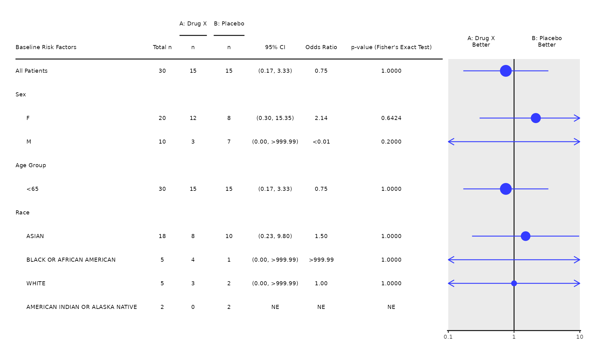

#### **4. Forest Plot for Odds Ratio (with user-defined subgroup analysis)**

The `subgroups` arguments controls which variables are used for subgroup
analysis. If `NULL`the subgroup analysis is removed.

``` r
run(fstg01, proc_data, subgroups = NULL)
```

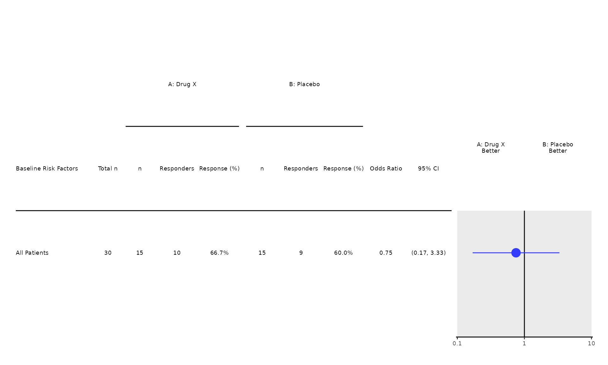

#### **5. Forest Plot for Odds Ratio (with stratified analysis)**

The `strata_var` argument is used to pass the columns used for
stratified analysis.

``` r
run(fstg01, proc_data, strata_var = "STRATA1")
#> Warning in coxexact.fit(X, Y, istrat, offset, init, control, weights = weights,
#> : Ran out of iterations and did not converge
#> Warning in s_odds_ratio(df = l_df[[2]], .var = "rsp", .ref_group = l_df[[1]], :
#> Unable to compute the odds ratio estimate. Please try re-running the function
#> with parameter `method` set to "approximate".
#> Warning in coxexact.fit(X, Y, istrat, offset, init, control, weights = weights,
#> : Ran out of iterations and did not converge
```

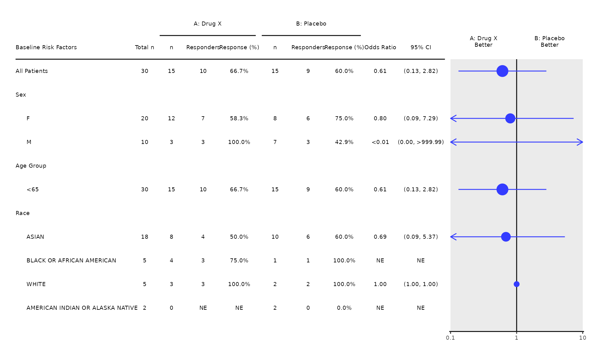

#### **6. Forest Plot for Odds Ratio (without proportional sizing of the odds ratio symbol)**

The `col_symbol_size` argument controls the size of the odds ratio
symbols which are by default proportional in size to the sample size of
the subgroup. If `NULL` the same symbol size is used for all subgroups.

``` r
run(fstg01, proc_data, col_symbol_size = NULL)
```


### **Forest Plot for Hazard Ratio (`FSTG02`)**

#### **1. Forest Plot for Hazard Ratio (with subgroup analysis)**

1.  The **`fstg02`** template produces the standard forest plot for
    hazard ratio.
2.  Users are expected to subset the parameter of interest
    (e.g. `PARAMCD == "OS"`) in pre-processing.
3.  Users are expected to subset the arm variable to keep only the two
    arms to compare (e.g. `ARM %in% c("A: Drug X", "B: Placebo")`).
4.  By default, the plots displays a subgroup analysis for `"SEX"`,
    `"AGEGR1"` and `"RACE"`.
5.  Unstratified analysis is provided by default.
6.  The plots displays by default the Total number of events, the hazard
    ratio and the 95% confidence interval, and, for each arm, the number
    of events and the median time to event in month.

``` r
proc_data <- log_filter(
  syn_data,
  PARAMCD == "OS" & ARM %in% c("A: Drug X", "B: Placebo"), "adtte"
)
run(fstg02, proc_data)
```


#### **2. Forest Plot for Hazard Ratio (with p-values and/or different statistics)**

The interaction p-values and a different set of statistics can be
displayed using the `control` argument. More details about the control
options are available in `[tern::extract_survival_subgroups]`

``` r
run(
  fstg02,
  proc_data,
  stat_var = c("n_tot", "n", "ci", "hr", "pval"),
  control = list(conf_level = 0.9, pval_method = "likelihood")
)
```

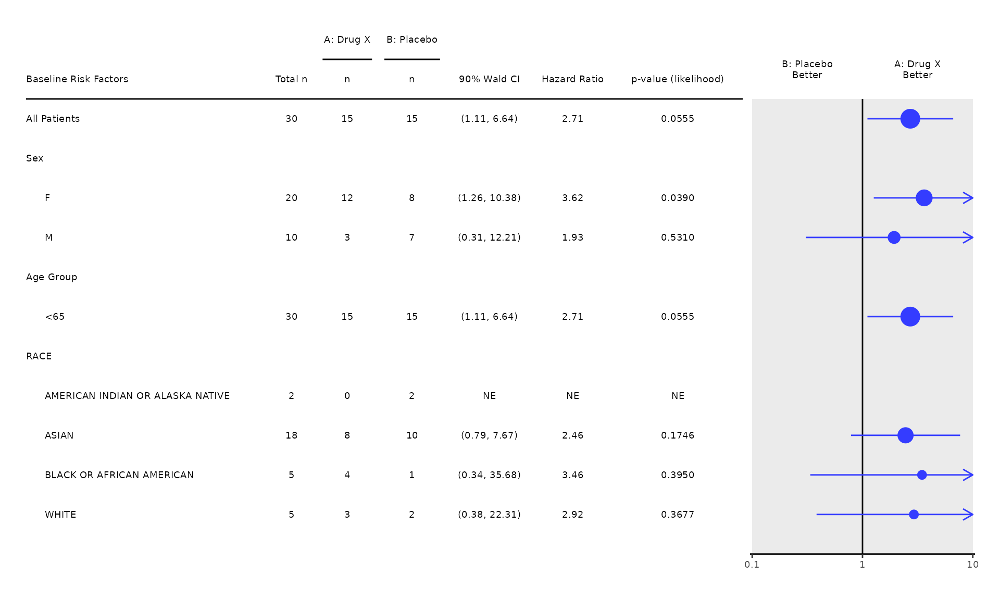

#### **3. Forest Plot for Hazard Ratio (with user-defined subgroup analysis)**

The `subgroups` arguments controls which variables are used for subgroup
analysis. If `NULL`the subgroup analysis is removed.

``` r
run(fstg02, proc_data, subgroups = NULL)
```

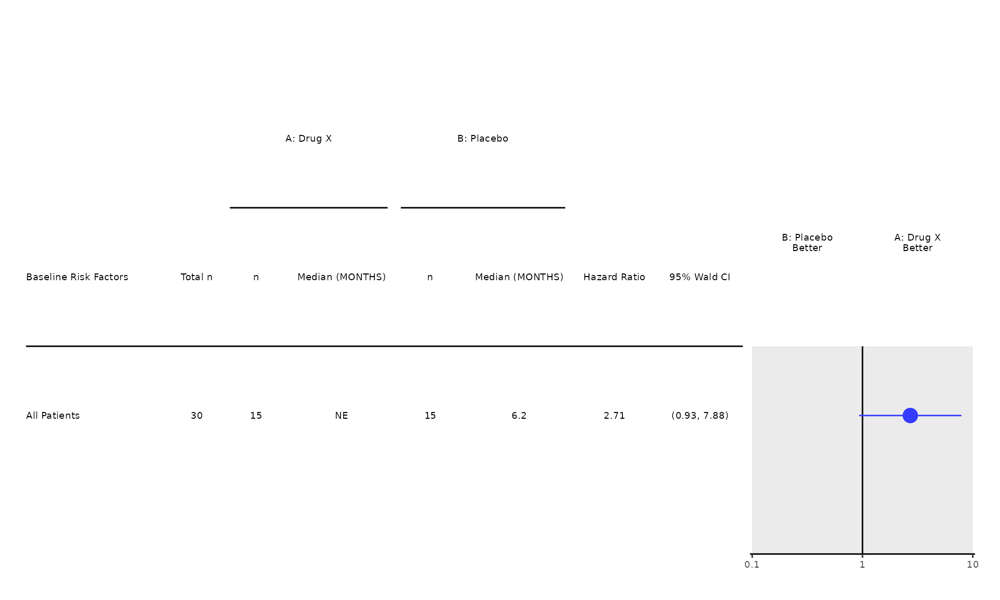

#### **4. Forest Plot for Hazard Ratio (with stratified analysis)**

The `strata_var` argument is used to pass the columns used for
stratified analysis.

``` r
run(fstg02, proc_data, strata_var = "STRATA1")
#> Warning in coxph.fit(X, Y, istrat, offset, init, control, weights = weights, :
#> Loglik converged before variable 1 ; coefficient may be infinite.
```


#### **5. Forest Plot for Hazard Ratio (without proportional sizing of the hazard ratio symbol)**

The `col_symbol_size` argument controls the size of the hazard ratio
symbols which are by default proportional in size to the number of
events in the subgroup. If `NULL` the same symbol size is used for all
subgroups.

``` r
run(fstg02, proc_data, col_symbol_size = NULL)
```


### **Kaplan-Meier Plot (`KMG01`)**

#### **1. Kaplan-Meier Plot (without comparative statistics)**

1.  The **`kmg01`** template produces the standard Kaplan-Meier Plot.
2.  Users are expected to select a particular parameter for analysis.
3.  Users are expected to select the treatment groups to compare,
    otherwise, all treatment groups available in the input datasets will
    be plotted.
4.  The comparative statistics are not included by default.
5.  The estimation of median survival time per treatment group by
    default.
6.  More arguments in the `g_km` and `control_coxph` functions can be
    passed through, please use the Help to find out more information.

``` r
proc_data <- log_filter(syn_data, PARAMCD == "OS", "adtte")
run(kmg01, proc_data, dataset = "adtte")
```


#### **2. Kaplan-Meier Plot (with comparative statistics)**

To enable the comparative statistics (hazard ratio and p-value), the
argument `annot_coxph` needs to be set to TRUE. The compare group is
determined by the levels in the factorized variable of treatment group
and the first level is used as reference group in the statistics.

``` r
proc_data <- log_filter(syn_data, PARAMCD == "OS", "adtte")
run(
  kmg01,
  proc_data,
  dataset = "adtte",
  annot_coxph = TRUE,
  control_annot_coxph = tern::control_coxph_annot(x = 0.33, y = 0.42)
)
```

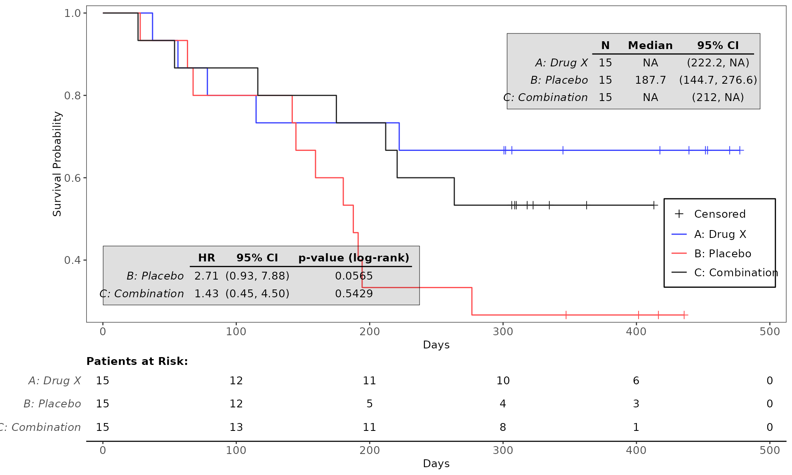

#### **3. Kaplan-Meier Plot (without censoring marks)**

To suppress the censoring marks, set the argument `cencor_show` to
FALSE.

``` r
proc_data <- log_filter(syn_data, PARAMCD == "OS", "adtte")
run(kmg01, proc_data, dataset = "adtte", censor_show = FALSE)
```

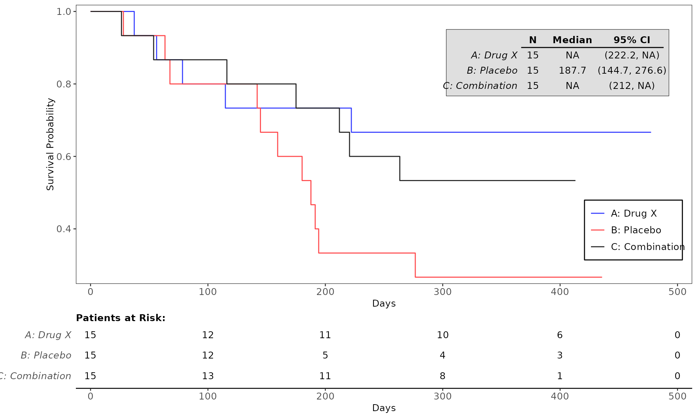

#### **4. Kaplan-Meier Plot (without estimation of median survival time)**

``` r
proc_data <- log_filter(syn_data, PARAMCD == "OS", "adtte")
run(kmg01, proc_data, dataset = "adtte", annot_surv_med = FALSE)
```


#### **5. Kaplan-Meier Plot (with statistical annotation of either median or min of survival time)**

To add the statistics annotation, use the function `annot_stats`.
Options are `min` or `median`.

``` r
proc_data <- log_filter(syn_data, PARAMCD == "OS", "adtte")
run(kmg01, proc_data, dataset = "adtte", annot_stats = "median")
```


``` r
run(kmg01, proc_data, dataset = "adtte", annot_stats = c("min", "median"))
```


#### **6. Kaplan-Meier Plot (without the table of patients at risk)**

``` r
proc_data <- log_filter(syn_data, PARAMCD == "OS", "adtte")
run(kmg01, proc_data, dataset = "adtte", annot_at_risk = FALSE)
```

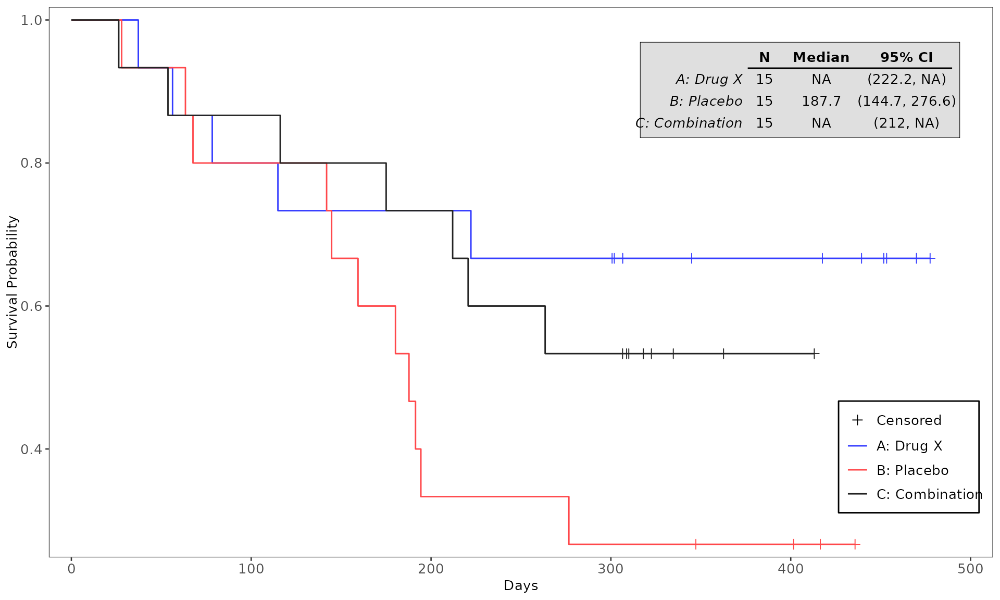

### **Mean Plot (`MNG01`)**

#### **1. Plot of Mean and Confidence Interval (with Table Section)**

1.  The **`mng01`** template produces the standard mean plot.
2.  Note that the template `mng01` is quite general. The users are
    expected to specify the analysis dataset and the visit variable in
    the `run` function, and select the parameters prior to the `run`
    function.
3.  The table of summary statistics is included by default.
4.  The variable Analysis Value `AVAL` is used for plotting by default.
5.  If the input dataset contains results of the same analyses in
    multiple units,(e.g. SI/CV units in `ADLB`), please make sure that
    the parameters in appropriate units are selected in advance.

``` r
proc_data <- log_filter(syn_data, PARAMCD == "DIABP", "advs")
run(mng01, proc_data, dataset = "advs", x_var = c("AVISIT", "AVISITN"))
#> $`Diastolic Blood Pressure`
```


#### **2. Plot of Mean and Confidence Interval of Change from Baseline of Vital Signs**

``` r
proc_data <- log_filter(syn_data, PARAMCD == "DIABP", "advs")
run(mng01, proc_data, dataset = "advs", x_var = c("AVISIT", "AVISITN"), y_var = "CHG")
#> `geom_line()`: Each group consists of only one observation.
#> ℹ Do you need to adjust the group aesthetic?
#> $`Diastolic Blood Pressure`
```

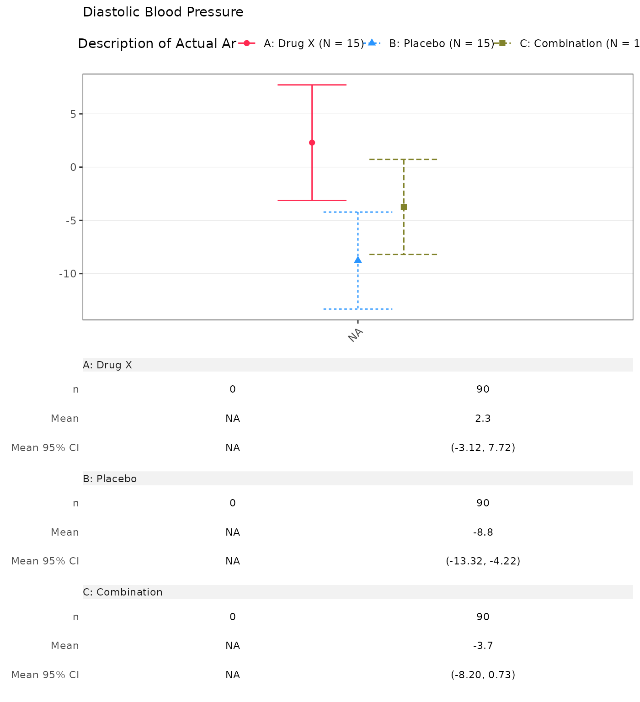

#### **3. Plot of Mean (+/-SD) (Changing the Statistics)**

To change the statistics, use the argument `interval_fun`. Options are
`mean_ci`, `mean_sei`, `mean_sdi`, `median_ci`, `quantiles`,`range`.

``` r
proc_data <- log_filter(syn_data, PARAMCD == "DIABP", "advs")
run(mng01, proc_data, dataset = "advs", x_var = c("AVISIT", "AVISITN"), interval_fun = "mean_sdi")
#> $`Diastolic Blood Pressure`
```

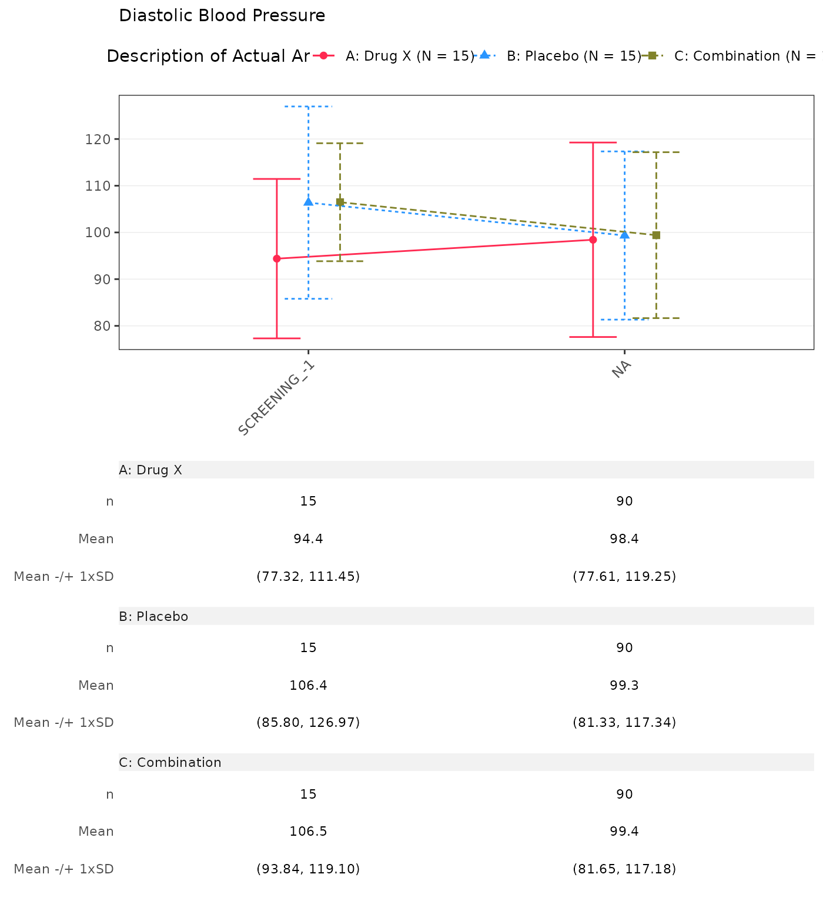

#### **4. Plot of Mean and Confidence Interval (Modify Alpha Level)**

To change the alpha level of the confidence interval, use the argument
`control = control_analyze_vars(conf_level = <0.xx>)`. Note that this is
only in effect when `interval_fun` is set to `mean_ci`.

``` r
proc_data <- log_filter(syn_data, PARAMCD == "DIABP", "advs")
run(
  mng01, proc_data,
  dataset = "advs", x_var = c("AVISIT", "AVISITN"),
  interval_fun = "mean_ci", control = tern::control_analyze_vars(conf_level = 0.80)
)
#> $`Diastolic Blood Pressure`
```


#### **5. Plot of Mean and Confidence Interval （With Number of Patients Only)**

``` r
proc_data <- log_filter(syn_data, PARAMCD == "DIABP", "advs")
run(mng01, proc_data, dataset = "advs", x_var = c("AVISIT", "AVISITN"), table = "n")
#> $`Diastolic Blood Pressure`
```


#### **6. Plot of Mean and Confidence Interval (without Table Section)**

``` r
proc_data <- log_filter(syn_data, PARAMCD == "DIABP", "advs")
run(mng01, proc_data, dataset = "advs", x_var = c("AVISIT", "AVISITN"), table = NULL)
#> $`Diastolic Blood Pressure`
```


A new argument has been added to control the theme (e.g. setting the
angle of the axis); see an example below:

``` r
ggtheme <- ggplot2::theme(
  panel.grid = ggplot2::element_line(colour = "black", linetype = 3),
  panel.background = ggplot2::element_rect(fill = "white"),
  legend.position = "top",
  axis.text.x = ggplot2::element_text(angle = 22, hjust = 1, vjust = 1)
)
run(mng01, syn_data, dataset = "adlb", ggtheme = ggtheme)
#> $`Alanine Aminotransferase Measurement`
```


    #> 
    #> $`C-Reactive Protein Measurement`

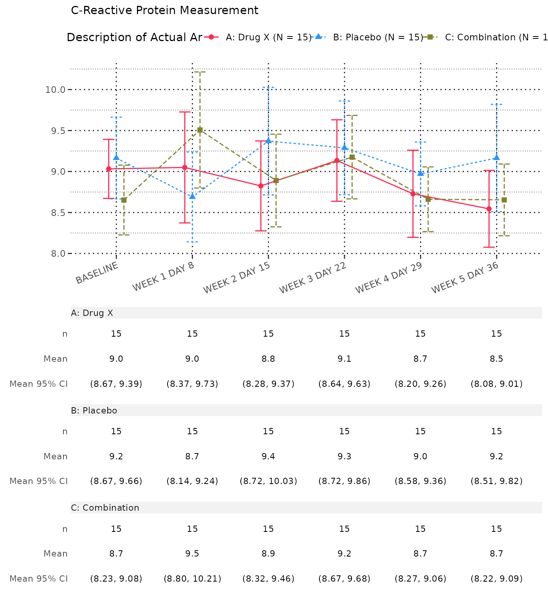

    #> 
    #> $`Immunoglobulin A Measurement`

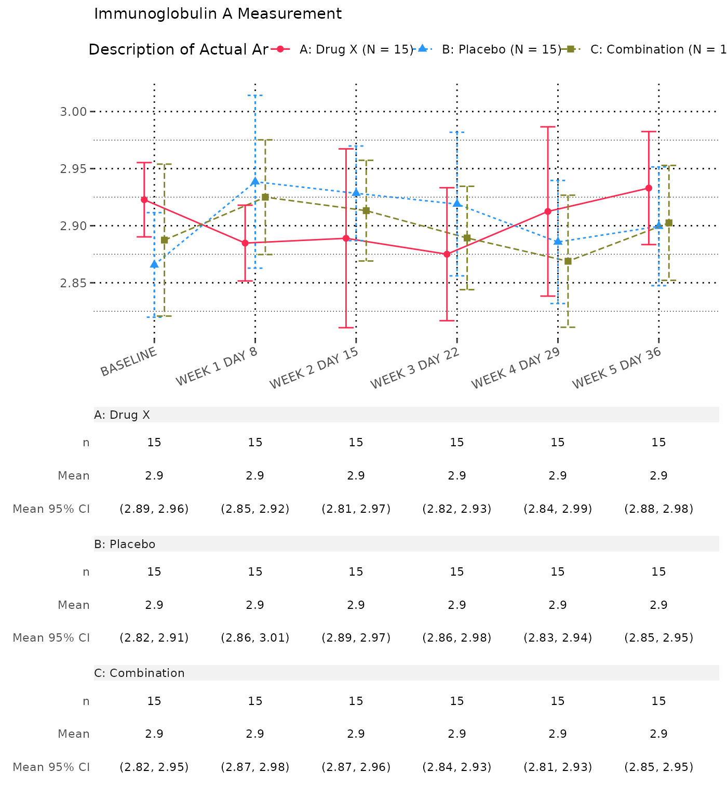
